# Artificial Bee Colony (ABC): Complete Numerical Example

This document provides a detailed, step-by-step numerical example for the **Artificial Bee Colony (ABC)** algorithm. The ABC algorithm mimics the foraging behavior of honey bees, using three types of bees—employed, onlooker, and scout—to balance exploration and exploitation.

---

## Proof of Concept Questions

Test your understanding with these quick-answer questions:

1. The three types of bees in ABC: **employed bees, onlooker bees, scout bees**
2. The bee type that performs local exploitation around food sources: **employed bees**
3. The bee type that selects food sources based on probability: **onlooker bees**
4. The bee type that explores new random solutions: **scout bees**
5. The formula for neighborhood search: **$v_{ij} = x_{ij} + \phi_{ij}(x_{ij} - x_{kj})$**
6. What triggers a scout bee reinitialization: **trial count exceeds the limit**
7. The parameter $\phi_{ij}$ is uniformly distributed in: **$[-1, 1]$**
8. The purpose of fitness transformation in ABC: **convert minimization to selection probability**

---

## Table of Contents

1. [ABC Problem Definition](#1-abc-problem-definition)
2. [ABC Algorithm Overview](#2-abc-algorithm-overview)
3. [ABC Parameters](#3-abc-parameters)
4. [ABC Initialization](#4-abc-initialization)
5. [Employed Bee Phase](#5-employed-bee-phase)
6. [Fitness Transformation](#6-fitness-transformation)
7. [Onlooker Bee Phase](#7-onlooker-bee-phase)
8. [Scout Bee Phase](#8-scout-bee-phase)
9. [ABC Cycle 1](#9-abc-cycle-1)
10. [ABC Cycle 2](#10-abc-cycle-2)
11. [ABC Cycle 3](#11-abc-cycle-3)
12. [ABC Convergence Analysis](#12-abc-convergence-analysis)

---

## 1. ABC Problem Definition

### Objective

We want to find the values of $(x_1, x_2)$ that **minimize** the Sphere function:

$$f(x_1, x_2) = x_1^2 + x_2^2$$

### Optimal Solution

The global minimum is at $(x_1^*, x_2^*) = (0, 0)$ with $f(0, 0) = 0$.

### Search Space

- Each variable: $x_j \in [-5, 5]$
- Dimension: $D = 2$

### Why This Problem?

The Sphere function is a classic benchmark for optimization algorithms. Its single global minimum makes it ideal for demonstrating ABC convergence behavior.

---

## 2. ABC Algorithm Overview

The ABC algorithm operates in cycles, with each cycle containing three phases:

### Bee Types and Their Roles

```mermaid
%%{init: {'theme': 'base', 'themeVariables': { 'primaryColor': '#e8f5e9', 'primaryTextColor': '#1b5e20', 'primaryBorderColor': '#388e3c', 'lineColor': '#66bb6a', 'background': '#ffffff', 'fontFamily': 'Inter, sans-serif'}}}%%
flowchart LR
    subgraph COLONY["🐝 ABC Colony Structure"]
        direction TB
        subgraph EMP["Employed Bees"]
            E1["Exploit assigned<br/>food sources"]
            E2["Neighborhood search:"]
            E3["$$v_{ij} = x_{ij} + \phi_{ij}(x_{ij} - x_{kj})$$"]
            E4["Share info via<br/>waggle dance"]
        end

        subgraph ONL["Onlooker Bees"]
            O1["Select by probability:"]
            O2["$$p_i = \frac{fit_i}{\sum fit_n}$$"]
            O3["Intensify search on<br/>good solutions"]
        end

        subgraph SCT["Scout Bees"]
            S1["Abandon exhausted<br/>sources"]
            S2["Random exploration:"]
            S3["$$x_{ij} = x_j^{min} + rand \cdot (x_j^{max} - x_j^{min})$$"]
        end
    end

    EMP -->|"Fitness info"| ONL
    ONL -->|"Stagnation"| SCT
    SCT -->|"New source"| EMP

    style EMP fill:#e3f2fd,stroke:#1976d2
    style ONL fill:#fff3e0,stroke:#f57c00
    style SCT fill:#ffebee,stroke:#c62828
    style COLONY fill:#fafafa,stroke:#9e9e9e
```

---

## 3. ABC Parameters

| Parameter     |    Symbol     | Value | Description              |
| :------------ | :-----------: | :---: | :----------------------- |
| Food Sources  |     $SN$      |   4   | Number of solutions      |
| Dimension     |      $D$      |   2   | Variables per solution   |
| Colony Size   | $2 \times SN$ |   8   | 4 employed + 4 onlookers |
| Lower Bound   |  $x_j^{min}$  |  -5   | Min value per dimension  |
| Upper Bound   |  $x_j^{max}$  |   5   | Max value per dimension  |
| Abandon Limit |    $limit$    |   3   | Max trials before scout  |
| Max Cycles    |     $MCN$     |   3   | Iterations to run        |

---

## 4. ABC Initialization

### Step 1: Generate Random Food Sources

Each food source $\mathbf{x}_i$ is initialized using:

$$x_{ij} = x_j^{min} + rand(0,1) \cdot (x_j^{max} - x_j^{min})$$

**Random numbers generated:**

| Source | $rand_1$ | $rand_2$ |
| :----: | :------: | :------: |
|   1    |   0.82   |   0.15   |
|   2    |   0.21   |   0.89   |
|   3    |   0.68   |   0.34   |
|   4    |   0.45   |   0.72   |

**Calculation for $\mathbf{x}_1$:**

$$x_{1,1} = -5 + 0.82 \times (5 - (-5))$$

$$= -5 + 0.82 \times 10 = 3.2$$

$$x_{1,2} = -5 + 0.15 \times 10 = -3.5$$

### Initial Population Matrix

$$\mathbf{X}^{(0)} = \begin{bmatrix} 3.2 & -3.5 \\ -2.9 & 3.9 \\ 1.8 & -1.6 \\ -0.5 & 2.2 \end{bmatrix}$$

### Step 2: Evaluate Objective Function

|  Food Source   | $x_1$ | $x_2$ |         $f(\mathbf{x}) = x_1^2 + x_2^2$          |
| :------------: | :---: | :---: | :----------------------------------------------: |
| $\mathbf{x}_1$ |  3.2  | -3.5  | $3.2^2 + 3.5^2 = 10.24 + 12.25 = \mathbf{22.49}$ |
| $\mathbf{x}_2$ | -2.9  |  3.9  | $2.9^2 + 3.9^2 = 8.41 + 15.21 = \mathbf{23.62}$  |
| $\mathbf{x}_3$ |  1.8  | -1.6  |  $1.8^2 + 1.6^2 = 3.24 + 2.56 = \mathbf{5.80}$   |
| $\mathbf{x}_4$ | -0.5  |  2.2  |  $0.5^2 + 2.2^2 = 0.25 + 4.84 = \mathbf{5.09}$   |

### Initialize Trial Counters

$$\mathbf{trial} = [0, 0, 0, 0]$$

**Best solution so far:** $\mathbf{x}_4 = (-0.5, 2.2)$ with $f = 5.09$

---

## 5. Employed Bee Phase

Each employed bee modifies its food source using the neighborhood formula:

$$v_{ij} = x_{ij} + \phi_{ij} \cdot (x_{ij} - x_{kj})$$

where:

- $k \neq i$ is a randomly chosen food source
- $j$ is a randomly selected dimension
- $\phi_{ij} \in [-1, 1]$ is a uniform random number

---

### Employed Bee 1: Modifying $\mathbf{x}_1 = (3.2, -3.5)$

**Random selections:** $k = 3$, $j = 1$, $\phi = 0.6$

$$v_{1,1} = x_{1,1} + \phi \cdot (x_{1,1} - x_{3,1})$$

$$v_{1,1} = 3.2 + 0.6 \times (3.2 - 1.8)$$

$$= 3.2 + 0.6 \times 1.4$$

$$= 3.2 + 0.84 = 4.04$$

**New candidate:** $\mathbf{v}_1 = (4.04, -3.5)$

$$f(\mathbf{v}_1) = 4.04^2 + 3.5^2$$

$$= 16.32 + 12.25 = 28.57$$

**Greedy Selection:** $f(\mathbf{v}_1) = 28.57 > f(\mathbf{x}_1) = 22.49$

$$\boxed{\text{Keep } \mathbf{x}_1, \quad trial_1 = 0 + 1 = 1}$$

---

### Employed Bee 2: Modifying $\mathbf{x}_2 = (-2.9, 3.9)$

**Random selections:** $k = 4$, $j = 2$, $\phi = -0.4$

$$v_{2,2} = 3.9 + (-0.4) \times (3.9 - 2.2)$$

$$= 3.9 - 0.4 \times 1.7$$

$$= 3.9 - 0.68 = 3.22$$

**New candidate:** $\mathbf{v}_2 = (-2.9, 3.22)$

$$f(\mathbf{v}_2) = 2.9^2 + 3.22^2$$

$$= 8.41 + 10.37 = 18.78$$

**Greedy Selection:** $f(\mathbf{v}_2) = 18.78 < f(\mathbf{x}_2) = 23.62$

$$\boxed{\mathbf{x}_2 \leftarrow (-2.9, 3.22), \quad trial_2 = 0}$$

---

### Employed Bee 3: Modifying $\mathbf{x}_3 = (1.8, -1.6)$

**Random selections:** $k = 1$, $j = 2$, $\phi = 0.8$

$$v_{3,2} = -1.6 + 0.8 \times (-1.6 - (-3.5))$$

$$= -1.6 + 0.8 \times 1.9$$

$$= -1.6 + 1.52 = -0.08$$

**New candidate:** $\mathbf{v}_3 = (1.8, -0.08)$

$$f(\mathbf{v}_3) = 1.8^2 + 0.08^2$$

$$= 3.24 + 0.0064 = 3.25$$

**Greedy Selection:** $f(\mathbf{v}_3) = 3.25 < f(\mathbf{x}_3) = 5.80$

$$\boxed{\mathbf{x}_3 \leftarrow (1.8, -0.08), \quad trial_3 = 0}$$

---

### Employed Bee 4: Modifying $\mathbf{x}_4 = (-0.5, 2.2)$

**Random selections:** $k = 2$, $j = 1$, $\phi = -0.7$

$$v_{4,1} = -0.5 + (-0.7) \times (-0.5 - (-2.9))$$

$$= -0.5 - 0.7 \times 2.4$$

$$= -0.5 - 1.68 = -2.18$$

**New candidate:** $\mathbf{v}_4 = (-2.18, 2.2)$

$$f(\mathbf{v}_4) = 2.18^2 + 2.2^2$$

$$= 4.75 + 4.84 = 9.59$$

**Greedy Selection:** $f(\mathbf{v}_4) = 9.59 > f(\mathbf{x}_4) = 5.09$

$$\boxed{\text{Keep } \mathbf{x}_4, \quad trial_4 = 0 + 1 = 1}$$

---

### Employed Bee Phase Summary

| Source |   Original    |   Candidate    | $f$(Original) | $f$(Candidate) |  Winner   | New Trial |
| :----: | :-----------: | :------------: | :-----------: | :------------: | :-------: | :-------: |
|   1    | $(3.2, -3.5)$ | $(4.04, -3.5)$ |     22.49     |     28.57      | Original  |     1     |
|   2    | $(-2.9, 3.9)$ | $(-2.9, 3.22)$ |     23.62     |   **18.78**    | Candidate |     0     |
|   3    | $(1.8, -1.6)$ | $(1.8, -0.08)$ |     5.80      |    **3.25**    | Candidate |     0     |
|   4    | $(-0.5, 2.2)$ | $(-2.18, 2.2)$ |     5.09      |      9.59      | Original  |     1     |

**After Employed Phase:**

$$\mathbf{X}^{(emp)} = \begin{bmatrix} 3.2 & -3.5 \\ -2.9 & 3.22 \\ 1.8 & -0.08 \\ -0.5 & 2.2 \end{bmatrix}, \quad \mathbf{trial} = [1, 0, 0, 1]$$

---

## 6. Fitness Transformation

### Why Transform Fitness?

ABC uses roulette-wheel selection, which requires **larger values for better solutions**. For minimization problems (where smaller $f(x)$ is better), we transform using:

$$fit_i = \begin{cases} \frac{1}{1 + f(\mathbf{x}_i)} & \text{if } f(\mathbf{x}_i) \geq 0 \\ 1 + |f(\mathbf{x}_i)| & \text{if } f(\mathbf{x}_i) < 0 \end{cases}$$

Since all our $f(x) \geq 0$, we use the first formula.

### Fitness Calculation

| Source | $f(\mathbf{x}_i)$ |     $fit_i = \frac{1}{1 + f(\mathbf{x}_i)}$      |
| :----: | :---------------: | :----------------------------------------------: |
|   1    |       22.49       | $\frac{1}{1 + 22.49} = \frac{1}{23.49} = 0.0426$ |
|   2    |       18.78       | $\frac{1}{1 + 18.78} = \frac{1}{19.78} = 0.0506$ |
|   3    |       3.25        |  $\frac{1}{1 + 3.25} = \frac{1}{4.25} = 0.2353$  |
|   4    |       5.09        |  $\frac{1}{1 + 5.09} = \frac{1}{6.09} = 0.1642$  |

### Selection Probability

$$p_i = \frac{fit_i}{\sum_{n=1}^{SN} fit_n}$$

**Total fitness:**

$$\sum fit = 0.0426 + 0.0506 + 0.2353 + 0.1642 = 0.4927$$

**Probabilities:**

$$\mathbf{p} = \begin{bmatrix} p_1 \\ p_2 \\ p_3 \\ p_4 \end{bmatrix} = \begin{bmatrix} \frac{0.0426}{0.4927} \\ \frac{0.0506}{0.4927} \\ \frac{0.2353}{0.4927} \\ \frac{0.1642}{0.4927} \end{bmatrix} = \begin{bmatrix} 0.086 \\ 0.103 \\ 0.478 \\ 0.333 \end{bmatrix}$$

> [!NOTE]
> Notice that $\mathbf{x}_3$ (lowest $f(x) = 3.25$) has the **highest** selection probability (47.8%), demonstrating that better solutions attract more onlooker bees!

---

## 7. Onlooker Bee Phase

Each of the $SN = 4$ onlooker bees selects a food source using roulette-wheel selection, then performs neighborhood search.

### Cumulative Probability

$$\mathbf{q} = [0.086, 0.189, 0.667, 1.000]$$

### Onlooker 1

**Random number:** $r = 0.42$

Since $0.189 < 0.42 \leq 0.667$, select $\mathbf{x}_3 = (1.8, -0.08)$

**Neighborhood search:** $k = 2$, $j = 1$, $\phi = 0.3$

$$v_{3,1} = 1.8 + 0.3 \times (1.8 - (-2.9))$$

$$= 1.8 + 0.3 \times 4.7$$

$$= 1.8 + 1.41 = 3.21$$

**Candidate:** $\mathbf{v}_3 = (3.21, -0.08)$

$$f(\mathbf{v}_3) = 3.21^2 + 0.08^2$$

$$= 10.30 + 0.0064 = 10.31$$

**Greedy selection:** $f(\mathbf{v}_3) = 10.31 > f(\mathbf{x}_3) = 3.25$ → Keep original, $trial_3 = 1$

---

### Onlooker 2

**Random number:** $r = 0.88$

Since $0.667 < 0.88 \leq 1.0$, select $\mathbf{x}_4 = (-0.5, 2.2)$

**Neighborhood search:** $k = 3$, $j = 2$, $\phi = -0.5$

$$v_{4,2} = 2.2 + (-0.5) \times (2.2 - (-0.08))$$

$$= 2.2 - 0.5 \times 2.28$$

$$= 2.2 - 1.14 = 1.06$$

**Candidate:** $\mathbf{v}_4 = (-0.5, 1.06)$

$$f(\mathbf{v}_4) = 0.5^2 + 1.06^2$$

$$= 0.25 + 1.12 = 1.37$$

**Greedy selection:** $f(\mathbf{v}_4) = 1.37 < f(\mathbf{x}_4) = 5.09$ → **Accept!**

$$\boxed{\mathbf{x}_4 \leftarrow (-0.5, 1.06), \quad trial_4 = 0}$$

---

### Onlooker 3

**Random number:** $r = 0.55$

Since $0.189 < 0.55 \leq 0.667$, select $\mathbf{x}_3 = (1.8, -0.08)$

**Neighborhood search:** $k = 1$, $j = 1$, $\phi = -0.6$

$$v_{3,1} = 1.8 + (-0.6) \times (1.8 - 3.2)$$

$$= 1.8 + (-0.6) \times (-1.4)$$

$$= 1.8 + 0.84 = 2.64$$

**Candidate:** $\mathbf{v}_3 = (2.64, -0.08)$

$$f(\mathbf{v}_3) = 2.64^2 + 0.08^2$$

$$= 6.97 + 0.0064 = 6.98$$

**Greedy selection:** $f(\mathbf{v}_3) = 6.98 > f(\mathbf{x}_3) = 3.25$ → Keep original, $trial_3 = 2$

---

### Onlooker 4

**Random number:** $r = 0.71$

Since $0.667 < 0.71 \leq 1.0$, select $\mathbf{x}_4 = (-0.5, 1.06)$ (updated)

**Neighborhood search:** $k = 2$, $j = 1$, $\phi = 0.4$

$$v_{4,1} = -0.5 + 0.4 \times (-0.5 - (-2.9))$$

$$= -0.5 + 0.4 \times 2.4$$

$$= -0.5 + 0.96 = 0.46$$

**Candidate:** $\mathbf{v}_4 = (0.46, 1.06)$

$$f(\mathbf{v}_4) = 0.46^2 + 1.06^2$$

$$= 0.21 + 1.12 = 1.33$$

**Greedy selection:** $f(\mathbf{v}_4) = 1.33 < f(\mathbf{x}_4) = 1.37$ → **Accept!**

$$\boxed{\mathbf{x}_4 \leftarrow (0.46, 1.06), \quad trial_4 = 0}$$

---

### Onlooker Phase Summary

| Onlooker | Selected Source |        Action         |    Result     |
| :------: | :-------------: | :-------------------: | :-----------: |
|    1     | $\mathbf{x}_3$  |   Reject candidate    | $trial_3 = 1$ |
|    2     | $\mathbf{x}_4$  | Accept $(-0.5, 1.06)$ | $trial_4 = 0$ |
|    3     | $\mathbf{x}_3$  |   Reject candidate    | $trial_3 = 2$ |
|    4     | $\mathbf{x}_4$  | Accept $(0.46, 1.06)$ | $trial_4 = 0$ |

**After Onlooker Phase:**

$$\mathbf{X}^{(onl)} = \begin{bmatrix} 3.2 & -3.5 \\ -2.9 & 3.22 \\ 1.8 & -0.08 \\ 0.46 & 1.06 \end{bmatrix}, \quad \mathbf{trial} = [1, 0, 2, 0]$$

---

## 8. Scout Bee Phase

### Check for Abandoned Solutions

A food source is abandoned if $trial_i \geq limit$ (where $limit = 3$).

| Source | Trial Count | $trial \geq 3$? | Action |
| :----: | :---------: | :-------------: | :----: |
|   1    |      1      |       No        |  Keep  |
|   2    |      0      |       No        |  Keep  |
|   3    |      2      |       No        |  Keep  |
|   4    |      0      |       No        |  Keep  |

**No scout activation in Cycle 0** — all trial counts are below the limit.

---

## 9. ABC Cycle 1

After Cycle 0, start Cycle 1 with the updated population.

### Population at Start of Cycle 1

$$\mathbf{X}^{(1)} = \begin{bmatrix} 3.2 & -3.5 \\ -2.9 & 3.22 \\ 1.8 & -0.08 \\ 0.46 & 1.06 \end{bmatrix}$$

| Source | $f(\mathbf{x})$ | Trial |
| :----: | :-------------: | :---: |
|   1    |      22.49      |   1   |
|   2    |      18.78      |   0   |
|   3    |      3.25       |   2   |
|   4    |    **1.33**     |   0   |

### Employed Bee Phase (Cycle 1)

| Source | Original $f$ |   Candidate    | Candidate $f$ |    Winner     | New Trial |
| :----: | :----------: | :------------: | :-----------: | :-----------: | :-------: |
|   1    |    22.49     | $(2.4, -3.5)$  |     18.01     | **Candidate** |     0     |
|   2    |    18.78     | $(-2.9, 2.5)$  |     14.66     | **Candidate** |     0     |
|   3    |     3.25     | $(1.2, -0.08)$ |     1.45      | **Candidate** |     0     |
|   4    |     1.33     | $(0.8, 1.06)$  |     1.76      |   Original    |     1     |

**After Employed Phase (Cycle 1):**

$$\mathbf{X}^{(1,emp)} = \begin{bmatrix} 2.4 & -3.5 \\ -2.9 & 2.5 \\ 1.2 & -0.08 \\ 0.46 & 1.06 \end{bmatrix}, \quad \mathbf{trial} = [0, 0, 0, 1]$$

### Fitness & Probability (Cycle 1)

| Source | $f(\mathbf{x})$ | $fit_i$ |   $p_i$   |
| :----: | :-------------: | :-----: | :-------: |
|   1    |      18.01      | 0.0526  |   0.055   |
|   2    |      14.66      | 0.0639  |   0.067   |
|   3    |      1.45       | 0.4082  | **0.429** |
|   4    |      1.33       | 0.4292  | **0.449** |

### Onlooker Phase (Cycle 1)

High probability sources ($\mathbf{x}_3$ and $\mathbf{x}_4$) receive most attention:

| Onlooker | Random $r$ |    Selected    | Candidate $f$ |          Result           |
| :------: | :--------: | :------------: | :-----------: | :-----------------------: |
|    1     |    0.35    | $\mathbf{x}_3$ |     2.10      |   Reject, $trial_3 = 1$   |
|    2     |    0.82    | $\mathbf{x}_4$ |     0.98      | **Accept** $(0.22, 0.92)$ |
|    3     |    0.60    | $\mathbf{x}_3$ |     0.89      | **Accept** $(0.85, 0.38)$ |
|    4     |    0.95    | $\mathbf{x}_4$ |     1.15      |   Reject, $trial_4 = 1$   |

**After Onlooker Phase (Cycle 1):**

$$\mathbf{X}^{(1,onl)} = \begin{bmatrix} 2.4 & -3.5 \\ -2.9 & 2.5 \\ 0.85 & 0.38 \\ 0.22 & 0.92 \end{bmatrix}$$

### Scout Phase (Cycle 1)

Trial counts: $[0, 0, 0, 1]$ — no abandonments.

**Best of Cycle 1:** $\mathbf{x}_3 = (0.85, 0.38)$ with $f = 0.87$

---

## 10. ABC Cycle 2

### Population at Start of Cycle 2

$$\mathbf{X}^{(2)} = \begin{bmatrix} 2.4 & -3.5 \\ -2.9 & 2.5 \\ 0.85 & 0.38 \\ 0.22 & 0.92 \end{bmatrix}$$

| Source | $f(\mathbf{x})$ | Trial |
| :----: | :-------------: | :---: |
|   1    |      18.01      |   0   |
|   2    |      14.66      |   0   |
|   3    |    **0.87**     |   0   |
|   4    |      0.89       |   1   |

### Employed Bee Phase (Cycle 2)

| Source | Original $f$ | Candidate $f$ |    Winner     | New Trial |
| :----: | :----------: | :-----------: | :-----------: | :-------: |
|   1    |    18.01     |     11.65     | **Candidate** |     0     |
|   2    |    14.66     |     9.25      | **Candidate** |     0     |
|   3    |     0.87     |     1.25      |   Original    |     1     |
|   4    |     0.89     |     0.63      | **Candidate** |     0     |

**Updated vectors:**

- $\mathbf{x}_1 = (1.8, -2.9)$
- $\mathbf{x}_2 = (-2.2, 2.1)$
- $\mathbf{x}_4 = (0.15, 0.78)$

### Fitness & Probability (Cycle 2)

| Source | $f(\mathbf{x})$ | $fit_i$ |   $p_i$   |
| :----: | :-------------: | :-----: | :-------: |
|   1    |      11.65      |  0.079  |   0.060   |
|   2    |      9.25       |  0.098  |   0.074   |
|   3    |      0.87       |  0.535  | **0.404** |
|   4    |      0.63       |  0.613  | **0.463** |

### Onlooker Phase (Cycle 2)

Most onlookers focus on $\mathbf{x}_3$ and $\mathbf{x}_4$:

| Onlooker |    Selected    | Candidate $f$ |          Result           |
| :------: | :------------: | :-----------: | :-----------------------: |
|    1     | $\mathbf{x}_4$ |     0.50      | **Accept** $(0.08, 0.70)$ |
|    2     | $\mathbf{x}_3$ |     0.69      | **Accept** $(0.65, 0.52)$ |
|    3     | $\mathbf{x}_4$ |     0.68      |   Reject, $trial_4 = 1$   |
|    4     | $\mathbf{x}_3$ |     0.95      |   Reject, $trial_3 = 1$   |

**After Cycle 2:**

$$\mathbf{X}^{(2,final)} = \begin{bmatrix} 1.8 & -2.9 \\ -2.2 & 2.1 \\ 0.65 & 0.52 \\ 0.08 & 0.70 \end{bmatrix}$$

| Source | $f(\mathbf{x})$ | Trial |
| :----: | :-------------: | :---: |
|   1    |      11.65      |   0   |
|   2    |      9.25       |   0   |
|   3    |      0.69       |   1   |
|   4    |    **0.50**     |   1   |

**Best of Cycle 2:** $\mathbf{x}_4 = (0.08, 0.70)$ with $f = 0.50$

---

## 11. ABC Cycle 3

### Population at Start of Cycle 3

$$\mathbf{X}^{(3)} = \begin{bmatrix} 1.8 & -2.9 \\ -2.2 & 2.1 \\ 0.65 & 0.52 \\ 0.08 & 0.70 \end{bmatrix}$$

### Employed Bee Phase (Cycle 3)

| Source | Original $f$ | Candidate $f$ |            Winner            | New Trial |
| :----: | :----------: | :-----------: | :--------------------------: | :-------: |
|   1    |    11.65     |     7.69      | **Candidate** $(1.2, -2.5)$  |     0     |
|   2    |     9.25     |     6.30      | **Candidate** $(-1.8, 1.75)$ |     0     |
|   3    |     0.69     |     0.45      | **Candidate** $(0.42, 0.52)$ |     0     |
|   4    |     0.50     |     0.31      | **Candidate** $(0.08, 0.55)$ |     0     |

### Fitness & Probability (Cycle 3)

| Source | $f(\mathbf{x})$ | $fit_i$ |   $p_i$   |
| :----: | :-------------: | :-----: | :-------: |
|   1    |      7.69       |  0.115  |   0.067   |
|   2    |      6.30       |  0.137  |   0.080   |
|   3    |      0.45       |  0.690  | **0.405** |
|   4    |      0.31       |  0.763  | **0.448** |

### Onlooker Phase (Cycle 3)

| Onlooker |    Selected    | Candidate $f$ |          Result           |
| :------: | :------------: | :-----------: | :-----------------------: |
|    1     | $\mathbf{x}_4$ |     0.26      | **Accept** $(0.12, 0.50)$ |
|    2     | $\mathbf{x}_3$ |     0.35      | **Accept** $(0.35, 0.48)$ |
|    3     | $\mathbf{x}_4$ |     0.21      | **Accept** $(0.08, 0.45)$ |
|    4     | $\mathbf{x}_4$ |     0.25      |   Reject, $trial_4 = 1$   |

### Final Population (Cycle 3)

$$\mathbf{X}^{(3,final)} = \begin{bmatrix} 1.2 & -2.5 \\ -1.8 & 1.75 \\ 0.35 & 0.48 \\ 0.08 & 0.45 \end{bmatrix}$$

| Source | $f(\mathbf{x})$ | Trial |
| :----: | :-------------: | :---: |
|   1    |      7.69       |   0   |
|   2    |      6.30       |   0   |
|   3    |      0.35       |   0   |
|   4    |    **0.21**     |   1   |

---

## 12. ABC Convergence Analysis

### Evolution Summary

|  Cycle   | Best Solution  | Best $f(\mathbf{x})$ | Average $f(\mathbf{x})$ | Improvement |
| :------: | :------------: | :------------------: | :---------------------: | :---------: |
| 0 (Init) | $(-0.5, 2.2)$  |         5.09         |          14.25          |      —      |
| 0 (End)  | $(0.46, 1.06)$ |         1.33         |          11.46          |    73.9%    |
|    1     | $(0.85, 0.38)$ |         0.87         |          8.61           |    34.6%    |
|    2     | $(0.08, 0.70)$ |         0.50         |          5.52           |    42.5%    |
|    3     | $(0.08, 0.45)$ |         0.21         |          3.64           |    58.0%    |

### Distance to Optimum $(0, 0)$

| Cycle | Best Solution  | $\|\mathbf{x}\| = \sqrt{x_1^2 + x_2^2}$ | $f(\mathbf{x})$ |
| :---: | :------------: | :-------------------------------------: | :-------------: |
|   0   | $(0.46, 1.06)$ |                  1.15                   |      1.33       |
|   1   | $(0.85, 0.38)$ |                  0.93                   |      0.87       |
|   2   | $(0.08, 0.70)$ |                  0.70                   |      0.50       |
|   3   | $(0.08, 0.45)$ |                  0.46                   |    **0.21**     |

### Convergence Chart

### Bee Phase Contributions

> [!TIP]
> The ABC algorithm successfully reduced the fitness from $5.09$ to $0.21$ over 3 cycles—a **95.9% reduction**! The best solution $(0.08, 0.45)$ is very close to the optimal $(0, 0)$.

---

## ABC Summary

### Algorithm Characteristics

| Aspect                    | Description                           |
| :------------------------ | :------------------------------------ |
| **Inspiration**           | Honey bee foraging behavior           |
| **Encoding**              | Real-valued vectors                   |
| **Selection**             | Roulette wheel (fitness-proportional) |
| **Exploitation**          | Employed bees + Onlooker bees         |
| **Exploration**           | Scout bees (random reinitialization)  |
| **Stagnation Prevention** | Abandon limit triggers scouts         |

### Phase Summary

| Phase   | Bee Type | Operation                            | Optimization Role        |
| :------ | :------- | :----------------------------------- | :----------------------- |
| Phase 1 | Employed | Neighborhood search                  | Local exploitation       |
| Phase 2 | Onlooker | Probability-based selection + search | Intensified exploitation |
| Phase 3 | Scout    | Random reinitialization              | Global exploration       |

### Key Formulas

| Formula        | Equation                                                       | Purpose               |
| :------------- | :------------------------------------------------------------- | :-------------------- |
| Initialization | $x_{ij} = x_j^{min} + rand(0,1) \cdot (x_j^{max} - x_j^{min})$ | Random food source    |
| Neighborhood   | $v_{ij} = x_{ij} + \phi_{ij}(x_{ij} - x_{kj})$                 | Local search          |
| Fitness        | $fit_i = \frac{1}{1 + f(\mathbf{x}_i)}$                        | Convert for selection |
| Probability    | $p_i = \frac{fit_i}{\sum fit_n}$                               | Roulette wheel        |

> [!IMPORTANT] > **Key Insight**: The ABC algorithm's strength lies in its balanced approach—employed bees exploit known good regions while scout bees prevent premature convergence by exploring new areas when solutions stagnate.

---

## References

1. Karaboga, D. (2005). _An Idea Based on Honey Bee Swarm for Numerical Optimization_. Technical Report TR06, Erciyes University.
