# Proof of Concept Questions

1. The phenomenon that inspires the Firefly Algorithm: **Bioluminescence (light production) in fireflies**.
2. The relationship between brightness and distance: **Brightness decreases as distance increases** (inverse-square law).
3. The formula for attractiveness: **$\beta = \beta_0 e^{-\gamma r^2}$**.
4. The parameter that controls the step size of random movement: **Randomization parameter $\alpha$**.
5. The movement formula for firefly $i$ toward firefly $j$: **$x_i^{t+1} = x_i^t + \beta_0 e^{-\gamma r_{ij}^2}(x_j^t - x_i^t) + \alpha \varepsilon_i$**.
6. What happens when $\gamma = 0$: **Attractiveness becomes constant ($\beta = \beta_0$) and fireflies are visible across the entire domain**.
7. What happens when $\gamma = \infty$: **Zero visibility, fireflies move randomly (random walks)**.
8. The parameter that represents light absorption in the medium: **Absorption coefficient $\gamma$**.
9. The brightest firefly's behavior when no brighter fireflies exist: **Moves randomly**.
10. The relationship between attractiveness and intensity: **Attractiveness is proportional to brightness/intensity**.

---

# Firefly Algorithm (FA) — Complete Numerical Example

This document provides a comprehensive, step-by-step numerical example of the **Firefly Algorithm (FA)**, a nature-inspired metaheuristic optimization algorithm developed by Xin-She Yang in 2008. The algorithm mimics the flashing behavior and attraction mechanisms of fireflies to find optimal solutions.

---

## 1. Algorithm Overview

```mermaid
%%{init: {'theme': 'base', 'themeVariables': { 'primaryColor': '#fff8e1', 'primaryTextColor': '#e65100', 'primaryBorderColor': '#ff9800', 'lineColor': '#ffb74d', 'secondaryColor': '#e3f2fd', 'tertiaryColor': '#fce4ec', 'background': '#ffffff', 'fontFamily': 'Inter, sans-serif'}, 'flowchart': {'nodePadding': 20, 'htmlLabels': true} }}%%
flowchart TB
    subgraph INIT["🌟 Initialization"]
        A["Initialize population of <i>n</i> fireflies<br/>(random candidate solutions)"]
        B["Evaluate brightness (fitness)<br/>of all fireflies"]
        C["Set parameters:<br/>$$ \quad \beta_0, \gamma, \alpha \quad $$"]
    end

    subgraph ITER["🔄 Iteration Loop"]
        D["For each firefly <i>i</i>"]
        E["For each firefly <i>j</i>"]
        F{{"Is firefly <i>j</i><br/>brighter than <i>i</i>?"}}

        subgraph MOVE["🔥 Attraction Movement"]
            G["Calculate distance <i>r<sub>ij</sub></i>"]
            H["Calculate attractiveness:<br/>$$ \quad \beta(r) = \beta_0 e^{-\gamma r^2} \quad $$"]
            %% FIX: Added \quad at start and end to prevent clipping %%
            I["$$ \quad x_i^{t+1} = x_i^t + \beta(x_j - x_i) + \alpha\varepsilon \quad $$"]
        end

        subgraph RANDOM["🎲 Random Walk"]
            %% FIX: Text on line 1, Math on line 2 (using <br/>), with \quad padding %%
            R["Move randomly:<br/>$$ \quad x_i^{t+1} = x_i^t + \alpha\varepsilon \quad $$"]
        end

        K["Evaluate new brightness"]
        L["Update firefly position"]
    end

    M["Update global best"]
    N{{"Max iterations<br/>reached?"}}
    P["Return best solution"]

    A --> B --> C --> D
    D --> E --> F
    F -->|"Yes"| G --> H --> I --> K
    F -->|"No (brightest)"| R --> K
    K --> L --> E
    E -->|"All j processed"| D
    D -->|"All i processed"| M --> N
    N -->|"No"| D
    N -->|"Yes"| P

    style INIT fill:#fff8e1,stroke:#ff9800
    style MOVE fill:#e3f2fd,stroke:#1976d2
    style RANDOM fill:#f3e5f5,stroke:#7b1fa2
    style ITER fill:#f5f5f5,stroke:#9e9e9e
```

---

## 2. Biological Inspiration

```mermaid
%%{init: {'theme': 'base', 'themeVariables': { 'primaryColor': '#fff8e1', 'primaryTextColor': '#e65100', 'primaryBorderColor': '#ff9800', 'lineColor': '#ffb74d', 'background': '#ffffff', 'fontFamily': 'Inter, sans-serif'}}}%%
flowchart LR
    subgraph NATURE["🌙 Nature: Firefly Behavior"]
        direction TB
        N1["Fireflies produce<br/><b>bioluminescent light</b>"]
        N2["Light attracts<br/>mates and prey"]
        N3["Brightness decreases<br/>with distance"]
        N4["Brighter fireflies<br/>attract others"]
    end

    subgraph ALGO["💻 Algorithm: Optimization"]
        direction TB
        A1["Solutions encoded as<br/><b>firefly positions</b>"]
        A2["Fitness = Brightness<br/>(objective function)"]
        A3["Attractiveness decays:<br/>$$ \quad \beta = \beta_0 e^{-\gamma r^2} \quad $$"]
        A4["Better solutions<br/>attract others"]
    end

    N1 -.->|"Maps to"| A1
    N2 -.->|"Maps to"| A2
    N3 -.->|"Maps to"| A3
    N4 -.->|"Maps to"| A4

    style NATURE fill:#e8f5e9,stroke:#388e3c
    style ALGO fill:#e3f2fd,stroke:#1976d2
```

### Key Properties of Fireflies

| Biological Property | Mathematical Representation       | Optimization Role                |
| :------------------ | :-------------------------------- | :------------------------------- |
| Light intensity     | $I(r) = I_0 e^{-\gamma r^2}$      | Solution quality (fitness)       |
| Attraction to light | $\beta = \beta_0 e^{-\gamma r^2}$ | Movement toward better solutions |
| Light absorption    | $\gamma$ (absorption coefficient) | Controls attraction range        |
| Random movement     | $\alpha \varepsilon$              | Exploration of search space      |

---

## 3. Problem Setup

### Objective Function

We will minimize the **Sphere function** in 3 dimensions:

$$f(\mathbf{x}) = \sum_{i=1}^{3} x_i^2 = x_1^2 + x_2^2 + x_3^2$$

where $\mathbf{x} = [x_1, x_2, x_3]$ and $x_i \in [-5, 5]$.

**Global Minimum**: $f(\mathbf{x}^*) = 0$ at $\mathbf{x}^* = [0, 0, 0]$

### Algorithm Parameters

| Parameter              |    Symbol    |   Value   | Description                  |
| :--------------------- | :----------: | :-------: | :--------------------------- |
| Population size        |     $n$      |     4     | Number of fireflies          |
| Dimensions             |     $D$      |     3     | Number of decision variables |
| Initial attractiveness |  $\beta_0$   |    1.0    | Attractiveness at $r = 0$    |
| Light absorption       |   $\gamma$   |    1.0    | Controls attraction decay    |
| Randomization          |   $\alpha$   |    0.2    | Random step size             |
| Max iterations         |  $T_{max}$   |     3     | Maximum generations          |
| Search bounds          | $[L_b, U_b]$ | $[-5, 5]$ | Lower and upper bounds       |

---

## 4. Mathematical Formulation

### Brightness/Intensity

The brightness of a firefly at position $\mathbf{x}$ is proportional to its fitness:

$$I(\mathbf{x}) \propto f(\mathbf{x})$$

For **minimization problems**, a lower $f(\mathbf{x})$ means **higher brightness** (better solution).

### Distance Between Fireflies

The Euclidean distance between firefly $i$ and firefly $j$:

$$r_{ij} = \|\mathbf{x}_i - \mathbf{x}_j\| = \sqrt{\sum_{k=1}^{D} (x_{i,k} - x_{j,k})^2}$$

### Attractiveness Function

Attractiveness decreases exponentially with distance:

$$\beta(r) = \beta_0 e^{-\gamma r^2}$$

where:

- $\beta_0$ = attractiveness at $r = 0$ (typically 1.0)
- $\gamma$ = light absorption coefficient
- $r$ = distance between fireflies

### Movement Equation

Firefly $i$ moves toward brighter firefly $j$ using:

$$\mathbf{x}_i^{t+1} = \mathbf{x}_i^t + \beta(r_{ij}) \cdot (\mathbf{x}_j^t - \mathbf{x}_i^t) + \alpha \boldsymbol{\varepsilon}_i$$

where:

- $\beta(r_{ij}) = \beta_0 e^{-\gamma r_{ij}^2}$ is the attractiveness
- $\boldsymbol{\varepsilon}_i$ is a random vector with values in $[-0.5, 0.5]$
- $\alpha$ scales the random component

---

## 5. Population Initialization

Generate 4 random fireflies in 3-dimensional space within bounds $[-5, 5]$:

### Initial Population Matrix

$$
\mathbf{X}^{(0)} = \begin{bmatrix}
\mathbf{x}_1^{(0)} \\
\mathbf{x}_2^{(0)} \\
\mathbf{x}_3^{(0)} \\
\mathbf{x}_4^{(0)}
\end{bmatrix} = \begin{bmatrix}
2.50 & -1.80 & 1.20 \\
-3.00 & 0.50 & 2.40 \\
1.00 & 2.80 & -0.60 \\
-0.40 & -1.20 & 0.80
\end{bmatrix}
$$

### Detailed Initial Positions

| Firefly              | $x_1$ | $x_2$ | $x_3$ |
| :------------------- | :---: | :---: | :---: |
| $\mathbf{x}_1^{(0)}$ | 2.50  | -1.80 | 1.20  |
| $\mathbf{x}_2^{(0)}$ | -3.00 | 0.50  | 2.40  |
| $\mathbf{x}_3^{(0)}$ | 1.00  | 2.80  | -0.60 |
| $\mathbf{x}_4^{(0)}$ | -0.40 | -1.20 | 0.80  |

### Initial Brightness Evaluation

For minimization, **lower $f(\mathbf{x})$ means brighter (better)**.

$$f(\mathbf{x}_1^{(0)}) = (2.50)^2 + (-1.80)^2 + (1.20)^2 = 6.25 + 3.24 + 1.44 = \mathbf{10.93}$$

$$f(\mathbf{x}_2^{(0)}) = (-3.00)^2 + (0.50)^2 + (2.40)^2 = 9.00 + 0.25 + 5.76 = \mathbf{15.01}$$

$$f(\mathbf{x}_3^{(0)}) = (1.00)^2 + (2.80)^2 + (-0.60)^2 = 1.00 + 7.84 + 0.36 = \mathbf{9.20}$$

$$f(\mathbf{x}_4^{(0)}) = (-0.40)^2 + (-1.20)^2 + (0.80)^2 = 0.16 + 1.44 + 0.64 = \mathbf{2.24}$$

### Initial Brightness Ranking

| Firefly              | Position               | Fitness $f(\mathbf{x})$ | Brightness Rank |
| :------------------- | :--------------------- | :---------------------: | :-------------: |
| $\mathbf{x}_4^{(0)}$ | $[-0.40, -1.20, 0.80]$ |        **2.24**         |  🥇 Brightest   |
| $\mathbf{x}_3^{(0)}$ | $[1.00, 2.80, -0.60]$  |          9.20           |       2nd       |
| $\mathbf{x}_1^{(0)}$ | $[2.50, -1.80, 1.20]$  |          10.93          |       3rd       |
| $\mathbf{x}_2^{(0)}$ | $[-3.00, 0.50, 2.40]$  |          15.01          |  4th (Dimmest)  |

**Current Best**: $\mathbf{x}_4^{(0)} = [-0.40, -1.20, 0.80]$ with $f = 2.24$

---

## 6. Iteration 1 (Generation t = 1)

### Firefly 1 Updates

Since $\mathbf{x}_1$ is NOT the brightest, it will move toward brighter fireflies.

#### Step 1: Move Toward Firefly 4 (Brightest)

**Calculate distance:**

$$r_{14} = \sqrt{(2.50 - (-0.40))^2 + (-1.80 - (-1.20))^2 + (1.20 - 0.80)^2}$$
$$= \sqrt{(2.90)^2 + (-0.60)^2 + (0.40)^2}$$
$$= \sqrt{8.41 + 0.36 + 0.16} = \sqrt{8.93} = 2.988$$

**Calculate attractiveness:**

$$\beta(r_{14}) = \beta_0 e^{-\gamma r_{14}^2} = 1.0 \times e^{-1.0 \times (2.988)^2} = e^{-8.93} \approx 0.000132$$

**Generate random vector:** $\boldsymbol{\varepsilon}_1 = [0.25, -0.15, 0.30]$

**Apply movement equation:**

$$\mathbf{x}_1^{(1)} = \mathbf{x}_1^{(0)} + \beta(r_{14}) \cdot (\mathbf{x}_4^{(0)} - \mathbf{x}_1^{(0)}) + \alpha \boldsymbol{\varepsilon}_1$$

Direction vector:
$$\mathbf{x}_4^{(0)} - \mathbf{x}_1^{(0)} = \begin{bmatrix} -0.40 \\ -1.20 \\ 0.80 \end{bmatrix} - \begin{bmatrix} 2.50 \\ -1.80 \\ 1.20 \end{bmatrix} = \begin{bmatrix} -2.90 \\ 0.60 \\ -0.40 \end{bmatrix}$$

**Component-wise calculation:**

| Dim | $x_1^{(0)}$ |       $\beta \cdot \Delta x$        |     $\alpha \varepsilon$      | $x_1^{(1)}$ |
| :-: | :---------: | :---------------------------------: | :---------------------------: | :---------: |
|  1  |    2.50     | $0.000132 \times (-2.90) = -0.0004$ |   $0.2 \times 0.25 = 0.050$   |   2.5496    |
|  2  |    -1.80    |   $0.000132 \times 0.60 = 0.0001$   | $0.2 \times (-0.15) = -0.030$ |   -1.8299   |
|  3  |    1.20     | $0.000132 \times (-0.40) = -0.0001$ |   $0.2 \times 0.30 = 0.060$   |   1.2599    |

$$\mathbf{x}_1^{(1)} = \begin{bmatrix} 2.550 \\ -1.830 \\ 1.260 \end{bmatrix}$$

**Evaluate new fitness:**

$$f(\mathbf{x}_1^{(1)}) = (2.550)^2 + (-1.830)^2 + (1.260)^2 = 6.503 + 3.349 + 1.588 = \mathbf{11.440}$$

> [!NOTE]
> Since $11.440 > 10.93$, the new position is slightly worse due to the random component. In strict FA, we **accept all moves**; the algorithm relies on global convergence. Here we keep the new position.

---

### Firefly 2 Updates

$\mathbf{x}_2$ is the dimmest, so it moves toward ALL brighter fireflies.

#### Move Toward Firefly 4 (Brightest)

**Calculate distance:**

$$r_{24} = \sqrt{(-3.00 - (-0.40))^2 + (0.50 - (-1.20))^2 + (2.40 - 0.80)^2}$$
$$= \sqrt{(-2.60)^2 + (1.70)^2 + (1.60)^2}$$
$$= \sqrt{6.76 + 2.89 + 2.56} = \sqrt{12.21} = 3.494$$

**Calculate attractiveness:**

$$\beta(r_{24}) = e^{-1.0 \times (3.494)^2} = e^{-12.21} \approx 0.0000050$$

**Generate random vector:** $\boldsymbol{\varepsilon}_2 = [-0.40, 0.20, -0.35]$

**Apply movement:**

$$\mathbf{x}_2^{(1)} = \mathbf{x}_2^{(0)} + \beta(r_{24}) \cdot (\mathbf{x}_4^{(0)} - \mathbf{x}_2^{(0)}) + \alpha \boldsymbol{\varepsilon}_2$$

Direction vector:
$$\mathbf{x}_4^{(0)} - \mathbf{x}_2^{(0)} = \begin{bmatrix} -0.40 \\ -1.20 \\ 0.80 \end{bmatrix} - \begin{bmatrix} -3.00 \\ 0.50 \\ 2.40 \end{bmatrix} = \begin{bmatrix} 2.60 \\ -1.70 \\ -1.60 \end{bmatrix}$$

| Dim | $x_2^{(0)}$ | $\beta \cdot \Delta x$ |     $\alpha \varepsilon$      | $x_2^{(1)}$ |
| :-: | :---------: | :--------------------: | :---------------------------: | :---------: |
|  1  |    -3.00    |      $\approx 0$       | $0.2 \times (-0.40) = -0.080$ |   -3.080    |
|  2  |    0.50     |      $\approx 0$       |   $0.2 \times 0.20 = 0.040$   |    0.540    |
|  3  |    2.40     |      $\approx 0$       | $0.2 \times (-0.35) = -0.070$ |    2.330    |

$$\mathbf{x}_2^{(1)} = \begin{bmatrix} -3.080 \\ 0.540 \\ 2.330 \end{bmatrix}$$

**New fitness:**
$$f(\mathbf{x}_2^{(1)}) = 9.486 + 0.292 + 5.429 = \mathbf{15.207}$$

---

### Firefly 3 Updates

#### Move Toward Firefly 4 (Brightest)

**Calculate distance:**

$$r_{34} = \sqrt{(1.00 - (-0.40))^2 + (2.80 - (-1.20))^2 + (-0.60 - 0.80)^2}$$
$$= \sqrt{(1.40)^2 + (4.00)^2 + (-1.40)^2}$$
$$= \sqrt{1.96 + 16.00 + 1.96} = \sqrt{19.92} = 4.463$$

**Calculate attractiveness:**

$$\beta(r_{34}) = e^{-1.0 \times (4.463)^2} = e^{-19.92} \approx 2.22 \times 10^{-9}$$

**Generate random vector:** $\boldsymbol{\varepsilon}_3 = [0.10, -0.45, 0.15]$

**Apply movement** (attractiveness is negligible, mainly random walk):

| Dim | $x_3^{(0)}$ |     $\alpha \varepsilon$      | $x_3^{(1)}$ |
| :-: | :---------: | :---------------------------: | :---------: |
|  1  |    1.00     |   $0.2 \times 0.10 = 0.020$   |    1.020    |
|  2  |    2.80     | $0.2 \times (-0.45) = -0.090$ |    2.710    |
|  3  |    -0.60    |   $0.2 \times 0.15 = 0.030$   |   -0.570    |

$$\mathbf{x}_3^{(1)} = \begin{bmatrix} 1.020 \\ 2.710 \\ -0.570 \end{bmatrix}$$

**New fitness:**
$$f(\mathbf{x}_3^{(1)}) = 1.040 + 7.344 + 0.325 = \mathbf{8.709}$$

---

### Firefly 4 Updates (Brightest)

Since $\mathbf{x}_4$ is the **brightest**, no other firefly is brighter. It performs a **random walk**:

$$\mathbf{x}_4^{(1)} = \mathbf{x}_4^{(0)} + \alpha \boldsymbol{\varepsilon}_4$$

**Generate random vector:** $\boldsymbol{\varepsilon}_4 = [-0.20, 0.35, -0.25]$

| Dim | $x_4^{(0)}$ |     $\alpha \varepsilon$      | $x_4^{(1)}$ |
| :-: | :---------: | :---------------------------: | :---------: |
|  1  |    -0.40    | $0.2 \times (-0.20) = -0.040$ |   -0.440    |
|  2  |    -1.20    |   $0.2 \times 0.35 = 0.070$   |   -1.130    |
|  3  |    0.80     | $0.2 \times (-0.25) = -0.050$ |    0.750    |

$$\mathbf{x}_4^{(1)} = \begin{bmatrix} -0.440 \\ -1.130 \\ 0.750 \end{bmatrix}$$

**New fitness:**
$$f(\mathbf{x}_4^{(1)}) = 0.194 + 1.277 + 0.563 = \mathbf{2.034}$$

---

### End of Iteration 1 Summary

|    Firefly     | Old Position           | New Position              | Old $f$ | New $f$  |   Status    |
| :------------: | :--------------------- | :------------------------ | :-----: | :------: | :---------: |
| $\mathbf{x}_1$ | $[2.50, -1.80, 1.20]$  | $[2.550, -1.830, 1.260]$  |  10.93  |  11.44   |    Moved    |
| $\mathbf{x}_2$ | $[-3.00, 0.50, 2.40]$  | $[-3.080, 0.540, 2.330]$  |  15.01  |  15.21   |    Moved    |
| $\mathbf{x}_3$ | $[1.00, 2.80, -0.60]$  | $[1.020, 2.710, -0.570]$  |  9.20   |   8.71   | ✅ Improved |
| $\mathbf{x}_4$ | $[-0.40, -1.20, 0.80]$ | $[-0.440, -1.130, 0.750]$ |  2.24   | **2.03** | ✅ Improved |

**Updated Best**: $\mathbf{x}_4^{(1)} = [-0.440, -1.130, 0.750]$ with $f = 2.03$

---

## 7. Iteration 2 (Generation t = 2)

### Current Population

$$
\mathbf{X}^{(1)} = \begin{bmatrix}
2.550 & -1.830 & 1.260 \\
-3.080 & 0.540 & 2.330 \\
1.020 & 2.710 & -0.570 \\
-0.440 & -1.130 & 0.750
\end{bmatrix}
$$

|    Firefly     | Fitness | Rank |
| :------------: | :-----: | :--: |
| $\mathbf{x}_4$ |  2.03   |  🥇  |
| $\mathbf{x}_3$ |  8.71   | 2nd  |
| $\mathbf{x}_1$ |  11.44  | 3rd  |
| $\mathbf{x}_2$ |  15.21  | 4th  |

### Firefly 1 → Moves Toward Firefly 4

**Distance:** $r_{14} = \sqrt{(2.550 + 0.440)^2 + (-1.830 + 1.130)^2 + (1.260 - 0.750)^2}$
$$= \sqrt{8.940 + 0.490 + 0.260} = \sqrt{9.690} = 3.113$$

**Attractiveness:** $\beta = e^{-9.690} \approx 0.0000617$

**Random:** $\boldsymbol{\varepsilon} = [0.35, 0.10, -0.20]$

| Dim | $x_1^{(1)}$ |             Update             | $x_1^{(2)}$ |
| :-: | :---------: | :----------------------------: | :---------: |
|  1  |    2.550    | $\beta(-2.99) + 0.07 = 0.070$  |    2.620    |
|  2  |   -1.830    |  $\beta(0.70) + 0.02 = 0.020$  |   -1.810    |
|  3  |    1.260    | $\beta(-0.51) - 0.04 = -0.040$ |    1.220    |

$$\mathbf{x}_1^{(2)} = \begin{bmatrix} 2.620 \\ -1.810 \\ 1.220 \end{bmatrix}$$

**Fitness:** $f = 6.864 + 3.276 + 1.488 = \mathbf{11.628}$

---

### Firefly 2 → Moves Toward Firefly 4

**Distance:** $r_{24} = \sqrt{(-3.080 + 0.440)^2 + (0.540 + 1.130)^2 + (2.330 - 0.750)^2}$
$$= \sqrt{6.970 + 2.790 + 2.496} = \sqrt{12.256} = 3.501$$

**Attractiveness:** $\beta = e^{-12.256} \approx 0.0000048$

**Random:** $\boldsymbol{\varepsilon} = [-0.30, -0.40, 0.25]$

| Dim | $x_2^{(1)}$ |  Update  | $x_2^{(2)}$ |
| :-: | :---------: | :------: | :---------: |
|  1  |   -3.080    | $-0.060$ |   -3.140    |
|  2  |    0.540    | $-0.080$ |    0.460    |
|  3  |    2.330    | $0.050$  |    2.380    |

$$\mathbf{x}_2^{(2)} = \begin{bmatrix} -3.140 \\ 0.460 \\ 2.380 \end{bmatrix}$$

**Fitness:** $f = 9.860 + 0.212 + 5.664 = \mathbf{15.736}$

---

### Firefly 3 → Moves Toward Firefly 4

**Distance:** $r_{34} = \sqrt{(1.020 + 0.440)^2 + (2.710 + 1.130)^2 + (-0.570 - 0.750)^2}$
$$= \sqrt{2.132 + 14.746 + 1.742} = \sqrt{18.620} = 4.315$$

**Attractiveness:** $\beta = e^{-18.620} \approx 8.15 \times 10^{-9}$

**Random:** $\boldsymbol{\varepsilon} = [0.15, -0.35, 0.40]$

| Dim | $x_3^{(1)}$ |  Update  | $x_3^{(2)}$ |
| :-: | :---------: | :------: | :---------: |
|  1  |    1.020    | $0.030$  |    1.050    |
|  2  |    2.710    | $-0.070$ |    2.640    |
|  3  |   -0.570    | $0.080$  |   -0.490    |

$$\mathbf{x}_3^{(2)} = \begin{bmatrix} 1.050 \\ 2.640 \\ -0.490 \end{bmatrix}$$

**Fitness:** $f = 1.103 + 6.970 + 0.240 = \mathbf{8.313}$

---

### Firefly 4 (Brightest) → Random Walk

**Random:** $\boldsymbol{\varepsilon} = [0.40, -0.15, 0.30]$

| Dim | $x_4^{(1)}$ |  Update  | $x_4^{(2)}$ |
| :-: | :---------: | :------: | :---------: |
|  1  |   -0.440    | $0.080$  |   -0.360    |
|  2  |   -1.130    | $-0.030$ |   -1.160    |
|  3  |    0.750    | $0.060$  |    0.810    |

$$\mathbf{x}_4^{(2)} = \begin{bmatrix} -0.360 \\ -1.160 \\ 0.810 \end{bmatrix}$$

**Fitness:** $f = 0.130 + 1.346 + 0.656 = \mathbf{2.132}$

---

### End of Iteration 2 Summary

|    Firefly     | Position                  | Fitness  |      Change      |
| :------------: | :------------------------ | :------: | :--------------: |
| $\mathbf{x}_1$ | $[2.620, -1.810, 1.220]$  |  11.63   |     ↓ Worse      |
| $\mathbf{x}_2$ | $[-3.140, 0.460, 2.380]$  |  15.74   |     ↓ Worse      |
| $\mathbf{x}_3$ | $[1.050, 2.640, -0.490]$  |   8.31   |   ✅ Improved    |
| $\mathbf{x}_4$ | $[-0.360, -1.160, 0.810]$ | **2.13** | ↓ Slightly worse |

**Best**: $\mathbf{x}_4 = [-0.360, -1.160, 0.810]$ with $f = 2.13$ (Note: previous iteration had 2.03, but random walk moved it slightly)

---

## 8. Iteration 3 (Generation t = 3)

### Firefly 1 → Move Toward Firefly 4

**Distance:** $r_{14} = 3.191$
**Attractiveness:** $\beta = e^{-10.18} \approx 0.0000378$
**Random:** $\boldsymbol{\varepsilon} = [-0.25, 0.30, 0.15]$

$$\mathbf{x}_1^{(3)} = \begin{bmatrix} 2.570 \\ -1.750 \\ 1.250 \end{bmatrix}$$

**Fitness:** $f = 6.605 + 3.063 + 1.563 = \mathbf{11.231}$

---

### Firefly 2 → Move Toward Firefly 4

**Distance:** $r_{24} = 3.585$
**Attractiveness:** $\beta \approx 0$
**Random:** $\boldsymbol{\varepsilon} = [0.45, -0.20, -0.30]$

$$\mathbf{x}_2^{(3)} = \begin{bmatrix} -3.050 \\ 0.420 \\ 2.320 \end{bmatrix}$$

**Fitness:** $f = 9.303 + 0.176 + 5.382 = \mathbf{14.861}$

---

### Firefly 3 → Move Toward Firefly 4

**Distance:** $r_{34} = 4.231$
**Attractiveness:** $\beta \approx 0$
**Random:** $\boldsymbol{\varepsilon} = [-0.35, -0.45, 0.20]$

$$\mathbf{x}_3^{(3)} = \begin{bmatrix} 0.980 \\ 2.550 \\ -0.450 \end{bmatrix}$$

**Fitness:** $f = 0.960 + 6.503 + 0.203 = \mathbf{7.666}$

---

### Firefly 4 (Brightest) → Random Walk

**Random:** $\boldsymbol{\varepsilon} = [0.25, 0.40, -0.35]$

$$\mathbf{x}_4^{(3)} = \begin{bmatrix} -0.310 \\ -1.080 \\ 0.740 \end{bmatrix}$$

**Fitness:** $f = 0.096 + 1.166 + 0.548 = \mathbf{1.810}$

---

### End of Iteration 3 — Final Results

|    Firefly     | Final Position            | Final Fitness | Improvement from Init |
| :------------: | :------------------------ | :-----------: | :-------------------: |
| $\mathbf{x}_1$ | $[2.570, -1.750, 1.250]$  |     11.23     |         -2.7%         |
| $\mathbf{x}_2$ | $[-3.050, 0.420, 2.320]$  |     14.86     |         +0.9%         |
| $\mathbf{x}_3$ | $[0.980, 2.550, -0.450]$  |     7.67      |      **+16.6%**       |
| $\mathbf{x}_4$ | $[-0.310, -1.080, 0.740]$ |   **1.81**    |      **+19.2%**       |

$$\boxed{\mathbf{Best\ Solution}: \mathbf{x}^* = \begin{bmatrix} -0.310 \\ -1.080 \\ 0.740 \end{bmatrix}, \quad f(\mathbf{x}^*) = 1.810}$$

---

## 9. Convergence Analysis

### Population Statistics Over Iterations

| Iteration | Best Fitness | Avg Fitness | Worst Fitness | Best Improvement |
| :-------: | :----------: | :---------: | :-----------: | :--------------: |
| 0 (Init)  |     2.24     |    9.35     |     15.01     |        —         |
|     1     |     2.03     |    9.35     |     15.21     |       9.4%       |
|     2     |     2.13     |    9.44     |     15.74     |     -4.9%\*      |
|     3     |   **1.81**   |    8.89     |     14.86     |    **15.0%**     |

\*Note: Iteration 2 showed slight regression due to random walk, but the algorithm recovered in Iteration 3.

---

## 10. Effect of Parameters

```mermaid
%%{init: {'theme': 'base', 'themeVariables': { 'primaryColor': '#fff3e0', 'primaryTextColor': '#e65100', 'primaryBorderColor': '#ff9800', 'lineColor': '#ffb74d', 'background': '#ffffff', 'fontFamily': 'Inter, sans-serif'}, 'themeCSS': '.node foreignObject { overflow: visible !important; }'}}%%
flowchart LR
    subgraph GAMMA["γ: Light Absorption"]
        direction TB
        G1["$$ \gamma = 0 $$"]
        G2["$$ \text{All fireflies visible:} \\ \beta = \beta_0 $$"]
        G3["$$ \gamma \to \infty $$"]
        G4["Zero visibility:<br/>Random walk only"]
        G1 --> G2
        G3 --> G4
    end

    subgraph ALPHA["α: Randomization"]
        direction TB
        A1["$$ \alpha $$ small"]
        A2["Fine-tuning<br/>(exploitation)"]
        A3["$$ \alpha $$ large"]
        A4["Broad search<br/>(exploration)"]
        A1 --> A2
        A3 --> A4
    end

    subgraph BETA["β₀: Initial Attractiveness"]
        direction TB
        B1["$$ \beta_0 = 0 $$"]
        B2["No attraction:<br/>Random search"]
        B3["$$ \beta_0 = 1 $$"]
        B4["Full attraction:<br/>at $$ r = 0 $$"]
        B1 --> B2
        B3 --> B4
    end

    style GAMMA fill:#e8f5e9,stroke:#388e3c
    style ALPHA fill:#e3f2fd,stroke:#1976d2
    style BETA fill:#fff3e0,stroke:#f57c00
```

### Parameter Effects Summary

| Parameter              |  Symbol   | Effect When Increased                     | Optimization Balance      |
| :--------------------- | :-------: | :---------------------------------------- | :------------------------ |
| Light absorption       | $\gamma$  | ↑ Faster decay → More exploration         | Controls visibility range |
| Randomization          | $\alpha$  | ↑ Larger random steps → More exploration  | Exploration strength      |
| Initial attractiveness | $\beta_0$ | ↑ Stronger attraction → More exploitation | Exploitation strength     |
| Population size        |    $n$    | ↑ More solutions → Better coverage        | Diversity vs. speed       |

---

## 11. Key Equations Summary

### Distance (Euclidean)

$$\boxed{r_{ij} = \sqrt{\sum_{k=1}^{D} (x_{i,k} - x_{j,k})^2}}$$

### Attractiveness (Exponential Decay)

$$\boxed{\beta(r) = \beta_0 e^{-\gamma r^2}}$$

### Movement Equation

$$\boxed{\mathbf{x}_i^{t+1} = \mathbf{x}_i^t + \beta(r_{ij}) \cdot (\mathbf{x}_j^t - \mathbf{x}_i^t) + \alpha \boldsymbol{\varepsilon}_i}$$

### Light Intensity Decay

$$\boxed{I(r) = I_0 e^{-\gamma r^2}}$$

### Special Cases

$$\beta = \begin{cases} \beta_0 & \text{if } \gamma = 0 \text{ (full visibility)} \\ 0 & \text{if } \gamma \to \infty \text{ (no visibility)} \end{cases}$$

---

## 12. Exploration vs Exploitation Balance

```mermaid
%%{init: {'theme': 'base', 'themeVariables': { 'primaryColor': '#e8f5e9', 'primaryTextColor': '#1b5e20', 'primaryBorderColor': '#388e3c', 'lineColor': '#66bb6a', 'background': '#ffffff', 'fontFamily': 'Inter, sans-serif'}, 'themeCSS': '.node foreignObject { overflow: visible !important; }'}}%%
flowchart LR
    subgraph EXP["🔭 EXPLORATION"]
        direction TB
        E1["Random component:<br/>$$ \quad \alpha \varepsilon \quad $$"]
        E2["Large $$ \gamma $$:<br/>short-range<br/>attraction"]
        E3["Brightest firefly random walk"]
        E4["Diverse initial population"]
    end

    subgraph EXL["🎯 EXPLOITATION"]
        direction TB
        X1["Attraction to brighter fireflies"]
        X2["Small $$ \gamma $$:<br/>long-range<br/>attraction"]
        X3["High $$ \beta_0 $$:<br/>strong<br/>attraction"]
        X4["Convergence to best region"]
    end

    subgraph BAL["⚖️ BALANCE"]
        direction TB
        B1["Adaptive $$ \alpha $$<br/>reduction"]
        B2["Moderate $$ \gamma $$<br/>selection"]
        B3["Population diversity"]
    end

    EXP --> BAL
    EXL --> BAL

    style EXP fill:#e3f2fd,stroke:#1976d2,stroke-width:2px
    style EXL fill:#fff3e0,stroke:#f57c00,stroke-width:2px
    style BAL fill:#e8f5e9,stroke:#388e3c,stroke-width:2px
```

---

## 13. Conclusion

After 3 iterations with a population of 4 fireflies:

| Metric                       | Value                      |
| :--------------------------- | :------------------------- |
| **Initial best fitness**     | 2.24                       |
| **Final best fitness**       | 1.81                       |
| **Best solution found**      | $[-0.310, -1.080, 0.740]$  |
| **Distance to optimum**      | $\|\mathbf{x}^*\| = 1.345$ |
| **Best fitness improvement** | 19.2%                      |

### Algorithm Characteristics Demonstrated

1. **Attraction-based search**: Dimmer fireflies move toward brighter ones
2. **Distance-dependent attraction**: Closer fireflies have stronger attraction
3. **Random exploration**: All fireflies include random perturbation
4. **Self-adaptation**: The brightest firefly explores via random walk
5. **Global convergence**: Population gradually concentrates around better solutions

### Comparison with Global Optimum

| Metric          | Found Solution | Global Optimum |
| :-------------- | :------------: | :------------: |
| $x_1$           |     -0.310     |     0.000      |
| $x_2$           |     -1.080     |     0.000      |
| $x_3$           |     0.740      |     0.000      |
| $f(\mathbf{x})$ |      1.81      |      0.00      |

> [!TIP]
> With more iterations and a larger population, the algorithm would continue to converge toward the global optimum at $\mathbf{x}^* = [0, 0, 0]$ with $f(\mathbf{x}^*) = 0$.

---

## References

1. Yang, X.-S. (2008). _Nature-Inspired Metaheuristic Algorithms_. Luniver Press.
2. Yang, X.-S. (2009). _Firefly Algorithms for Multimodal Optimization_. Stochastic Algorithms: Foundations and Applications.
3. Fister, I., et al. (2013). _A comprehensive review of firefly algorithms_. Swarm and Evolutionary Computation.
