# Proof of Concept Questions

1. The biological process that inspires the global search phase: Cross-pollination (Biotic).
2. The mathematical distribution used to generate step sizes for long-distance moves: Lévy distribution.
3. The parameter that governs the trade-off between exploration and exploitation: Switch probability $p$.
4. The type of walk used for local pollination (when $r \ge p$): Uniform random walk (Abiotic).
5. The algorithm used to generate Lévy flight steps numerically: Mantegna algorithm.
6. The parameter that scales the step size in global pollination: Scaling factor $\gamma$.
7. The term representing the current best solution that influences global moves: $g_*$.
8. The biological pollination type that corresponds to local neighborhood search: Abiotic / Self-pollination.
9. The distribution from which $\epsilon$ is drawn in local pollination: Uniform distribution $U(0, 1)$.
10. The biological behavior where pollinators consistently visit specific flower species, increasing reproduction: Flower constancy.

---

# Flower Pollination Algorithm (FPA) — Complete Numerical Example

This document provides a comprehensive, step-by-step numerical example of the **Flower Pollination Algorithm (FPA)**, a nature-inspired metaheuristic optimization algorithm developed by Xin-She Yang in 2012. The algorithm mimics the pollination behavior of flowering plants to find optimal solutions.

---

## 1. Algorithm Overview

```mermaid
%%{init: {'theme': 'base', 'themeVariables': { 'primaryColor': '#e8f5e9', 'primaryTextColor': '#1b5e20', 'primaryBorderColor': '#388e3c', 'lineColor': '#66bb6a', 'secondaryColor': '#fff3e0', 'tertiaryColor': '#fce4ec', 'background': '#ffffff', 'fontFamily': 'Inter, sans-serif'}}}%%
flowchart TB
    subgraph INIT["🌱 Initialization"]
        A["Initialize population of <i>n</i> flowers<br/>(random candidate solutions)"]
        B["Evaluate fitness of all flowers"]
        C["Identify best solution <i>g</i><sup>*</sup>"]
    end

    subgraph ITER["🔄 Iteration Loop"]
        D["For each flower <i>i</i>"]
        E{"Generate random <i>r</i> ∈ [0,1]<br/>Is <i>r</i> < <i>p</i> ?"}

        subgraph GLOBAL["🌍 Global Pollination"]
            F["Generate Lévy flight step <i>L</i>"]
            G["$$x_i^{t+1} = x_i^t + \gamma L(g^* - x_i^t)$$"]
        end

        subgraph LOCAL["🏠 Local Pollination"]
            H["Select random flowers <i>j</i>, <i>k</i>"]
            I["Generate ε ~ U(0,1)"]
            J["$$x_i^{t+1} = x_i^t + \epsilon(x_j^t - x_k^t)$$"]
        end


        K["Evaluate new solution"]
        L{"Is new solution better?"}
        M["Update flower <i>i</i>"]
        N["Keep original"]
        O["Update global best <i>g</i><sup>*</sup>"]
    end

    P["Return best solution <i>g</i><sup>*</sup>"]

    A --> B --> C --> D
    D --> E
    E -->|"Yes (<i>r</i> < <i>p</i>)"| F --> G --> K
    E -->|"No (<i>r</i> ≥ <i>p</i>)"| H --> I --> J --> K
    K --> L
    L -->|Yes| M --> O
    L -->|No| N --> O
    O --> D
    D -->|"All flowers processed"| P

    style INIT fill:#e8f5e9,stroke:#388e3c
    style GLOBAL fill:#e3f2fd,stroke:#1976d2
    style LOCAL fill:#fff3e0,stroke:#f57c00
    style ITER fill:#f5f5f5,stroke:#9e9e9e
```



---

## 2. Problem Setup

### Objective Function

We will minimize the **Sphere function** in 5 dimensions:

$$f(\mathbf{x}) = \sum_{i=1}^{5} x_i^2$$

where $\mathbf{x} = [x_1, x_2, x_3, x_4, x_5]$ and $x_i \in [-5, 5]$.

**Global Minimum**: $f(\mathbf{x}^*) = 0$ at $\mathbf{x}^* = [0, 0, 0, 0, 0]$

### Algorithm Parameters

| Parameter          | Symbol       | Value     | Description                              |
| ------------------ | ------------ | --------- | ---------------------------------------- |
| Population size    | $n$          | 4         | Number of flowers (candidate solutions)  |
| Dimensions         | $D$          | 5         | Number of decision variables             |
| Switch probability | $p$          | 0.8       | Probability of global pollination        |
| Scaling factor     | $\gamma$     | 0.1       | Controls step size in global pollination |
| Lévy exponent      | $\lambda$    | 1.5       | Parameter for Lévy distribution          |
| Max iterations     | $T_{max}$    | 3         | Maximum number of generations            |
| Search bounds      | $[L_b, U_b]$ | $[-5, 5]$ | Lower and upper bounds                   |

---

## 3. Lévy Flight Calculation (Mantegna Algorithm)

The Lévy flight step size is computed using the **Mantegna algorithm**:

$$s = \frac{U}{|V|^{1/\lambda}}$$

where:

- $U \sim \mathcal{N}(0, \sigma_u^2)$
- $V \sim \mathcal{N}(0, 1)$

The standard deviation $\sigma_u$ is calculated as:

$$\sigma_u = \left[ \frac{\Gamma(1+\lambda) \sin(\pi\lambda/2)}{\Gamma\left(\frac{1+\lambda}{2}\right) \lambda \cdot 2^{(\lambda-1)/2}} \right]^{1/\lambda}$$

### Numerical Calculation of $\sigma_u$ (for $\lambda = 1.5$):

$$\sigma_u = \left[ \frac{\Gamma(2.5) \sin(0.75\pi)}{\Gamma(1.25) \cdot 1.5 \cdot 2^{0.25}} \right]^{1/1.5}$$

Computing each component:

- $\Gamma(2.5) = 1.5 \times 0.5 \times \Gamma(0.5) = 0.75 \times \sqrt{\pi} \approx 1.3293$
- $\sin(0.75\pi) = \sin(135°) \approx 0.7071$
- $\Gamma(1.25) \approx 0.9064$
- $2^{0.25} \approx 1.1892$

$$\sigma_u = \left[ \frac{1.3293 \times 0.7071}{0.9064 \times 1.5 \times 1.1892} \right]^{0.6667} = \left[ \frac{0.9400}{1.6173} \right]^{0.6667} = (0.5812)^{0.6667} \approx 0.6966$$

---

## 4. Population Initialization

Generate 4 random flowers (solutions) in 5-dimensional space:

### Initial Population Matrix

$$
\mathbf{X}^{(0)} = \begin{bmatrix}
x_1^{(0)} \\
x_2^{(0)} \\
x_3^{(0)} \\
x_4^{(0)}
\end{bmatrix} = \begin{bmatrix}
2.34 & -1.56 & 0.89 & \cdots & -2.12 \\
-3.21 & 0.45 & 2.78 & \cdots & 1.34 \\
1.67 & 3.89 & -0.34 & \cdots & -1.89 \\
-0.78 & -2.45 & 1.23 & \cdots & 0.56
\end{bmatrix}
$$

#### Detailed Initial Positions:

| Flower               | $x_1$ | $x_2$ | $x_3$ | $x_4$ | $x_5$ |
| -------------------- | ----- | ----- | ----- | ----- | ----- |
| $\mathbf{x}_1^{(0)}$ | 2.34  | -1.56 | 0.89  | 1.45  | -2.12 |
| $\mathbf{x}_2^{(0)}$ | -3.21 | 0.45  | 2.78  | -0.67 | 1.34  |
| $\mathbf{x}_3^{(0)}$ | 1.67  | 3.89  | -0.34 | 2.11  | -1.89 |
| $\mathbf{x}_4^{(0)}$ | -0.78 | -2.45 | 1.23  | 0.34  | 0.56  |

### Initial Fitness Evaluation

$$f(\mathbf{x}_1^{(0)}) = (2.34)^2 + (-1.56)^2 + (0.89)^2 + (1.45)^2 + (-2.12)^2$$
$$= 5.476 + 2.434 + 0.792 + 2.103 + 4.494 = \mathbf{15.299}$$

$$f(\mathbf{x}_2^{(0)}) = (-3.21)^2 + (0.45)^2 + (2.78)^2 + (-0.67)^2 + (1.34)^2$$
$$= 10.304 + 0.203 + 7.729 + 0.449 + 1.796 = \mathbf{20.481}$$

$$f(\mathbf{x}_3^{(0)}) = (1.67)^2 + (3.89)^2 + (-0.34)^2 + (2.11)^2 + (-1.89)^2$$
$$= 2.789 + 15.132 + 0.116 + 4.452 + 3.572 = \mathbf{26.061}$$

$$f(\mathbf{x}_4^{(0)}) = (-0.78)^2 + (-2.45)^2 + (1.23)^2 + (0.34)^2 + (0.56)^2$$
$$= 0.608 + 6.003 + 1.513 + 0.116 + 0.314 = \mathbf{8.554}$$

### Initial Best Solution

| Flower               | Fitness $f(\mathbf{x})$ | Rank    |
| -------------------- | ----------------------- | ------- |
| $\mathbf{x}_4^{(0)}$ | **8.554**               | 🥇 Best |
| $\mathbf{x}_1^{(0)}$ | 15.299                  | 2nd     |
| $\mathbf{x}_2^{(0)}$ | 20.481                  | 3rd     |
| $\mathbf{x}_3^{(0)}$ | 26.061                  | 4th     |

$$\mathbf{g}^* = \mathbf{x}_4^{(0)} = \begin{bmatrix} -0.78 \\ -2.45 \\ 1.23 \\ 0.34 \\ 0.56 \end{bmatrix}$$
$$f(\mathbf{g}^*) = 8.554$$

---

## 5. Iteration 1 (Generation t = 1)

### Flower 1 Update

**Step 1**: Generate random number $r = 0.35$

Since $r = 0.35 < p = 0.8$ → **Global Pollination**

**Step 2**: Generate Lévy flight step using Mantegna algorithm

Draw random values:

- $U = [0.42, -0.31, 0.18, \cdots , -0.25]$ (from $\mathcal{N}(0, \sigma_u^2)$)
- $V = [0.87, 0.54, -1.23, \cdots , 0.91]$ (from $\mathcal{N}(0, 1)$)

Calculate step for each dimension:
$$L_j = \frac{U_j}{|V_j|^{1/1.5}}$$

| Dim | $U_j$ | $V_j$ | $\|V_j\|^{0.667}$ | $L_j$  |
| --- | ----- | ----- | ----------------- | ------ |
| 1   | 0.42  | 0.87  | 0.912             | 0.461  |
| 2   | -0.31 | 0.54  | 0.662             | -0.468 |
| 3   | 0.18  | -1.23 | 1.150             | 0.157  |
| 4   | 0.55  | 0.76  | 0.834             | 0.659  |
| 5   | -0.25 | 0.91  | 0.939             | -0.266 |

$$\mathbf{L} = \begin{bmatrix} 0.461 \\ -0.468 \\ 0.157 \\ 0.659 \\ -0.266 \end{bmatrix}$$

**Step 3**: Apply global pollination formula

$$\mathbf{x}_1^{(1)} = \mathbf{x}_1^{(0)} + \gamma \cdot \mathbf{L} \cdot (\mathbf{g}^* - \mathbf{x}_1^{(0)})$$

Calculate direction vector:

$$\mathbf{g}^* - \mathbf{x}_1^{(0)} = \begin{bmatrix} -0.78 \\ -2.45 \\ 1.23 \\ 0.34 \\ 0.56 \end{bmatrix} - \begin{bmatrix} 2.34 \\ -1.56 \\ 0.89 \\ 1.45 \\ -2.12 \end{bmatrix} = \begin{bmatrix} -3.12 \\ -0.89 \\ 0.34 \\ -1.11 \\ 2.68 \end{bmatrix}$$

Apply update:

$$\mathbf{x}_1^{(1)} = \begin{bmatrix} 2.34 \\ -1.56 \\ 0.89 \\ 1.45 \\ -2.12 \end{bmatrix} + 0.1 \times \begin{bmatrix} 0.461 \\ -0.468 \\ 0.157 \\ 0.659 \\ -0.266 \end{bmatrix} \odot \begin{bmatrix} -3.12 \\ -0.89 \\ 0.34 \\ -1.11 \\ 2.68 \end{bmatrix}$$

Component-wise calculation:
| Dim | $x_1^{(0)}$ | $\gamma L_j (g_j^* - x_{1,j}^{(0)})$ | $x_1^{(1)}$ |
|-----|-------------|--------------------------------------|-------------|
| 1 | 2.34 | $0.1 \times 0.461 \times (-3.12) = -0.144$ | 2.196 |
| 2 | -1.56 | $0.1 \times (-0.468) \times (-0.89) = 0.042$ | -1.518 |
| 3 | 0.89 | $0.1 \times 0.157 \times 0.34 = 0.005$ | 0.895 |
| 4 | 1.45 | $0.1 \times 0.659 \times (-1.11) = -0.073$ | 1.377 |
| 5 | -2.12 | $0.1 \times (-0.266) \times 2.68 = -0.071$ | -2.191 |

$$\mathbf{x}_1^{(1)} = \begin{bmatrix} 2.196 \\ -1.518 \\ 0.895 \\ 1.377 \\ -2.191 \end{bmatrix}$$

**Step 4**: Evaluate new fitness

$$f(\mathbf{x}_1^{(1)}) = (2.196)^2 + (-1.518)^2 + (0.895)^2 + (1.377)^2 + (-2.191)^2$$
$$= 4.822 + 2.304 + 0.801 + 1.896 + 4.800 = \mathbf{14.623}$$

**Step 5**: Compare and update

Since $f(\mathbf{x}_1^{(1)}) = 14.623 < f(\mathbf{x}_1^{(0)}) = 15.299$ → ✅ **Accept new solution**

---

### Flower 2 Update

**Step 1**: Generate random number $r = 0.92$

Since $r = 0.92 \geq p = 0.8$ → **Local Pollination**

**Step 2**: Randomly select two flowers $j = 1$ and $k = 4$

**Step 3**: Generate $\epsilon = 0.63$ from $U(0,1)$

**Step 4**: Apply local pollination formula

$$\mathbf{x}_2^{(1)} = \mathbf{x}_2^{(0)} + \epsilon \cdot (\mathbf{x}_1^{(0)} - \mathbf{x}_4^{(0)})$$

Calculate difference:

$$\mathbf{x}_1^{(0)} - \mathbf{x}_4^{(0)} = \begin{bmatrix} 2.34 \\ -1.56 \\ 0.89 \\ 1.45 \\ -2.12 \end{bmatrix} - \begin{bmatrix} -0.78 \\ -2.45 \\ 1.23 \\ 0.34 \\ 0.56 \end{bmatrix} = \begin{bmatrix} 3.12 \\ 0.89 \\ -0.34 \\ 1.11 \\ -2.68 \end{bmatrix}$$

Apply update:

$$\mathbf{x}_2^{(1)} = \begin{bmatrix} -3.21 \\ 0.45 \\ 2.78 \\ -0.67 \\ 1.34 \end{bmatrix} + 0.63 \times \begin{bmatrix} 3.12 \\ 0.89 \\ -0.34 \\ 1.11 \\ -2.68 \end{bmatrix}$$

| Dim | $x_2^{(0)}$ | $\epsilon (x_{1,j}^{(0)} - x_{4,j}^{(0)})$ | $x_2^{(1)}$ |
| --- | ----------- | ------------------------------------------ | ----------- |
| 1   | -3.21       | $0.63 \times 3.12 = 1.966$                 | -1.244      |
| 2   | 0.45        | $0.63 \times 0.89 = 0.561$                 | 1.011       |
| 3   | 2.78        | $0.63 \times (-0.34) = -0.214$             | 2.566       |
| 4   | -0.67       | $0.63 \times 1.11 = 0.699$                 | 0.029       |
| 5   | 1.34        | $0.63 \times (-2.68) = -1.688$             | -0.348      |

$$\mathbf{x}_2^{(1)} = \begin{bmatrix} -1.244 \\ 1.011 \\ 2.566 \\ 0.029 \\ -0.348 \end{bmatrix}$$

**Step 5**: Evaluate new fitness

$$f(\mathbf{x}_2^{(1)}) = (-1.244)^2 + (1.011)^2 + (2.566)^2 + (0.029)^2 + (-0.348)^2$$
$$= 1.548 + 1.022 + 6.585 + 0.001 + 0.121 = \mathbf{9.277}$$

**Step 6**: Compare and update

Since $f(\mathbf{x}_2^{(1)}) = 9.277 < f(\mathbf{x}_2^{(0)}) = 20.481$ → ✅ **Accept new solution**

---

### Flower 3 Update

**Step 1**: Generate random number $r = 0.15$

Since $r = 0.15 < p = 0.8$ → **Global Pollination**

**Step 2**: Generate Lévy flight

$$\mathbf{L} = \begin{bmatrix} 0.312 \\ 0.856 \\ -0.223 \\ 0.445 \\ 0.178 \end{bmatrix}$$

**Step 3**: Apply global pollination

$$\mathbf{g}^* - \mathbf{x}_3^{(0)} = \begin{bmatrix} -0.78 \\ -2.45 \\ 1.23 \\ 0.34 \\ 0.56 \end{bmatrix} - \begin{bmatrix} 1.67 \\ 3.89 \\ -0.34 \\ 2.11 \\ -1.89 \end{bmatrix} = \begin{bmatrix} -2.45 \\ -6.34 \\ 1.57 \\ -1.77 \\ 2.45 \end{bmatrix}$$

$$\mathbf{x}_3^{(1)} = \mathbf{x}_3^{(0)} + 0.1 \times \mathbf{L} \odot (\mathbf{g}^* - \mathbf{x}_3^{(0)})$$

| Dim | $x_3^{(0)}$ | Update                                     | $x_3^{(1)}$ |
| --- | ----------- | ------------------------------------------ | ----------- |
| 1   | 1.67        | $0.1 \times 0.312 \times (-2.45) = -0.076$ | 1.594       |
| 2   | 3.89        | $0.1 \times 0.856 \times (-6.34) = -0.543$ | 3.347       |
| 3   | -0.34       | $0.1 \times (-0.223) \times 1.57 = -0.035$ | -0.375      |
| 4   | 2.11        | $0.1 \times 0.445 \times (-1.77) = -0.079$ | 2.031       |
| 5   | -1.89       | $0.1 \times 0.178 \times 2.45 = 0.044$     | -1.846      |

$$\mathbf{x}_3^{(1)} = \begin{bmatrix} 1.594 \\ 3.347 \\ -0.375 \\ 2.031 \\ -1.846 \end{bmatrix}$$

**Fitness**:
$$f(\mathbf{x}_3^{(1)}) = 2.541 + 11.202 + 0.141 + 4.125 + 3.408 = \mathbf{21.417}$$

Since $21.417 < 26.061$ → ✅ **Accept**

---

### Flower 4 Update

**Step 1**: Generate random number $r = 0.88$

Since $r = 0.88 \geq p = 0.8$ → **Local Pollination**

**Step 2**: Select flowers $j = 2$ and $k = 3$

**Step 3**: Generate $\epsilon = 0.28$

**Step 4**: Apply local pollination

$$\mathbf{x}_2^{(0)} - \mathbf{x}_3^{(0)} = \begin{bmatrix} -3.21 \\ 0.45 \\ 2.78 \\ -0.67 \\ 1.34 \end{bmatrix} - \begin{bmatrix} 1.67 \\ 3.89 \\ -0.34 \\ 2.11 \\ -1.89 \end{bmatrix} = \begin{bmatrix} -4.88 \\ -3.44 \\ 3.12 \\ -2.78 \\ 3.23 \end{bmatrix}$$

$$\mathbf{x}_4^{(1)} = \begin{bmatrix} -0.78 \\ -2.45 \\ 1.23 \\ 0.34 \\ 0.56 \end{bmatrix} + 0.28 \times \begin{bmatrix} -4.88 \\ -3.44 \\ 3.12 \\ -2.78 \\ 3.23 \end{bmatrix}$$

| Dim | $x_4^{(0)}$ | Update | $x_4^{(1)}$ |
| --- | ----------- | ------ | ----------- |
| 1   | -0.78       | -1.366 | -2.146      |
| 2   | -2.45       | -0.963 | -3.413      |
| 3   | 1.23        | 0.874  | 2.104       |
| 4   | 0.34        | -0.778 | -0.438      |
| 5   | 0.56        | 0.904  | 1.464       |

$$\mathbf{x}_4^{(1)} = \begin{bmatrix} -2.146 \\ -3.413 \\ 2.104 \\ -0.438 \\ 1.464 \end{bmatrix}$$

**Fitness**:
$$f(\mathbf{x}_4^{(1)}) = 4.605 + 11.649 + 4.427 + 0.192 + 2.143 = \mathbf{23.016}$$

Since $23.016 > 8.554$ → ❌ **Reject, keep original**

$$\mathbf{x}_4^{(1)} = \mathbf{x}_4^{(0)} = \begin{bmatrix} -0.78 \\ -2.45 \\ 1.23 \\ 0.34 \\ 0.56 \end{bmatrix}$$

---

### End of Iteration 1 Summary

| Flower         | Old Fitness | New Fitness | Status     | Current Position                        |
| -------------- | ----------- | ----------- | ---------- | --------------------------------------- |
| $\mathbf{x}_1$ | 15.299      | 14.623      | ✅ Updated | $[2.196, -1.518, 0.895, 1.377, -2.191]$ |
| $\mathbf{x}_2$ | 20.481      | 9.277       | ✅ Updated | $[-1.244, 1.011, 2.566, 0.029, -0.348]$ |
| $\mathbf{x}_3$ | 26.061      | 21.417      | ✅ Updated | $[1.594, 3.347, -0.375, 2.031, -1.846]$ |
| $\mathbf{x}_4$ | 8.554       | 23.016      | ❌ Kept    | $[-0.78, -2.45, 1.23, 0.34, 0.56]$      |

**Updated Global Best**: $\mathbf{g}^* = \mathbf{x}_4 = [-0.78, -2.45, 1.23, 0.34, 0.56]$ with $f(\mathbf{g}^*) = 8.554$

---

## 6. Iteration 2 (Generation t = 2)

### Flower 1 Update

$r = 0.67 < 0.8$ → **Global Pollination**

Lévy step: $\mathbf{L} = \begin{bmatrix} 0.534 \\ -0.289 \\ 0.178 \\ -0.412 \\ 0.623 \end{bmatrix}$

$$\mathbf{g}^* - \mathbf{x}_1^{(1)} = \begin{bmatrix} -0.78 \\ -2.45 \\ 1.23 \\ 0.34 \\ 0.56 \end{bmatrix} - \begin{bmatrix} 2.196 \\ -1.518 \\ 0.895 \\ 1.377 \\ -2.191 \end{bmatrix} = \begin{bmatrix} -2.976 \\ -0.932 \\ 0.335 \\ -1.037 \\ 2.751 \end{bmatrix}$$

| Dim | $x_1^{(1)}$ | Update                                        | $x_1^{(2)}$ |
| --- | ----------- | --------------------------------------------- | ----------- |
| 1   | 2.196       | $0.1 \times 0.534 \times (-2.976) = -0.159$   | 2.037       |
| 2   | -1.518      | $0.1 \times (-0.289) \times (-0.932) = 0.027$ | -1.491      |
| 3   | 0.895       | $0.1 \times 0.178 \times 0.335 = 0.006$       | 0.901       |
| 4   | 1.377       | $0.1 \times (-0.412) \times (-1.037) = 0.043$ | 1.420       |
| 5   | -2.191      | $0.1 \times 0.623 \times 2.751 = 0.171$       | -2.020      |

$$\mathbf{x}_1^{(2)} = \begin{bmatrix} 2.037 \\ -1.491 \\ 0.901 \\ 1.420 \\ -2.020 \end{bmatrix}$$

$$f(\mathbf{x}_1^{(2)}) = 4.149 + 2.223 + 0.812 + 2.016 + 4.080 = \mathbf{13.280}$$

Since $13.280 < 14.623$ → ✅ **Accept**

---

### Flower 2 Update

$r = 0.45 < 0.8$ → **Global Pollination**

Lévy step: $\mathbf{L} = \begin{bmatrix} -0.198 \\ 0.445 \\ 0.312 \\ 0.167 \\ -0.534 \end{bmatrix}$

$$\mathbf{g}^* - \mathbf{x}_2^{(1)} = \begin{bmatrix} -0.78 \\ -2.45 \\ 1.23 \\ 0.34 \\ 0.56 \end{bmatrix} - \begin{bmatrix} -1.244 \\ 1.011 \\ 2.566 \\ 0.029 \\ -0.348 \end{bmatrix} = \begin{bmatrix} 0.464 \\ -3.461 \\ -1.336 \\ 0.311 \\ 0.908 \end{bmatrix}$$

| Dim | $x_2^{(1)}$ | Update                                      | $x_2^{(2)}$ |
| --- | ----------- | ------------------------------------------- | ----------- |
| 1   | -1.244      | $0.1 \times (-0.198) \times 0.464 = -0.009$ | -1.253      |
| 2   | 1.011       | $0.1 \times 0.445 \times (-3.461) = -0.154$ | 0.857       |
| 3   | 2.566       | $0.1 \times 0.312 \times (-1.336) = -0.042$ | 2.524       |
| 4   | 0.029       | $0.1 \times 0.167 \times 0.311 = 0.005$     | 0.034       |
| 5   | -0.348      | $0.1 \times (-0.534) \times 0.908 = -0.049$ | -0.397      |

$$\mathbf{x}_2^{(2)} = \begin{bmatrix} -1.253 \\ 0.857 \\ 2.524 \\ 0.034 \\ -0.397 \end{bmatrix}$$

$$f(\mathbf{x}_2^{(2)}) = 1.570 + 0.734 + 6.371 + 0.001 + 0.158 = \mathbf{8.834}$$

Since $8.834 < 9.277$ → ✅ **Accept**

---

### Flower 3 Update

$r = 0.55 < 0.8$ → **Global Pollination**

Lévy step: $\mathbf{L} = \begin{bmatrix} 0.278 \\ 0.623 \\ -0.156 \\ 0.389 \\ 0.234 \end{bmatrix}$

$$\mathbf{g}^* - \mathbf{x}_3^{(1)} = \begin{bmatrix} -0.78 \\ -2.45 \\ 1.23 \\ 0.34 \\ 0.56 \end{bmatrix} - \begin{bmatrix} 1.594 \\ 3.347 \\ -0.375 \\ 2.031 \\ -1.846 \end{bmatrix} = \begin{bmatrix} -2.374 \\ -5.797 \\ 1.605 \\ -1.691 \\ 2.406 \end{bmatrix}$$

| Dim | $x_3^{(1)}$ | Update                                      | $x_3^{(2)}$ |
| --- | ----------- | ------------------------------------------- | ----------- |
| 1   | 1.594       | $0.1 \times 0.278 \times (-2.374) = -0.066$ | 1.528       |
| 2   | 3.347       | $0.1 \times 0.623 \times (-5.797) = -0.361$ | 2.986       |
| 3   | -0.375      | $0.1 \times (-0.156) \times 1.605 = -0.025$ | -0.400      |
| 4   | 2.031       | $0.1 \times 0.389 \times (-1.691) = -0.066$ | 1.965       |
| 5   | -1.846      | $0.1 \times 0.234 \times 2.406 = 0.056$     | -1.790      |

$$\mathbf{x}_3^{(2)} = \begin{bmatrix} 1.528 \\ 2.986 \\ -0.400 \\ 1.965 \\ -1.790 \end{bmatrix}$$

$$f(\mathbf{x}_3^{(2)}) = 2.335 + 8.916 + 0.160 + 3.861 + 3.204 = \mathbf{18.476}$$

Since $18.476 < 21.417$ → ✅ **Accept**

---

### Flower 4 Update

$r = 0.72 < 0.8$ → **Global Pollination**

Since $\mathbf{x}_4 = \mathbf{g}^*$, the direction vector is zero:

$$\mathbf{g}^* - \mathbf{x}_4^{(1)} = \mathbf{0}$$

Therefore: $\mathbf{x}_4^{(2)} = \mathbf{x}_4^{(1)} = \begin{bmatrix} -0.78 \\ -2.45 \\ 1.23 \\ 0.34 \\ 0.56 \end{bmatrix}$

No change. $f(\mathbf{x}_4^{(2)}) = 8.554$

---

### End of Iteration 2 Summary

| Flower         | Fitness Before | Fitness After | Status      |
| -------------- | -------------- | ------------- | ----------- |
| $\mathbf{x}_1$ | 14.623         | 13.280        | ✅ Improved |
| $\mathbf{x}_2$ | 9.277          | 8.834         | ✅ Improved |
| $\mathbf{x}_3$ | 21.417         | 18.476        | ✅ Improved |
| $\mathbf{x}_4$ | 8.554          | 8.554         | — Same      |

**Global Best**: $\mathbf{g}^* = \mathbf{x}_4 = [-0.78, -2.45, 1.23, 0.34, 0.56]$ with $f(\mathbf{g}^*) = 8.554$

---

## 7. Iteration 3 (Generation t = 3)

### Flower 1 Update

$r = 0.23 < 0.8$ → **Global Pollination**

Lévy step: $\mathbf{L} = \begin{bmatrix} 0.412 \\ 0.178 \\ -0.334 \\ 0.256 \\ 0.489 \end{bmatrix}$

$$\mathbf{g}^* - \mathbf{x}_1^{(2)} = \begin{bmatrix} -0.78 \\ -2.45 \\ 1.23 \\ 0.34 \\ 0.56 \end{bmatrix} - \begin{bmatrix} 2.037 \\ -1.491 \\ 0.901 \\ 1.420 \\ -2.020 \end{bmatrix} = \begin{bmatrix} -2.817 \\ -0.959 \\ 0.329 \\ -1.080 \\ 2.580 \end{bmatrix}$$

| Dim | $x_1^{(2)}$ | Update | $x_1^{(3)}$ |
| --- | ----------- | ------ | ----------- |
| 1   | 2.037       | -0.116 | 1.921       |
| 2   | -1.491      | -0.017 | -1.508      |
| 3   | 0.901       | -0.011 | 0.890       |
| 4   | 1.420       | -0.028 | 1.392       |
| 5   | -2.020      | 0.126  | -1.894      |

$$\mathbf{x}_1^{(3)} = \begin{bmatrix} 1.921 \\ -1.508 \\ 0.890 \\ 1.392 \\ -1.894 \end{bmatrix}$$

$$f(\mathbf{x}_1^{(3)}) = 3.690 + 2.274 + 0.792 + 1.938 + 3.587 = \mathbf{12.281}$$

Since $12.281 < 13.280$ → ✅ **Accept**

---

### Flower 2 Update

$r = 0.85 \geq 0.8$ → **Local Pollination**

Select flowers $j = 3$, $k = 4$, $\epsilon = 0.41$

$$\mathbf{x}_3^{(2)} - \mathbf{x}_4^{(2)} = \begin{bmatrix} 1.528 \\ 2.986 \\ -0.400 \\ 1.965 \\ -1.790 \end{bmatrix} - \begin{bmatrix} -0.78 \\ -2.45 \\ 1.23 \\ 0.34 \\ 0.56 \end{bmatrix} = \begin{bmatrix} 2.308 \\ 5.436 \\ -1.630 \\ 1.625 \\ -2.350 \end{bmatrix}$$

$$\mathbf{x}_2^{(3)} = \begin{bmatrix} -1.253 \\ 0.857 \\ 2.524 \\ 0.034 \\ -0.397 \end{bmatrix} + 0.41 \times \begin{bmatrix} 2.308 \\ 5.436 \\ -1.630 \\ 1.625 \\ -2.350 \end{bmatrix}$$

| Dim | $x_2^{(2)}$ | Update | $x_2^{(3)}$ |
| --- | ----------- | ------ | ----------- |
| 1   | -1.253      | 0.946  | -0.307      |
| 2   | 0.857       | 2.229  | 3.086       |
| 3   | 2.524       | -0.668 | 1.856       |
| 4   | 0.034       | 0.666  | 0.700       |
| 5   | -0.397      | -0.964 | -1.361      |

$$\mathbf{x}_2^{(3)} = \begin{bmatrix} -0.307 \\ 3.086 \\ 1.856 \\ 0.700 \\ -1.361 \end{bmatrix}$$

$$f(\mathbf{x}_2^{(3)}) = 0.094 + 9.523 + 3.445 + 0.490 + 1.852 = \mathbf{15.404}$$

Since $15.404 > 8.834$ → ❌ **Reject, keep original**

---

### Flower 3 Update

$r = 0.38 < 0.8$ → **Global Pollination**

Lévy step: $\mathbf{L} = \begin{bmatrix} 0.523 \\ 0.734 \\ 0.189 \\ -0.278 \\ 0.412 \end{bmatrix}$

$$\mathbf{g}^* - \mathbf{x}_3^{(2)} = \begin{bmatrix} -0.78 \\ -2.45 \\ 1.23 \\ 0.34 \\ 0.56 \end{bmatrix} - \begin{bmatrix} 1.528 \\ 2.986 \\ -0.400 \\ 1.965 \\ -1.790 \end{bmatrix} = \begin{bmatrix} -2.308 \\ -5.436 \\ 1.630 \\ -1.625 \\ 2.350 \end{bmatrix}$$

| Dim | $x_3^{(2)}$ | Update | $x_3^{(3)}$ |
| --- | ----------- | ------ | ----------- |
| 1   | 1.528       | -0.121 | 1.407       |
| 2   | 2.986       | -0.399 | 2.587       |
| 3   | -0.400      | 0.031  | -0.369      |
| 4   | 1.965       | 0.045  | 2.010       |
| 5   | -1.790      | 0.097  | -1.693      |

$$\mathbf{x}_3^{(3)} = \begin{bmatrix} 1.407 \\ 2.587 \\ -0.369 \\ 2.010 \\ -1.693 \end{bmatrix}$$

$$f(\mathbf{x}_3^{(3)}) = 1.980 + 6.693 + 0.136 + 4.040 + 2.866 = \mathbf{15.715}$$

Since $15.715 < 18.476$ → ✅ **Accept**

---

### Flower 4 Update

$r = 0.91 \geq 0.8$ → **Local Pollination**

Select flowers $j = 1$, $k = 2$, $\epsilon = 0.55$

$$\mathbf{x}_1^{(2)} - \mathbf{x}_2^{(2)} = \begin{bmatrix} 2.037 \\ -1.491 \\ 0.901 \\ 1.420 \\ -2.020 \end{bmatrix} - \begin{bmatrix} -1.253 \\ 0.857 \\ 2.524 \\ 0.034 \\ -0.397 \end{bmatrix} = \begin{bmatrix} 3.290 \\ -2.348 \\ -1.623 \\ 1.386 \\ -1.623 \end{bmatrix}$$

$$\mathbf{x}_4^{(3)} = \begin{bmatrix} -0.78 \\ -2.45 \\ 1.23 \\ 0.34 \\ 0.56 \end{bmatrix} + 0.55 \times \begin{bmatrix} 3.290 \\ -2.348 \\ -1.623 \\ 1.386 \\ -1.623 \end{bmatrix}$$

| Dim | $x_4^{(2)}$ | Update | $x_4^{(3)}$ |
| --- | ----------- | ------ | ----------- |
| 1   | -0.78       | 1.810  | 1.030       |
| 2   | -2.45       | -1.291 | -3.741      |
| 3   | 1.23        | -0.893 | 0.337       |
| 4   | 0.34        | 0.762  | 1.102       |
| 5   | 0.56        | -0.893 | -0.333      |

$$\mathbf{x}_4^{(3)} = \begin{bmatrix} 1.030 \\ -3.741 \\ 0.337 \\ 1.102 \\ -0.333 \end{bmatrix}$$

$$f(\mathbf{x}_4^{(3)}) = 1.061 + 13.995 + 0.114 + 1.214 + 0.111 = \mathbf{16.495}$$

Since $16.495 > 8.554$ → ❌ **Reject, keep original**

---

### End of Iteration 3 Summary

| Flower         | Position                                | Final Fitness |
| -------------- | --------------------------------------- | ------------- |
| $\mathbf{x}_1$ | $[1.921, -1.508, 0.890, 1.392, -1.894]$ | 12.281        |
| $\mathbf{x}_2$ | $[-1.253, 0.857, 2.524, 0.034, -0.397]$ | 8.834         |
| $\mathbf{x}_3$ | $[1.407, 2.587, -0.369, 2.010, -1.693]$ | 15.715        |
| $\mathbf{x}_4$ | $[-0.78, -2.45, 1.23, 0.34, 0.56]$      | **8.554**     |

**Final Global Best**: $\mathbf{g}^* = \begin{bmatrix} -0.78 \\ -2.45 \\ 1.23 \\ 0.34 \\ 0.56 \end{bmatrix}$ with $f(\mathbf{g}^*) = 8.554$

---

## 8. Convergence Analysis


### Population Statistics

| Iteration | Best Fitness | Avg Fitness | Worst Fitness | Improvement |
| --------- | ------------ | ----------- | ------------- | ----------- |
| 0 (Init)  | 8.554        | 17.599      | 26.061        | —           |
| 1         | 8.554        | 13.468      | 21.417        | 23.49%      |
| 2         | 8.554        | 12.286      | 18.476        | 8.78%       |
| 3         | 8.554        | 11.346      | 15.715        | 7.65%       |

---

## 9. Pollination Type Summary

```mermaid
%%{init: {'theme': 'base', 'themeVariables': { 'primaryColor': '#e8f5e9', 'primaryTextColor': '#1b5e20', 'primaryBorderColor': '#388e3c', 'lineColor': '#66bb6a', 'background': '#ffffff', 'fontFamily': 'Inter, sans-serif'}}}%%
pie showData
    title "$$ \text{Pollination Type Distribution (12 total operations)} $$"
    "$$ \text{Global Pollination (Lévy Flights)} $$" : 8
    "$$ \text{Local Pollination (Random Walk)} $$" : 4
```



| Iteration | Global (r < 0.8) | Local (r ≥ 0.8) | Accepted | Rejected |
| --------- | ---------------- | --------------- | -------- | -------- |
| 1         | 2                | 2               | 3        | 1        |
| 2         | 4                | 0               | 3        | 0\*      |
| 3         | 2                | 2               | 2        | 2        |
| **Total** | **8**            | **4**           | **8**    | **4**    |

\*Note: Flower 4 had no change in Iteration 2 since it was the global best.

---

## 10. Exploration vs Exploitation Visualization

```mermaid
%%{init: {'theme': 'base', 'themeVariables': { 'primaryColor': '#fff3e0', 'primaryTextColor': '#e65100', 'primaryBorderColor': '#ff9800', 'lineColor': '#ffb74d', 'background': '#ffffff', 'fontFamily': 'Inter, sans-serif'}}}%%
flowchart LR
    subgraph EXP["$$ \text{🔭 EXPLORATION} $$"]
        direction TB
        E1["$$ \text{Global Pollination} $$"]
        E2["$$ \text{Lévy Flight Steps} $$"]
        E3["$$ \text{Long-range jumps} $$"]
        E4["$$ \text{Escapes local minima} $$"]
    end

    subgraph EXL["$$ \text{🎯 EXPLOITATION} $$"]
        direction TB
        X1["$$ \text{Local Pollination} $$"]
        X2["$$ \text{Neighbor-based steps} $$"]
        X3["$$ \text{Fine-tuning solutions} $$"]
        X4["$$ \text{Converges to optimum} $$"]
    end

    subgraph BAL["$$ \text{⚖️ BALANCE} $$"]
        direction TB
        B1["$$ \text{Switch probability } p = 0.8 $$"]
        B2["$$ 80\% \text{ Global / } 20\% \text{ Local} $$"]
    end

    EXP --> BAL
    EXL --> BAL

    style EXP fill:#e3f2fd,stroke:#1976d2,stroke-width:2px
    style EXL fill:#fff3e0,stroke:#f57c00,stroke-width:2px
    style BAL fill:#e8f5e9,stroke:#388e3c,stroke-width:2px
```

---

## 11. Key Equations Summary

### Global Pollination (Lévy Flight)

$$\boxed{x_i^{t+1} = x_i^t + \gamma L(\lambda)(g^* - x_i^t)}$$

where $L$ is drawn from Lévy distribution using Mantegna algorithm:

$$L = \frac{U}{|V|^{1/\lambda}}, \quad U \sim \mathcal{N}(0, \sigma_u^2), \quad V \sim \mathcal{N}(0, 1)$$

### Local Pollination (Random Walk)

$$\boxed{x_i^{t+1} = x_i^t + \epsilon(x_j^t - x_k^t)}$$

where $\epsilon \sim U(0,1)$ and $j, k$ are randomly selected flowers.

### Switch Mechanism

$$\text{Pollination Type} = \begin{cases} \text{Global} & \text{if } r < p \\ \text{Local} & \text{if } r \geq p \end{cases}$$

where $r \sim U(0,1)$ and $p$ is the switch probability.

---

## 12. Conclusion

After 3 iterations with a population of 4 flowers:

- **Initial best fitness**: 8.554
- **Final best fitness**: 8.554
- **Best solution found**: $\mathbf{g}^* = \begin{bmatrix} -0.78 \\ -2.45 \\ 1.23 \\ 0.34 \\ 0.56 \end{bmatrix}$
- **Average population fitness improvement**: 35.53%

The FPA successfully improved the average population fitness while maintaining the best solution. With more iterations and a larger population, the algorithm would continue to converge toward the global optimum at $\mathbf{x}^* = \begin{bmatrix} 0 \\ 0 \\ 0 \\ 0 \\ 0 \end{bmatrix}$ with $f(\mathbf{x}^*) = 0$.

### Algorithm Characteristics Demonstrated:

1. **Global search capability**: Lévy flights enable exploration of distant regions
2. **Local refinement**: Neighbor-based updates fine-tune promising solutions
3. **Elitism**: Best solution is preserved across iterations
4. **Adaptive balance**: Switch probability controls exploration-exploitation trade-off
