# Evolutionary Algorithms: Complete Numerical Examples

This document provides detailed, step-by-step numerical examples for **Genetic Algorithm (GA)**, **Genetic Programming (GP)**, and **Differential Evolution (DE)**.

---

## Proof of Concept Questions

Test your understanding with these quick-answer questions:

### Genetic Algorithm (GA)

1. The encoding method used for representing solutions in GA: **binary strings**
2. The selection method that gives higher probability to fitter individuals: **roulette wheel selection**
3. The GA operator that combines two parent chromosomes: **crossover**
4. The GA operator that introduces random changes to chromosomes: **mutation**
5. The fitness function used in the GA example: **$f(x) = x^2$**
6. The crossover type demonstrated in the GA example: **single-point crossover**

### Genetic Programming (GP)

7. The data structure used to represent programs in GP: **expression trees**
8. The fitness metric used for symbolic regression: **Mean Squared Error (MSE)**
9. The selection method used in the GP example: **tournament selection**
10. The GP crossover operator that swaps tree nodes: **subtree exchange**
11. The target function discovered by GP: **$(x+1)^2 = x^2 + 2x + 1$**
12. The MSE value when GP finds the perfect solution: **0.0**

### Differential Evolution (DE)

13. The type of encoding used in DE: **real-valued vectors**
14. The mutation strategy demonstrated: **DE/rand/1**
15. The mutation formula: **$\mathbf{v} = \mathbf{x}_{r1} + F(\mathbf{x}_{r2} - \mathbf{x}_{r3})$**
16. The crossover type used in DE: **binomial crossover**
17. The selection method in DE: **pairwise greedy (trial vs target)**
18. The scaling factor $F$ used in the DE example: **0.8**
19. The crossover rate $CR$ used in the DE example: **0.7**
20. The objective function minimized in DE: **$f(x_1, x_2) = x_1^2 + x_2^2$ (Sphere function)**

---

## Table of Contents

### Part I: Genetic Algorithm (GA)

1. [Problem Definition](#1-problem-definition)
2. [Algorithm Overview](#2-algorithm-overview)
3. [GA Parameters](#3-ga-parameters)
4. [Generation 0: Initial Population](#4-generation-0-initial-population)
5. [Fitness Evaluation](#5-step-1-fitness-evaluation)
6. [Selection](#6-step-2-selection)
7. [Crossover](#7-step-3-crossover)
8. [Mutation](#8-step-4-mutation)
9. [Generation 1: New Population](#9-generation-1-new-population)
10. [Generation 2: Second Iteration](#10-generation-2-second-iteration)
11. [Convergence Analysis](#11-convergence-analysis)

### Part II: Genetic Programming (GP)

12. [GP Problem Definition](#12-gp-problem-definition)
13. [Tree Representation](#13-tree-representation)
14. [GP Parameters](#14-gp-parameters)
15. [Generation 0: Initial Population](#15-generation-0-initial-population)
16. [Fitness Evaluation](#16-fitness-evaluation)
17. [Selection: Tournament Selection](#17-selection-tournament-selection)
18. [Crossover: Subtree Exchange](#18-crossover-subtree-exchange)
19. [Mutation: Subtree Replacement](#19-mutation-subtree-replacement)
20. [Generation 1: New Population](#20-generation-1-new-population)
21. [Generation 2: Evolution Continues](#21-generation-2-evolution-continues)
22. [Generation 3: Finding the Solution](#22-generation-3-finding-the-solution)
23. [Evolution Summary](#23-evolution-summary)
24. [GP vs GA Comparison](#24-gp-vs-ga-comparison)

### Part III: Differential Evolution (DE)

25. [DE Problem Definition](#25-de-problem-definition)
26. [DE Algorithm Overview](#26-de-algorithm-overview)
27. [DE Parameters](#27-de-parameters)
28. [DE Generation 0: Initial Population](#28-de-generation-0-initial-population)
29. [DE Mutation](#29-de-mutation)
30. [DE Crossover](#30-de-crossover)
31. [DE Selection](#31-de-selection)
32. [DE Generation 1](#32-de-generation-1-new-population)
33. [DE Generation 2](#33-de-generation-2-second-iteration)
34. [DE Generation 3](#35-de-generation-3-third-iteration)
35. [DE Convergence Analysis](#36-de-convergence-analysis)

---

## 1. Problem Definition

### Objective

We want to find the value of $x$ that **maximizes** the function:

$$f(x) = x^2$$

### Constraints

- $x$ is an integer in the range $[0, 31]$
- This gives us a search space of 32 possible values

### Why This Problem?

This simple quadratic function allows us to clearly demonstrate GA mechanics. The optimal solution is $x^* = 31$ with $f(x^*) = 961$.

### Chromosome Encoding

Since $x \in [0, 31]$, we need **5 bits** to represent all possible values:

$$x = \sum_{i=0}^{4} b_i \cdot 2^i$$

Where $b_i \in \{0, 1\}$ is the $i$-th bit of the chromosome.

**Encoding examples:**

| Decimal $x$ | Binary Chromosome |
| :---------: | :---------------: |
|      0      |      `00000`      |
|     13      |      `01101`      |
|     31      |      `11111`      |

The decoding formula for a chromosome $\mathbf{c} = [b_4, b_3, b_2, b_1, b_0]$ is:

$$x = b_4 \cdot 16 + b_3 \cdot 8 + b_2 \cdot 4 + b_1 \cdot 2 + b_0 \cdot 1$$

---

## 2. Algorithm Overview

The genetic algorithm follows this iterative process:

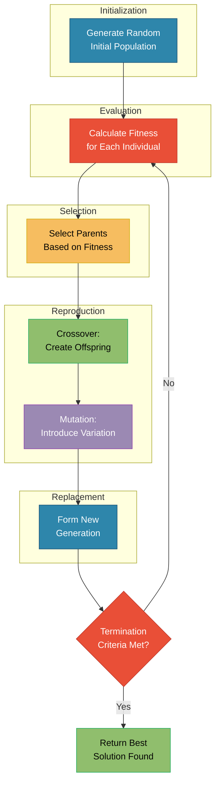

---

## 3. GA Parameters

For our example, we use:

| Parameter         |     Value      | Description              |
| :---------------- | :------------: | :----------------------- |
| Population Size   |    $N = 4$     | Number of individuals    |
| Chromosome Length |    $L = 5$     | Bits per individual      |
| Crossover Rate    |  $p_c = 0.8$   | Probability of crossover |
| Mutation Rate     |  $p_m = 0.1$   | Probability per bit      |
| Selection Method  | Roulette Wheel | Fitness-proportionate    |
| Crossover Type    |  Single-Point  | One crossover point      |
| Generations       |    $G = 3$     | Iterations to run        |

---

## 4. Generation 0: Initial Population

We randomly generate 4 individuals. The initial population matrix is:

$$\mathbf{P}_0 = \begin{bmatrix} 0 & 1 & 1 & 0 & 1 \\ 1 & 1 & 0 & 0 & 0 \\ 0 & 1 & 0 & 0 & 0 \\ 1 & 0 & 0 & 1 & 1 \end{bmatrix}$$

Each row represents one individual (chromosome):

|   Individual   | Chromosome |             Calculation             | Decimal $x$ |
| :------------: | :--------: | :---------------------------------: | :---------: |
| $\mathbf{c}_1$ |  `01101`   | $0(16) + 1(8) + 1(4) + 0(2) + 1(1)$ |   **13**    |
| $\mathbf{c}_2$ |  `11000`   | $1(16) + 1(8) + 0(4) + 0(2) + 0(1)$ |   **24**    |
| $\mathbf{c}_3$ |  `01000`   | $0(16) + 1(8) + 0(4) + 0(2) + 0(1)$ |    **8**    |
| $\mathbf{c}_4$ |  `10011`   | $1(16) + 0(8) + 0(4) + 1(2) + 1(1)$ |   **19**    |

---

## 5. Step 1: Fitness Evaluation

### Computing Fitness Values

For each individual, we calculate $f(x) = x^2$:

$$\mathbf{f} = \begin{bmatrix} f_1 \\ f_2 \\ f_3 \\ f_4 \end{bmatrix} = \begin{bmatrix} 13^2 \\ 24^2 \\ 8^2 \\ 19^2 \end{bmatrix} = \begin{bmatrix} 169 \\ 576 \\ 64 \\ 361 \end{bmatrix}$$

### Fitness Summary Table

|   Individual   | $x$ | $f(x) = x^2$ | Fitness |
| :------------: | :-: | :----------: | :-----: |
| $\mathbf{c}_1$ | 13  |    $13^2$    | **169** |
| $\mathbf{c}_2$ | 24  |    $24^2$    | **576** |
| $\mathbf{c}_3$ |  8  |    $8^2$     | **64**  |
| $\mathbf{c}_4$ | 19  |    $19^2$    | **361** |

### Population Statistics

$$\text{Total Fitness} = \sum_{i=1}^{4} f_i = 169 + 576 + 64 + 361 = \boxed{1170}$$

$$\text{Average Fitness} = \bar{f} = \frac{1170}{4} = \boxed{292.5}$$

$$\text{Best Fitness} = \max(f_i) = \boxed{576} \quad \text{(Individual } \mathbf{c}_2\text{)}$$

---

## 6. Step 2: Selection

We use **Roulette Wheel Selection** (fitness-proportionate selection).

### Selection Probability Calculation

The probability of selecting individual $i$ is:

$$p_i = \frac{f_i}{\sum_{j=1}^{N} f_j}$$

Calculating for each individual:

$$\mathbf{p} = \begin{bmatrix} p_1 \\ p_2 \\ p_3 \\ p_4 \end{bmatrix} = \begin{bmatrix} \frac{169}{1170} \\ \frac{576}{1170} \\ \frac{64}{1170} \\ \frac{361}{1170} \end{bmatrix} = \begin{bmatrix} 0.1444 \\ 0.4923 \\ 0.0547 \\ 0.3085 \end{bmatrix}$$

### Cumulative Probability Distribution

$$\mathbf{q} = \begin{bmatrix} q_1 \\ q_2 \\ q_3 \\ q_4 \end{bmatrix} = \begin{bmatrix} 0.1444 \\ 0.1444 + 0.4923 \\ 0.6367 + 0.0547 \\ 0.6914 + 0.3085 \end{bmatrix} = \begin{bmatrix} 0.1444 \\ 0.6367 \\ 0.6914 \\ 1.0000 \end{bmatrix}$$

### Roulette Wheel Visualization

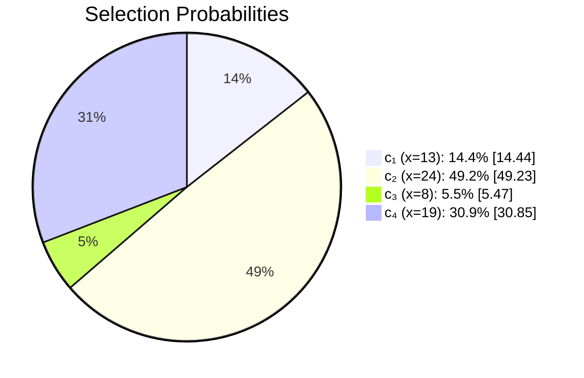

### Selection Process

We spin the roulette wheel 4 times with random numbers $r \in [0, 1]$:

| Spin | Random $r$ |    Selected    | Reason                      |
| :--: | :--------: | :------------: | :-------------------------- |
|  1   |    0.52    | $\mathbf{c}_2$ | $0.1444 < 0.52 \leq 0.6367$ |
|  2   |    0.18    | $\mathbf{c}_2$ | $0.1444 < 0.18 \leq 0.6367$ |
|  3   |    0.85    | $\mathbf{c}_4$ | $0.6914 < 0.85 \leq 1.0$    |
|  4   |    0.11    | $\mathbf{c}_1$ | $0 < 0.11 \leq 0.1444$      |

### Mating Pool

The selected parents (mating pool) are:

$$\mathbf{M} = \begin{bmatrix} 1 & 1 & 0 & 0 & 0 \\ 1 & 1 & 0 & 0 & 0 \\ 1 & 0 & 0 & 1 & 1 \\ 0 & 1 & 1 & 0 & 1 \end{bmatrix} = \begin{bmatrix} \mathbf{c}_2 \\ \mathbf{c}_2 \\ \mathbf{c}_4 \\ \mathbf{c}_1 \end{bmatrix}$$

| Position | Selected Individual | Chromosome | Decimal |
| :------: | :-----------------: | :--------: | :-----: |
|    1     |   $\mathbf{c}_2$    |  `11000`   |   24    |
|    2     |   $\mathbf{c}_2$    |  `11000`   |   24    |
|    3     |   $\mathbf{c}_4$    |  `10011`   |   19    |
|    4     |   $\mathbf{c}_1$    |  `01101`   |   13    |

> [!NOTE]
> Notice that $\mathbf{c}_2$ (highest fitness) was selected twice, while $\mathbf{c}_3$ (lowest fitness) was not selected at all. This is the "survival of the fittest" principle in action!

---

## 7. Step 3: Crossover

We pair parents and apply **single-point crossover** with probability $p_c = 0.8$.

### Pair 1: Parents $\mathbf{c}_2$ and $\mathbf{c}_2$

- **Random number:** $r_1 = 0.45 < 0.8$ → **Crossover occurs**
- **Crossover point:** Randomly selected position = **2** (after bit 2)

**Before Crossover:**
$$\text{Parent}_1: \underbrace{1 \, 1}_{\text{keep}} \, | \, \underbrace{0 \, 0 \, 0}_{\text{swap}}$$
$$\text{Parent}_2: \underbrace{1 \, 1}_{\text{keep}} \, | \, \underbrace{0 \, 0 \, 0}_{\text{swap}}$$

**After Crossover:**
$$\text{Offspring}_1: 1 \, 1 \, 0 \, 0 \, 0 \quad (x = 24)$$
$$\text{Offspring}_2: 1 \, 1 \, 0 \, 0 \, 0 \quad (x = 24)$$

> Since both parents are identical, offspring are also identical.

### Pair 2: Parents $\mathbf{c}_4$ and $\mathbf{c}_1$

- **Random number:** $r_2 = 0.62 < 0.8$ → **Crossover occurs**
- **Crossover point:** Randomly selected position = **3** (after bit 3)

**Before Crossover:**

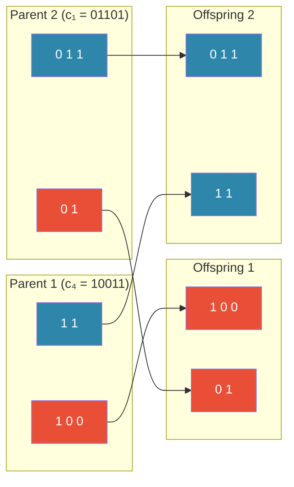

**Mathematical representation:**

$$\text{Parent}_1: \underbrace{1 \, 0 \, 0}_{\textcolor{red}{\text{keep}}} \, | \, \underbrace{1 \, 1}_{\textcolor{blue}{\text{swap}}}$$

$$\text{Parent}_2: \underbrace{0 \, 1 \, 1}_{\textcolor{blue}{\text{keep}}} \, | \, \underbrace{0 \, 1}_{\textcolor{red}{\text{swap}}}$$

**After Crossover:**

$$\text{Offspring}_3 = [1, 0, 0, 0, 1] \quad \Rightarrow \quad x = 16 + 1 = \boxed{17}$$

$$\text{Offspring}_4 = [0, 1, 1, 1, 1] \quad \Rightarrow \quad x = 8 + 4 + 2 + 1 = \boxed{15}$$

### Crossover Summary Table

| Pair |   Parent 1   |   Parent 2   | Point | Offspring 1  | Offspring 2  |
| :--: | :----------: | :----------: | :---: | :----------: | :----------: |
|  1   | `11000` (24) | `11000` (24) |   2   | `11000` (24) | `11000` (24) |
|  2   | `10011` (19) | `01101` (13) |   3   | `10001` (17) | `01111` (15) |

---

## 8. Step 4: Mutation

We apply **bit-flip mutation** with probability $p_m = 0.1$ per bit.

### Mutation Process

For each of the 20 bits (4 individuals × 5 bits), we generate a random number. If $r < 0.1$, we flip that bit.

**Offspring after crossover:**
$$\mathbf{O} = \begin{bmatrix} 1 & 1 & 0 & 0 & 0 \\ 1 & 1 & 0 & 0 & 0 \\ 1 & 0 & 0 & 0 & 1 \\ 0 & 1 & 1 & 1 & 1 \end{bmatrix}$$

**Random numbers for each bit:**

| Individual | Bit 1 | Bit 2 |  Bit 3  |  Bit 4  | Bit 5 |
| :--------: | :---: | :---: | :-----: | :-----: | :---: |
|     1      | 0.43  | 0.87  |  0.22   |  0.61   | 0.55  |
|     2      | 0.31  | 0.72  |  0.95   | 0.08 ⚡ | 0.48  |
|     3      | 0.66  | 0.14  | 0.03 ⚡ |  0.77   | 0.29  |
|     4      | 0.91  | 0.45  |  0.68   |  0.23   | 0.84  |

> ⚡ indicates $r < 0.1$ → mutation occurs!

### Applying Mutations

**Offspring 2, Bit 4:** $0 \rightarrow 1$
$$[1, 1, 0, \textcolor{red}{0}, 0] \rightarrow [1, 1, 0, \textcolor{green}{1}, 0]$$
$$x: 24 \rightarrow 26$$

**Offspring 3, Bit 3:** $0 \rightarrow 1$
$$[1, 0, \textcolor{red}{0}, 0, 1] \rightarrow [1, 0, \textcolor{green}{1}, 0, 1]$$
$$x: 17 \rightarrow 21$$

### Mutation Summary

| Offspring | Before Mutation | After Mutation | $x$ Before | $x$ After |
| :-------: | :-------------: | :------------: | :--------: | :-------: |
|     1     |     `11000`     |    `11000`     |     24     |    24     |
|     2     |     `11000`     |    `11010`     |     24     |  **26**   |
|     3     |     `10001`     |    `10101`     |     17     |  **21**   |
|     4     |     `01111`     |    `01111`     |     15     |    15     |

---

## 9. Generation 1: New Population

After selection, crossover, and mutation, the new population is:

$$\mathbf{P}_1 = \begin{bmatrix} 1 & 1 & 0 & 0 & 0 \\ 1 & 1 & 0 & 1 & 0 \\ 1 & 0 & 1 & 0 & 1 \\ 0 & 1 & 1 & 1 & 1 \end{bmatrix}$$

### Generation 1 Fitness Evaluation

|      Individual      | Chromosome | Decimal $x$ | Fitness $f(x) = x^2$ |
| :------------------: | :--------: | :---------: | :------------------: |
| $\mathbf{c}_1^{(1)}$ |  `11000`   |     24      |       **576**        |
| $\mathbf{c}_2^{(1)}$ |  `11010`   |     26      |       **676**        |
| $\mathbf{c}_3^{(1)}$ |  `10101`   |     21      |       **441**        |
| $\mathbf{c}_4^{(1)}$ |  `01111`   |     15      |       **225**        |

### Generation 1 Statistics

$$\text{Total Fitness} = 576 + 676 + 441 + 225 = \boxed{1918}$$

$$\text{Average Fitness} = \frac{1918}{4} = \boxed{479.5}$$

$$\text{Best Fitness} = \boxed{676} \quad \text{(Individual } \mathbf{c}_2^{(1)}, x=26\text{)}$$

> [!IMPORTANT] > **Improvement observed!**
>
> - Best fitness: $576 \rightarrow 676$ (+17.4%)
> - Average fitness: $292.5 \rightarrow 479.5$ (+63.9%)
> - The mutation on Offspring 2 created a better solution!

---

## 10. Generation 2: Second Iteration

### Selection Probabilities for Generation 1

$$\mathbf{p}^{(1)} = \begin{bmatrix} \frac{576}{1918} \\ \frac{676}{1918} \\ \frac{441}{1918} \\ \frac{225}{1918} \end{bmatrix} = \begin{bmatrix} 0.300 \\ 0.352 \\ 0.230 \\ 0.117 \end{bmatrix}$$

### Selection Results (Generation 1 → 2)

| Spin | Random $r$ |       Selected       | Original $x$ |
| :--: | :--------: | :------------------: | :----------: |
|  1   |    0.28    | $\mathbf{c}_1^{(1)}$ |      24      |
|  2   |    0.41    | $\mathbf{c}_2^{(1)}$ |      26      |
|  3   |    0.55    | $\mathbf{c}_2^{(1)}$ |      26      |
|  4   |    0.92    | $\mathbf{c}_3^{(1)}$ |      21      |

### Crossover (Generation 2)

**Pair 1:** `11000` (24) × `11010` (26) at point 4

- Offspring 1: `11011` → $x = 27$
- Offspring 2: `11001` → $x = 25$

**Pair 2:** `11010` (26) × `10101` (21) at point 2

- Offspring 3: `11101` → $x = 29$
- Offspring 4: `10010` → $x = 18$

### Mutation (Generation 2)

Assume one mutation: Offspring 3, Bit 5: `11101` → `11100` ($x = 28$)

### Generation 2 Final Population

$$\mathbf{P}_2 = \begin{bmatrix} 1 & 1 & 0 & 1 & 1 \\ 1 & 1 & 0 & 0 & 1 \\ 1 & 1 & 1 & 0 & 0 \\ 1 & 0 & 0 & 1 & 0 \end{bmatrix}$$

### Generation 2 Fitness

| Individual | Chromosome | $x$ | $f(x)$  |
| :--------: | :--------: | :-: | :-----: |
|     1      |  `11011`   | 27  | **729** |
|     2      |  `11001`   | 25  | **625** |
|     3      |  `11100`   | 28  | **784** |
|     4      |  `10010`   | 18  | **324** |

$$\text{Best Fitness} = \boxed{784} \quad (x = 28)$$

$$\text{Average Fitness} = \frac{729 + 625 + 784 + 324}{4} = \boxed{615.5}$$

---

## 11. Convergence Analysis

### Fitness Progression Across Generations

| Generation | Best Fitness | Best $x$ | Average Fitness | Improvement |
| :--------: | :----------: | :------: | :-------------: | :---------: |
|     0      |     576      |    24    |      292.5      |      —      |
|     1      |     676      |    26    |      479.5      |   +17.4%    |
|     2      |     784      |    28    |      615.5      |   +16.0%    |

### Convergence Visualization

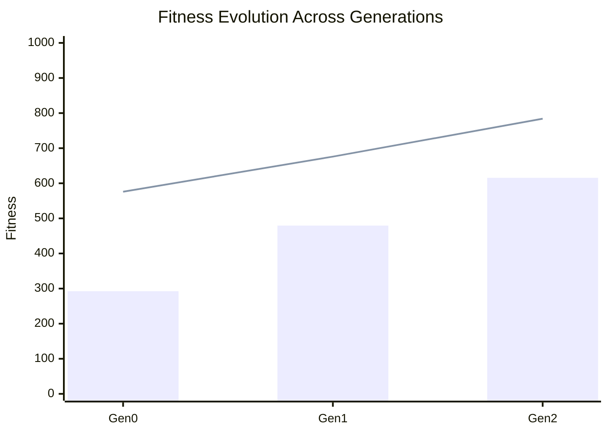

### Distance to Optimal Solution

The optimal solution is $x^* = 31$ with $f(x^*) = 961$.

| Generation | Best $x$ | Gap to Optimal |    Fitness Gap    |
| :--------: | :------: | :------------: | :---------------: |
|     0      |    24    | $31 - 24 = 7$  | $961 - 576 = 385$ |
|     1      |    26    | $31 - 26 = 5$  | $961 - 676 = 285$ |
|     2      |    28    | $31 - 28 = 3$  | $961 - 784 = 177$ |

> [!TIP]
> The algorithm is steadily converging toward the optimal solution. With more generations, it would likely find $x = 31$.

---

# Genetic Programming: A Complete Numerical Example

**Genetic Programming (GP)** evolves _programs_ (typically represented as trees) rather than fixed-length bit strings. This section demonstrates GP through a **symbolic regression** example.

---

## 12. GP Problem Definition

### Objective

Find a mathematical expression that best fits the target function:

$$f(x) = x^2 + 2x + 1$$

We have 5 training data points:

| $x$ | $y = f(x)$ |
| :-: | :--------: |
| -2  |     1      |
| -1  |     0      |
|  0  |     1      |
|  1  |     4      |
|  2  |     9      |

### Function and Terminal Sets

| Set           | Elements           | Description                  |
| :------------ | :----------------- | :--------------------------- |
| **Functions** | $\{+, -, \times\}$ | Binary operators (arity = 2) |
| **Terminals** | $\{x, 1, 2\}$      | Variables and constants      |

---

## 13. Tree Representation

Programs are represented as **expression trees** where:

- **Internal nodes** = functions (operators)
- **Leaf nodes** = terminals (variables/constants)

### Example Tree for $(x + 1) \times (x + 1)$

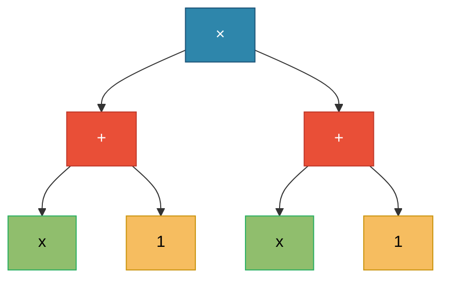

This tree evaluates to: $(x + 1) \times (x + 1) = x^2 + 2x + 1$ ✓

---

## 14. GP Parameters

| Parameter       | Value                    |
| :-------------- | :----------------------- |
| Population Size | $N = 4$                  |
| Max Depth       | 3                        |
| Crossover Rate  | $p_c = 0.9$              |
| Mutation Rate   | $p_m = 0.1$              |
| Selection       | Tournament (size 2)      |
| Fitness         | Mean Squared Error (MSE) |

---

## 15. Generation 0: Initial Population

We randomly generate 4 expression trees:

### Tree 1: $x + 2$

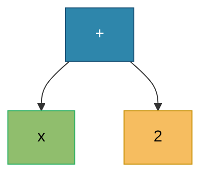

### Tree 2: $x \times x$

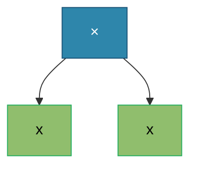

### Tree 3: $(x + 1) \times 2$

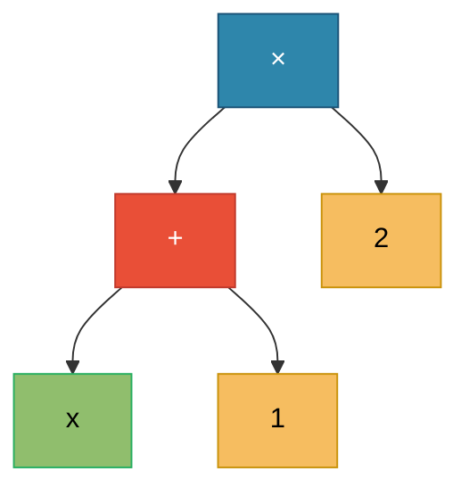

### Tree 4: $x - 1$

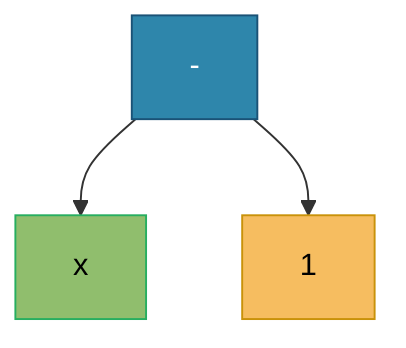

---

## 16. Fitness Evaluation

### Fitness Function: Mean Squared Error (MSE)

$$\text{MSE} = \frac{1}{n} \sum_{i=1}^{n} (y_i - \hat{y}_i)^2$$

Lower MSE = better fitness. We use **adjusted fitness**: $f_{adj} = \frac{1}{1 + \text{MSE}}$

### Tree 1: $\hat{y} = x + 2$

Predictions: $\mathbf{\hat{y}}_1 = [0, 1, 2, 3, 4]$

Target: $\mathbf{y} = [1, 0, 1, 4, 9]$

$$\text{MSE}_1 = \frac{(1-0)^2 + (0-1)^2 + (1-2)^2 + (4-3)^2 + (9-4)^2}{5} = \frac{1+1+1+1+25}{5} = \boxed{5.8}$$

### Tree 2: $\hat{y} = x \times x = x^2$

Predictions: $\mathbf{\hat{y}}_2 = [4, 1, 0, 1, 4]$

$$\text{MSE}_2 = \frac{(1-4)^2 + (0-1)^2 + (1-0)^2 + (4-1)^2 + (9-4)^2}{5} = \frac{9+1+1+9+25}{5} = \boxed{9.0}$$

### Tree 3: $\hat{y} = (x+1) \times 2 = 2x + 2$

Predictions: $\mathbf{\hat{y}}_3 = [-2, 0, 2, 4, 6]$

$$\text{MSE}_3 = \frac{(1-(-2))^2 + (0-0)^2 + (1-2)^2 + (4-4)^2 + (9-6)^2}{5} = \frac{9+0+1+0+9}{5} = \boxed{3.8}$$

### Tree 4: $\hat{y} = x - 1$

Predictions: $\mathbf{\hat{y}}_4 = [-3, -2, -1, 0, 1]$

$$\text{MSE}_4 = \frac{(1-(-3))^2 + (0-(-2))^2 + (1-(-1))^2 + (4-0)^2 + (9-1)^2}{5} = \frac{16+4+4+16+64}{5} = \boxed{20.8}$$

### Fitness Summary

| Tree | Expression | MSE  | Adjusted Fitness | Rank  |
| :--: | :--------- | :--: | :--------------: | :---: |
|  1   | $x + 2$    | 5.8  |      0.147       |   2   |
|  2   | $x^2$      | 9.0  |      0.100       |   3   |
|  3   | $2x + 2$   | 3.8  |      0.208       | **1** |
|  4   | $x - 1$    | 20.8 |      0.046       |   4   |

Tree 3 has the **best fitness** (lowest MSE).

---

## 17. Selection: Tournament Selection

With tournament size $k = 2$:

1. Randomly select 2 individuals
2. Choose the one with better fitness
3. Repeat to fill mating pool

| Tournament |   Competitors    |          Winner          |
| :--------: | :--------------: | :----------------------: |
|     1      | Tree 1 vs Tree 4 | Tree 1 (MSE: 5.8 < 20.8) |
|     2      | Tree 2 vs Tree 3 | Tree 3 (MSE: 3.8 < 9.0)  |
|     3      | Tree 1 vs Tree 3 | Tree 3 (MSE: 3.8 < 5.8)  |
|     4      | Tree 2 vs Tree 4 | Tree 2 (MSE: 9.0 < 20.8) |

**Mating Pool:** [Tree 1, Tree 3, Tree 3, Tree 2]

---

## 18. Crossover: Subtree Exchange

Select random subtrees from two parents and swap them.

### Crossover: Tree 1 × Tree 3

**Parent 1:** $x + 2$ — select subtree `2`  
**Parent 2:** $(x + 1) \times 2$ — select subtree `(x + 1)`

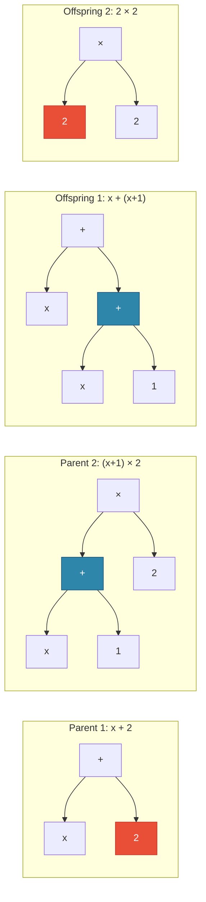

**Offspring 1:** $x + (x + 1) = 2x + 1$  
**Offspring 2:** $2 \times 2 = 4$ (constant)

---

## 19. Mutation: Subtree Replacement

Replace a random subtree with a newly generated random subtree.

### Mutation on Offspring 1

**Original:** $x + (x + 1) = 2x + 1$

**Mutation:** Replace terminal `1` with `x`

**Result:** $x + (x + x) = 3x$

---

## 20. Generation 1: New Population

After crossover and mutation, the new population is:

### Tree 1': $2x + 1$

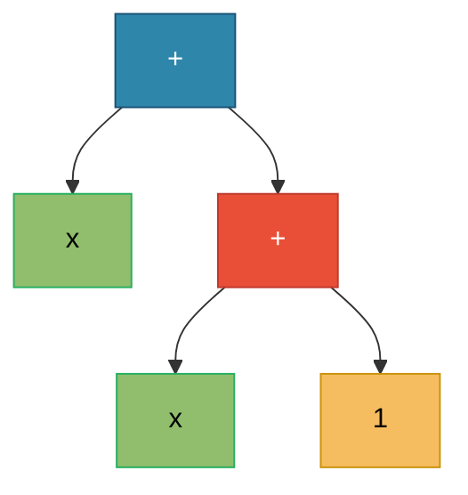

### Tree 2': $4$ (constant)

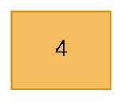

### Tree 3': $x^2$

### Tree 4': $(x+1) \times 2$

### Generation 1 Fitness

| Tree | Expression       | Predictions $\mathbf{\hat{y}}$ |   MSE   |
| :--: | :--------------- | :----------------------------- | :-----: |
|  1'  | $2x + 1$         | $[-3, -1, 1, 3, 5]$            |   6.8   |
|  2'  | $4$              | $[4, 4, 4, 4, 4]$              |  11.8   |
|  3'  | $x^2$            | $[4, 1, 0, 1, 4]$              |   9.0   |
|  4'  | $(x+1) \times 2$ | $[-2, 0, 2, 4, 6]$             | **3.8** |

**Best:** Tree 4' with MSE = 3.8

---

## 21. Generation 2: Evolution Continues

### Tournament Selection (Gen 1 → Gen 2)

| Tournament |    Competitors     |       Winner       |
| :--------: | :----------------: | :----------------: |
|     1      | Tree 3' vs Tree 4' | Tree 4' (MSE: 3.8) |
|     2      | Tree 1' vs Tree 2' | Tree 1' (MSE: 6.8) |
|     3      | Tree 4' vs Tree 1' | Tree 4' (MSE: 3.8) |
|     4      | Tree 3' vs Tree 2' | Tree 3' (MSE: 9.0) |

**Mating Pool:** [Tree 4', Tree 1', Tree 4', Tree 3']

### Crossover: Tree 4' × Tree 3'

**Parent 1:** $(x+1) \times 2$ — select subtree `2`  
**Parent 2:** $x \times x$ — select subtree `x` (right child)

**Offspring 1:** $(x+1) \times x$

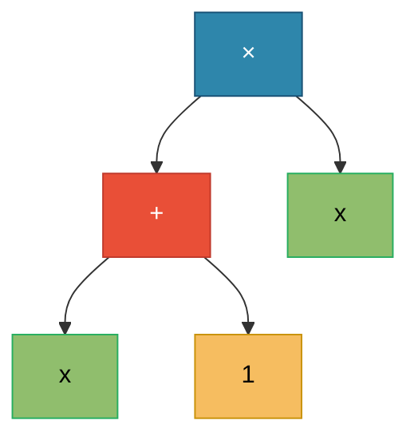

Evaluates to: $(x+1) \times x = x^2 + x$

### Generation 2 Population

| Tree | Expression       |   MSE   |
| :--: | :--------------- | :-----: |
| 1''  | $(x+1) \times x$ | **3.0** |
| 2''  | $(x+1) \times 2$ |   3.8   |
| 3''  | $x^2$            |   9.0   |
| 4''  | $2x + 1$         |   6.8   |

**Best:** Tree 1'' with MSE = 3.0 (improved from 3.8)

---

## 22. Generation 3: Finding the Solution

### Tournament Selection (Gen 2 → Gen 3)

| Tournament |     Competitors      |       Winner        |
| :--------: | :------------------: | :-----------------: |
|     1      | Tree 1'' vs Tree 3'' | Tree 1'' (MSE: 3.0) |
|     2      | Tree 2'' vs Tree 4'' | Tree 2'' (MSE: 3.8) |
|     3      | Tree 1'' vs Tree 2'' | Tree 1'' (MSE: 3.0) |
|     4      | Tree 1'' vs Tree 4'' | Tree 1'' (MSE: 3.0) |

**Mating Pool:** [Tree 1'', Tree 2'', Tree 1'', Tree 1'']

### Crossover: Tree 1'' × Tree 2''

**Parent 1:** $(x+1) \times x$  
**Parent 2:** $(x+1) \times 2$

**Crossover Operation:**

- From Parent 1: select the right subtree `x`
- From Parent 2: select the left subtree `(x+1)`
- Swap: Replace `x` in Parent 1 with `(x+1)` from Parent 2

Select subtree `x` from Parent 1 and subtree `(x+1)` from Parent 2:

**Offspring:** $(x+1) \times (x+1)$

This evaluates to: $(x+1)^2 = x^2 + 2x + 1$

### Fitness Evaluation: Perfect Match!

| $x$ | $\hat{y} = (x+1)^2$ | $y = x^2 + 2x + 1$ | $(y - \hat{y})^2$ |
| :-: | :-----------------: | :----------------: | :---------------: |
| -2  |          1          |         1          |         0         |
| -1  |          0          |         0          |         0         |
|  0  |          1          |         1          |         0         |
|  1  |          4          |         4          |         0         |
|  2  |          9          |         9          |         0         |

$$\text{MSE} = \frac{0 + 0 + 0 + 0 + 0}{5} = \boxed{0.0}$$

**Solution Found!** The tree $(x+1) \times (x+1)$ perfectly represents $f(x) = x^2 + 2x + 1$.

---

## 23. Evolution Summary

| Generation | Best Expression      | Best MSE | Improvement |
| :--------: | :------------------- | :------: | :---------: |
|     0      | $(x+1) \times 2$     |   3.8    |      —      |
|     1      | $(x+1) \times 2$     |   3.8    |     0%      |
|     2      | $(x+1) \times x$     |   3.0    |     21%     |
|     3      | $(x+1) \times (x+1)$ | **0.0**  |    100%     |

The algorithm discovered the exact target function $(x+1)^2 = x^2 + 2x + 1$ through:

1. Building blocks: $(x+1)$ subtrees preserved through selection
2. Crossover: Combined $(x+1)$ subtrees to form $(x+1) \times (x+1)$
3. Selection pressure: Lower-MSE individuals reproduced more

---

## 24. GP vs GA Comparison

| Aspect             | Genetic Algorithm          | Genetic Programming   |
| :----------------- | :------------------------- | :-------------------- |
| **Representation** | Fixed-length strings       | Variable-size trees   |
| **Search Space**   | Parameter values           | Program structures    |
| **Crossover**      | Point/uniform              | Subtree exchange      |
| **Mutation**       | Bit flip                   | Subtree replacement   |
| **Output**         | Optimal parameters         | Executable programs   |
| **Example**        | Find $x$ maximizing $f(x)$ | Find $f$ fitting data |

---

# Differential Evolution: A Complete Numerical Example

**Differential Evolution (DE)** is a population-based optimization algorithm for continuous spaces that uses vector differences for mutation. This section demonstrates DE through a **function minimization** example.

---

## 25. DE Problem Definition

### Objective

Find the values of $x_1$ and $x_2$ that **minimize** the **Sphere function**:

$$f(\mathbf{x}) = f(x_1, x_2) = x_1^2 + x_2^2$$

### Search Space

- $x_1 \in [-5, 5]$
- $x_2 \in [-5, 5]$

**Optimal Solution:** $\mathbf{x}^* = (0, 0)$ where $f(\mathbf{x}^*) = 0$

---

## 26. DE Algorithm Overview

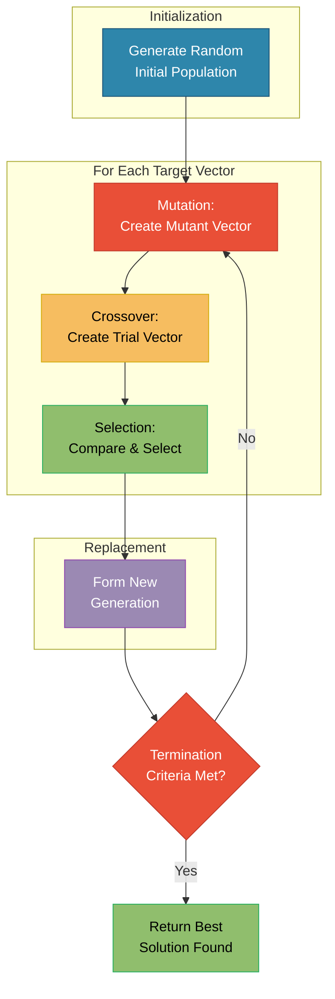

---

## 27. DE Parameters

| Parameter       | Symbol |   Value   | Description                                                           |
| :-------------- | :----: | :-------: | :-------------------------------------------------------------------- |
| Population Size |  $NP$  |     4     | Number of candidate solutions                                         |
| Dimensions      |  $D$   |     2     | Number of variables                                                   |
| Scaling Factor  |  $F$   |    0.8    | Mutation amplification                                                |
| Crossover Rate  |  $CR$  |    0.7    | Crossover probability                                                 |
| Strategy        |   —    | DE/rand/1 | $\mathbf{v} = \mathbf{x}_{r1} + F(\mathbf{x}_{r2} - \mathbf{x}_{r3})$ |

---

## 28. DE Generation 0: Initial Population

$$\mathbf{X}^{(0)} = \begin{bmatrix} 3.2 & -1.5 \\ -2.1 & 4.0 \\ 1.8 & 2.3 \\ -0.5 & -3.2 \end{bmatrix}$$

|   Individual   | $x_1$ | $x_2$ | $f(\mathbf{x}) = x_1^2 + x_2^2$ |
| :------------: | :---: | :---: | :-----------------------------: |
| $\mathbf{x}_1$ |  3.2  | -1.5  |            **12.49**            |
| $\mathbf{x}_2$ | -2.1  |  4.0  |            **20.41**            |
| $\mathbf{x}_3$ |  1.8  |  2.3  |            **8.53**             |
| $\mathbf{x}_4$ | -0.5  | -3.2  |            **10.49**            |

**Best:** $\mathbf{x}_3$ with $f = 8.53$

---

## 29. DE Mutation

For each target vector $\mathbf{x}_i$, create a mutant vector using **DE/rand/1**:

$$\mathbf{v}_i = \mathbf{x}_{r1} + F \cdot (\mathbf{x}_{r2} - \mathbf{x}_{r3})$$

where $r1 \neq r2 \neq r3 \neq i$ are randomly selected distinct indices.

---

### Mutant for $\mathbf{x}_1 = (3.2, -1.5)$

**Step 1:** Randomly select $r1=3$, $r2=2$, $r3=4$

**Step 2:** Compute difference vector:
$$\mathbf{x}_2 - \mathbf{x}_4 = \begin{bmatrix} -2.1 \\ 4.0 \end{bmatrix} - \begin{bmatrix} -0.5 \\ -3.2 \end{bmatrix} = \begin{bmatrix} -1.6 \\ 7.2 \end{bmatrix}$$

**Step 3:** Scale by $F = 0.8$:
$$F \cdot (\mathbf{x}_2 - \mathbf{x}_4) = 0.8 \times \begin{bmatrix} -1.6 \\ 7.2 \end{bmatrix} = \begin{bmatrix} -1.28 \\ 5.76 \end{bmatrix}$$

**Step 4:** Add to base vector $\mathbf{x}_3$:
$$\mathbf{v}_1 = \begin{bmatrix} 1.8 \\ 2.3 \end{bmatrix} + \begin{bmatrix} -1.28 \\ 5.76 \end{bmatrix} = \begin{bmatrix} 0.52 \\ 8.06 \end{bmatrix}$$

**Step 5:** Boundary check: $x_2 = 8.06 > 5$ → clamp to 5.0

$$\boxed{\mathbf{v}_1 = (0.52, 5.0)}$$

---

### Mutant for $\mathbf{x}_2 = (-2.1, 4.0)$

**Indices:** $r1=1$, $r2=4$, $r3=3$

$$\mathbf{v}_2 = \mathbf{x}_1 + F \cdot (\mathbf{x}_4 - \mathbf{x}_3)$$

$$\mathbf{v}_2 = \begin{bmatrix} 3.2 \\ -1.5 \end{bmatrix} + 0.8 \times \left( \begin{bmatrix} -0.5 \\ -3.2 \end{bmatrix} - \begin{bmatrix} 1.8 \\ 2.3 \end{bmatrix} \right)$$

$$= \begin{bmatrix} 3.2 \\ -1.5 \end{bmatrix} + 0.8 \times \begin{bmatrix} -2.3 \\ -5.5 \end{bmatrix} = \begin{bmatrix} 3.2 \\ -1.5 \end{bmatrix} + \begin{bmatrix} -1.84 \\ -4.4 \end{bmatrix} = \begin{bmatrix} 1.36 \\ -5.9 \end{bmatrix}$$

**Boundary check:** $x_2 = -5.9 < -5$ → clamp to -5.0

$$\boxed{\mathbf{v}_2 = (1.36, -5.0)}$$

---

### Mutant for $\mathbf{x}_3 = (1.8, 2.3)$

**Indices:** $r1=4$, $r2=1$, $r3=2$

$$\mathbf{v}_3 = \mathbf{x}_4 + F \cdot (\mathbf{x}_1 - \mathbf{x}_2)$$

$$\mathbf{v}_3 = \begin{bmatrix} -0.5 \\ -3.2 \end{bmatrix} + 0.8 \times \left( \begin{bmatrix} 3.2 \\ -1.5 \end{bmatrix} - \begin{bmatrix} -2.1 \\ 4.0 \end{bmatrix} \right)$$

$$= \begin{bmatrix} -0.5 \\ -3.2 \end{bmatrix} + 0.8 \times \begin{bmatrix} 5.3 \\ -5.5 \end{bmatrix} = \begin{bmatrix} -0.5 \\ -3.2 \end{bmatrix} + \begin{bmatrix} 4.24 \\ -4.4 \end{bmatrix} = \begin{bmatrix} 3.74 \\ -7.6 \end{bmatrix}$$

**Boundary check:** $x_2 = -7.6 < -5$ → clamp to -5.0

$$\boxed{\mathbf{v}_3 = (3.74, -5.0)}$$

---

### Mutant for $\mathbf{x}_4 = (-0.5, -3.2)$

**Indices:** $r1=2$, $r2=3$, $r3=1$

$$\mathbf{v}_4 = \mathbf{x}_2 + F \cdot (\mathbf{x}_3 - \mathbf{x}_1)$$

$$\mathbf{v}_4 = \begin{bmatrix} -2.1 \\ 4.0 \end{bmatrix} + 0.8 \times \left( \begin{bmatrix} 1.8 \\ 2.3 \end{bmatrix} - \begin{bmatrix} 3.2 \\ -1.5 \end{bmatrix} \right)$$

$$= \begin{bmatrix} -2.1 \\ 4.0 \end{bmatrix} + 0.8 \times \begin{bmatrix} -1.4 \\ 3.8 \end{bmatrix} = \begin{bmatrix} -2.1 \\ 4.0 \end{bmatrix} + \begin{bmatrix} -1.12 \\ 3.04 \end{bmatrix} = \begin{bmatrix} -3.22 \\ 7.04 \end{bmatrix}$$

**Boundary check:** $x_2 = 7.04 > 5$ → clamp to 5.0

$$\boxed{\mathbf{v}_4 = (-3.22, 5.0)}$$

---

### Mutation Summary (Generation 0 → 1)

|     Target     | $r1, r2, r3$ | Mutant Vector  | Clamped? |
| :------------: | :----------: | :------------: | :------: |
| $\mathbf{x}_1$ |   3, 2, 4    | $(0.52, 5.0)$  |   Yes    |
| $\mathbf{x}_2$ |   1, 4, 3    | $(1.36, -5.0)$ |   Yes    |
| $\mathbf{x}_3$ |   4, 1, 2    | $(3.74, -5.0)$ |   Yes    |
| $\mathbf{x}_4$ |   2, 3, 1    | $(-3.22, 5.0)$ |   Yes    |

---

## 30. DE Crossover

For each dimension $j$, decide whether to take from mutant or target:

$$u_{i,j} = \begin{cases} v_{i,j} & \text{if } rand_j < CR \text{ or } j = j_{rand} \\ x_{i,j} & \text{otherwise} \end{cases}$$

where $CR = 0.7$ and $j_{rand}$ ensures at least one component from mutant.

---

### Trial Vector for $\mathbf{x}_1$

**Target:** $(3.2, -1.5)$, **Mutant:** $(0.52, 5.0)$, **$j_{rand}=1$**

| Component | Target | Mutant | $rand_j$ | $rand_j < 0.7$? | $j = j_{rand}$? | Source |  Trial   |
| :-------: | :----: | :----: | :------: | :-------------: | :-------------: | :----: | :------: |
|   $x_1$   |  3.2   |  0.52  |   0.45   |       Yes       |       Yes       | Mutant | **0.52** |
|   $x_2$   |  -1.5  |  5.0   |   0.82   |       No        |       No        | Target | **-1.5** |

$$\boxed{\mathbf{u}_1 = (0.52, -1.5)}$$

---

### Trial Vector for $\mathbf{x}_2$

**Target:** $(-2.1, 4.0)$, **Mutant:** $(1.36, -5.0)$, **$j_{rand}=2$**

| Component | Target | Mutant | $rand_j$ | $rand_j < 0.7$? | $j = j_{rand}$? | Source |  Trial   |
| :-------: | :----: | :----: | :------: | :-------------: | :-------------: | :----: | :------: |
|   $x_1$   |  -2.1  |  1.36  |   0.35   |       Yes       |       No        | Mutant | **1.36** |
|   $x_2$   |  4.0   |  -5.0  |   0.61   |       Yes       |       Yes       | Mutant | **-5.0** |

$$\boxed{\mathbf{u}_2 = (1.36, -5.0)}$$

---

### Trial Vector for $\mathbf{x}_3$

**Target:** $(1.8, 2.3)$, **Mutant:** $(3.74, -5.0)$, **$j_{rand}=1$**

| Component | Target | Mutant | $rand_j$ | $rand_j < 0.7$? | $j = j_{rand}$? | Source |  Trial   |
| :-------: | :----: | :----: | :------: | :-------------: | :-------------: | :----: | :------: |
|   $x_1$   |  1.8   |  3.74  |   0.55   |       Yes       |       Yes       | Mutant | **3.74** |
|   $x_2$   |  2.3   |  -5.0  |   0.91   |       No        |       No        | Target | **2.3**  |

$$\boxed{\mathbf{u}_3 = (3.74, 2.3)}$$

---

### Trial Vector for $\mathbf{x}_4$

**Target:** $(-0.5, -3.2)$, **Mutant:** $(-3.22, 5.0)$, **$j_{rand}=2$**

| Component | Target | Mutant | $rand_j$ | $rand_j < 0.7$? | $j = j_{rand}$? | Source |   Trial   |
| :-------: | :----: | :----: | :------: | :-------------: | :-------------: | :----: | :-------: |
|   $x_1$   |  -0.5  | -3.22  |   0.23   |       Yes       |       No        | Mutant | **-3.22** |
|   $x_2$   |  -3.2  |  5.0   |   0.68   |       Yes       |       Yes       | Mutant |  **5.0**  |

$$\boxed{\mathbf{u}_4 = (-3.22, 5.0)}$$

---

### Crossover Summary

| Ind | Target $\mathbf{x}$ | Mutant $\mathbf{v}$ | Trial $\mathbf{u}$ |
| :-: | :-----------------: | :-----------------: | :----------------: |
|  1  |    $(3.2, -1.5)$    |    $(0.52, 5.0)$    |   $(0.52, -1.5)$   |
|  2  |    $(-2.1, 4.0)$    |   $(1.36, -5.0)$    |   $(1.36, -5.0)$   |
|  3  |    $(1.8, 2.3)$     |   $(3.74, -5.0)$    |   $(3.74, 2.3)$    |
|  4  |   $(-0.5, -3.2)$    |   $(-3.22, 5.0)$    |   $(-3.22, 5.0)$   |

---

## 31. DE Selection

Compare each trial vector against its target. The one with **lower fitness** survives (minimization).

---

### Selection for Individual 1

**Target:** $\mathbf{x}_1 = (3.2, -1.5)$
$$f(\mathbf{x}_1) = 3.2^2 + (-1.5)^2 = 10.24 + 2.25 = 12.49$$

**Trial:** $\mathbf{u}_1 = (0.52, -1.5)$
$$f(\mathbf{u}_1) = 0.52^2 + (-1.5)^2 = 0.27 + 2.25 = 2.52$$

$$f(\mathbf{u}_1) = 2.52 < f(\mathbf{x}_1) = 12.49 \implies \boxed{\text{Trial wins!}}$$

---

### Selection for Individual 2

**Target:** $\mathbf{x}_2 = (-2.1, 4.0)$
$$f(\mathbf{x}_2) = (-2.1)^2 + 4.0^2 = 4.41 + 16.0 = 20.41$$

**Trial:** $\mathbf{u}_2 = (1.36, -5.0)$
$$f(\mathbf{u}_2) = 1.36^2 + (-5.0)^2 = 1.85 + 25.0 = 26.85$$

$$f(\mathbf{u}_2) = 26.85 > f(\mathbf{x}_2) = 20.41 \implies \boxed{\text{Target wins!}}$$

---

### Selection for Individual 3

**Target:** $\mathbf{x}_3 = (1.8, 2.3)$
$$f(\mathbf{x}_3) = 1.8^2 + 2.3^2 = 3.24 + 5.29 = 8.53$$

**Trial:** $\mathbf{u}_3 = (3.74, 2.3)$
$$f(\mathbf{u}_3) = 3.74^2 + 2.3^2 = 13.99 + 5.29 = 19.28$$

$$f(\mathbf{u}_3) = 19.28 > f(\mathbf{x}_3) = 8.53 \implies \boxed{\text{Target wins!}}$$

---

### Selection for Individual 4

**Target:** $\mathbf{x}_4 = (-0.5, -3.2)$
$$f(\mathbf{x}_4) = (-0.5)^2 + (-3.2)^2 = 0.25 + 10.24 = 10.49$$

**Trial:** $\mathbf{u}_4 = (-3.22, 5.0)$
$$f(\mathbf{u}_4) = (-3.22)^2 + 5.0^2 = 10.37 + 25.0 = 35.37$$

$$f(\mathbf{u}_4) = 35.37 > f(\mathbf{x}_4) = 10.49 \implies \boxed{\text{Target wins!}}$$

---

### Selection Summary (Generation 0 → 1)

| Ind |     Target     |     Trial      | $f(\text{Target})$ | $f(\text{Trial})$ | Winner |    Survivor    |
| :-: | :------------: | :------------: | :----------------: | :---------------: | :----: | :------------: |
|  1  | $(3.2, -1.5)$  | $(0.52, -1.5)$ |       12.49        |     **2.52**      | Trial  | $(0.52, -1.5)$ |
|  2  | $(-2.1, 4.0)$  | $(1.36, -5.0)$ |     **20.41**      |       26.85       | Target | $(-2.1, 4.0)$  |
|  3  |  $(1.8, 2.3)$  | $(3.74, 2.3)$  |      **8.53**      |       19.28       | Target |  $(1.8, 2.3)$  |
|  4  | $(-0.5, -3.2)$ | $(-3.22, 5.0)$ |     **10.49**      |       35.37       | Target | $(-0.5, -3.2)$ |

---

## 32. DE Generation 1: New Population

$$\mathbf{X}^{(1)} = \begin{bmatrix} 0.52 & -1.5 \\ -2.1 & 4.0 \\ 1.8 & 2.3 \\ -0.5 & -3.2 \end{bmatrix}$$

|   Individual   | $x_1$ | $x_2$ | Fitness  | Change from Gen 0  |
| :------------: | :---: | :---: | :------: | :----------------: |
| $\mathbf{x}_1$ | 0.52  | -1.5  | **2.52** | ↓ 9.97 (improved!) |
| $\mathbf{x}_2$ | -2.1  |  4.0  |  20.41   |   0 (unchanged)    |
| $\mathbf{x}_3$ |  1.8  |  2.3  |   8.53   |   0 (unchanged)    |
| $\mathbf{x}_4$ | -0.5  | -3.2  |  10.49   |   0 (unchanged)    |

**Generation 1 Best:** $\mathbf{x}_1 = (0.52, -1.5)$ with $f = 2.52$

**Improvement:** From $f = 8.53$ (Gen 0) to $f = 2.52$ (Gen 1) = **70% reduction!**

---

## 33. DE Generation 2: Second Iteration

Apply mutation → crossover → selection to Generation 1 population.

### Mutation (Gen 1 → Gen 2)

|     Target     | $r1, r2, r3$ | Formula                                           | Mutant (clamped) |
| :------------: | :----------: | :------------------------------------------------ | :--------------: |
| $\mathbf{x}_1$ |   2, 3, 4    | $\mathbf{x}_2 + 0.8(\mathbf{x}_3 - \mathbf{x}_4)$ |  $(-0.26, 5.0)$  |
| $\mathbf{x}_2$ |   1, 4, 3    | $\mathbf{x}_1 + 0.8(\mathbf{x}_4 - \mathbf{x}_3)$ | $(-1.32, -5.0)$  |
| $\mathbf{x}_3$ |   4, 2, 1    | $\mathbf{x}_4 + 0.8(\mathbf{x}_2 - \mathbf{x}_1)$ |  $(-2.60, 1.2)$  |
| $\mathbf{x}_4$ |   3, 1, 2    | $\mathbf{x}_3 + 0.8(\mathbf{x}_1 - \mathbf{x}_2)$ |  $(3.90, -2.1)$  |

### Crossover (Gen 1 → Gen 2)

| Ind |     Target     |     Mutant      |      Trial      |
| :-: | :------------: | :-------------: | :-------------: |
|  1  | $(0.52, -1.5)$ | $(-0.26, 5.0)$  | $(-0.26, -1.5)$ |
|  2  | $(-2.1, 4.0)$  | $(-1.32, -5.0)$ | $(-1.32, -5.0)$ |
|  3  |  $(1.8, 2.3)$  | $(-2.60, 1.2)$  | $(-2.60, 2.3)$  |
|  4  | $(-0.5, -3.2)$ | $(3.90, -2.1)$  | $(3.90, -3.2)$  |

### Selection (Gen 1 → Gen 2)

| Ind |     Target     | $f(\text{Target})$ |      Trial      | $f(\text{Trial})$ | Winner |    Survivor     |
| :-: | :------------: | :----------------: | :-------------: | :---------------: | :----: | :-------------: |
|  1  | $(0.52, -1.5)$ |        2.52        | $(-0.26, -1.5)$ |     **2.32**      | Trial  | $(-0.26, -1.5)$ |
|  2  | $(-2.1, 4.0)$  |     **20.41**      | $(-1.32, -5.0)$ |       26.74       | Target |  $(-2.1, 4.0)$  |
|  3  |  $(1.8, 2.3)$  |      **8.53**      | $(-2.60, 2.3)$  |       12.05       | Target |  $(1.8, 2.3)$   |
|  4  | $(-0.5, -3.2)$ |     **10.49**      | $(3.90, -3.2)$  |       25.45       | Target | $(-0.5, -3.2)$  |

### Generation 2 Population

$$\mathbf{X}^{(2)} = \begin{bmatrix} -0.26 & -1.5 \\ -2.1 & 4.0 \\ 1.8 & 2.3 \\ -0.5 & -3.2 \end{bmatrix}$$

**Generation 2 Best:** $\mathbf{x}_1 = (-0.26, -1.5)$ with $f = 2.32$

---

## 35. DE Generation 3: Third Iteration

Apply mutation → crossover → selection to Generation 2 population.

### Mutation (Gen 2 → Gen 3)

|     Target     | $r1, r2, r3$ | Formula                                           |          Mutant (clamped)          |
| :------------: | :----------: | :------------------------------------------------ | :--------------------------------: |
| $\mathbf{x}_1$ |   3, 4, 2    | $\mathbf{x}_3 + 0.8(\mathbf{x}_4 - \mathbf{x}_2)$ |          $(3.08, -3.46)$           |
| $\mathbf{x}_2$ |   4, 1, 3    | $\mathbf{x}_4 + 0.8(\mathbf{x}_1 - \mathbf{x}_3)$ | $(-2.15, -6.24)$ → $(-2.15, -5.0)$ |
| $\mathbf{x}_3$ |   1, 2, 4    | $\mathbf{x}_1 + 0.8(\mathbf{x}_2 - \mathbf{x}_4)$ |          $(-1.54, 4.26)$           |
| $\mathbf{x}_4$ |   2, 3, 1    | $\mathbf{x}_2 + 0.8(\mathbf{x}_3 - \mathbf{x}_1)$ |  $(-0.45, 7.04)$ → $(-0.45, 5.0)$  |

### Crossover (Gen 2 → Gen 3)

| Ind |     Target      |     Mutant      |      Trial      |
| :-: | :-------------: | :-------------: | :-------------: |
|  1  | $(-0.26, -1.5)$ | $(3.08, -3.46)$ | $(3.08, -1.5)$  |
|  2  |  $(-2.1, 4.0)$  | $(-2.15, -5.0)$ | $(-2.15, -5.0)$ |
|  3  |  $(1.8, 2.3)$   | $(-1.54, 4.26)$ | $(-1.54, 2.3)$  |
|  4  | $(-0.5, -3.2)$  | $(-0.45, 5.0)$  | $(-0.45, -3.2)$ |

### Selection (Gen 2 → Gen 3)

| Ind |     Target      | $f(\text{Target})$ |      Trial      | $f(\text{Trial})$ |   Winner   |    Survivor     |
| :-: | :-------------: | :----------------: | :-------------: | :---------------: | :--------: | :-------------: |
|  1  | $(-0.26, -1.5)$ |        2.32        | $(3.08, -1.5)$  |       11.74       | **Target** | $(-0.26, -1.5)$ |
|  2  |  $(-2.1, 4.0)$  |     **20.41**      | $(-2.15, -5.0)$ |       29.62       |   Target   |  $(-2.1, 4.0)$  |
|  3  |  $(1.8, 2.3)$   |      **8.53**      | $(-1.54, 2.3)$  |       7.66        | **Trial**  | $(-1.54, 2.3)$  |
|  4  | $(-0.5, -3.2)$  |     **10.49**      | $(-0.45, -3.2)$ |       10.44       | **Trial**  | $(-0.45, -3.2)$ |

### Generation 3 Population

$$\mathbf{X}^{(3)} = \begin{bmatrix} -0.26 & -1.5 \\ -2.1 & 4.0 \\ -1.54 & 2.3 \\ -0.45 & -3.2 \end{bmatrix}$$

|   Individual   | $x_1$ | $x_2$ |  Fitness  | Change from Gen 2  |
| :------------: | :---: | :---: | :-------: | :----------------: |
| $\mathbf{x}_1$ | -0.26 | -1.5  | **2.32**  |   0 (unchanged)    |
| $\mathbf{x}_2$ | -2.1  |  4.0  |   20.41   |   0 (unchanged)    |
| $\mathbf{x}_3$ | -1.54 |  2.3  | **7.66**  | ↓ 0.87 (improved!) |
| $\mathbf{x}_4$ | -0.45 | -3.2  | **10.44** | ↓ 0.05 (improved!) |

**Generation 3 Best:** $\mathbf{x}_1 = (-0.26, -1.5)$ with $f = 2.32$ (still best overall)

---

## 36. DE Convergence Analysis

### Evolution Summary

| Generation | Best Individual |   Best Vector   | Best Fitness | Avg Fitness | Improvement |
| :--------: | :-------------: | :-------------: | :----------: | :---------: | :---------: |
|     0      | $\mathbf{x}_3$  |  $(1.8, 2.3)$   |     8.53     |    12.98    |      —      |
|     1      | $\mathbf{x}_1$  | $(0.52, -1.5)$  |     2.52     |    10.49    |     70%     |
|     2      | $\mathbf{x}_1$  | $(-0.26, -1.5)$ |     2.32     |    10.44    |     73%     |
|     3      | $\mathbf{x}_1$  | $(-0.26, -1.5)$ |     2.32     |    10.21    |     73%     |

### Distance to Optimum $(0, 0)$

| Generation |   Best Vector   |   Distance $\|\mathbf{x}\|$    | Fitness |
| :--------: | :-------------: | :----------------------------: | :-----: |
|     0      |  $(1.8, 2.3)$   | $\sqrt{1.8^2 + 2.3^2} = 2.92$  |  8.53   |
|     1      | $(0.52, -1.5)$  | $\sqrt{0.52^2 + 1.5^2} = 1.59$ |  2.52   |
|     2      | $(-0.26, -1.5)$ | $\sqrt{0.26^2 + 1.5^2} = 1.52$ |  2.32   |
|     3      | $(-0.26, -1.5)$ | $\sqrt{0.26^2 + 1.5^2} = 1.52$ |  2.32   |

### Convergence Chart

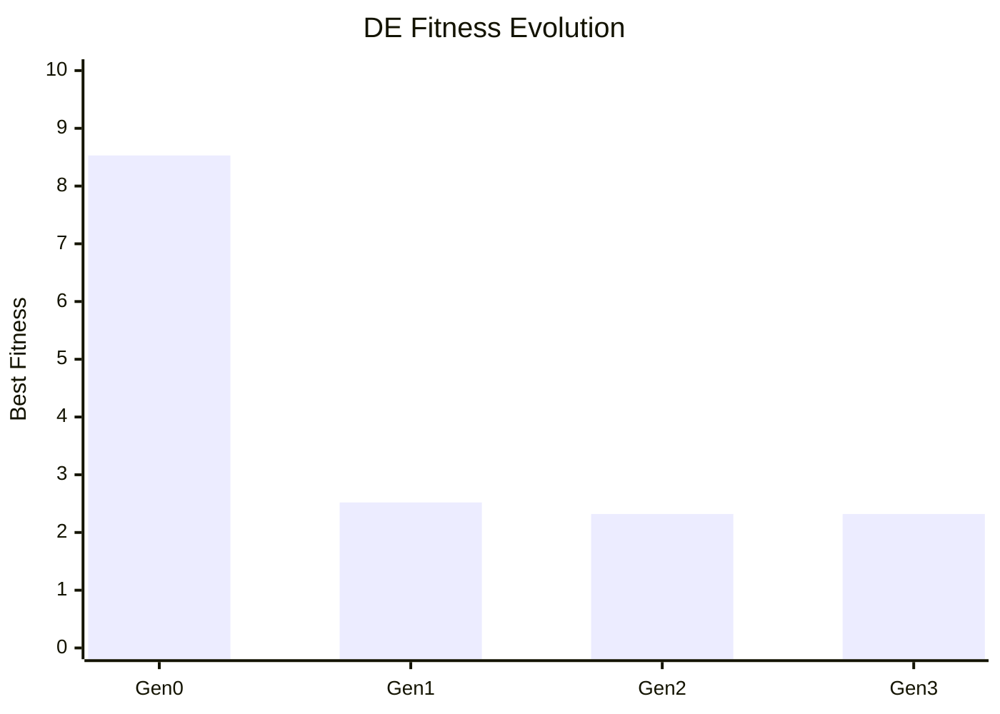

> [!TIP]
> The algorithm reached a plateau at Gen 3. The best fitness remained at 2.32, indicating local convergence. More generations or parameter tuning (e.g., higher F) would help escape this plateau.

---

## Summary

### Genetic Algorithm (GA)

1. **Representation**: Binary-encoded chromosomes
2. **Problem**: Maximize $f(x) = x^2$
3. **Selection**: Roulette wheel
4. **Operators**: Single-point crossover, bit-flip mutation

### Genetic Programming (GP)

1. **Representation**: Variable-size expression trees
2. **Problem**: Symbolic regression $f(x) = x^2 + 2x + 1$
3. **Selection**: Tournament selection
4. **Operators**: Subtree crossover, subtree mutation

### Differential Evolution (DE)

1. **Representation**: Real-valued vectors
2. **Problem**: Minimize $f(x_1, x_2) = x_1^2 + x_2^2$
3. **Selection**: Pairwise (trial vs target)
4. **Operators**: Vector difference mutation, binomial crossover

### Algorithm Comparison

| Aspect           | GA            | GP       | DE           |
| :--------------- | :------------ | :------- | :----------- |
| **Encoding**     | Binary        | Trees    | Real vectors |
| **Search Space** | Discrete      | Programs | Continuous   |
| **Mutation**     | Bit flip      | Subtree  | Vector diff  |
| **Best For**     | Combinatorial | Symbolic | Continuous   |

---

## References

1. Holland, J. H. (1975). _Adaptation in Natural and Artificial Systems_. University of Michigan Press.
2. Goldberg, D. E. (1989). _Genetic Algorithms in Search, Optimization, and Machine Learning_. Addison-Wesley.
3. Mitchell, M. (1998). _An Introduction to Genetic Algorithms_. MIT Press.
4. Koza, J. R. (1992). _Genetic Programming_. MIT Press.
5. Storn, R. & Price, K. (1997). _Differential Evolution_. Journal of Global Optimization, 11, 341-359.

