# Connectionist Temporal Classification (CTC) - Complete Numerical Example

> **Target**: Transcribe audio to **"na group"**  
> A step-by-step guide through the CTC algorithm with full calculations

---

## 📋 Proof-of-Concept Questions

Before diving in, test your understanding with these questions:

1. **Why can't we simply align each audio frame to one character?**  
   _Hint: Think about variable speech rates and silence._

2. **What is the purpose of the blank token (ε)?**  
   _Hint: Consider the word "hello" with repeated 'l'._

3. **If we have T=12 timesteps and target "na group" (8 chars), how many states are in the extended sequence Z?**  
   _Answer revealed in Section 4._

4. **Why does CTC use dynamic programming instead of enumerating all alignments?**  
   _Hint: For T=100 and U=50, there are ~10⁴⁰ possible alignments._

---

## 1. Introduction: The Alignment Problem

### The Challenge

In speech recognition, we have:

- **Input**: Audio waveform → RNN features at each timestep
- **Output**: Text transcription (e.g., "na group")

**Problem**: We don't know which audio frames correspond to which characters!

```mermaid
flowchart LR
    subgraph Input["Audio Input (T=12 frames)"]
        A1["🔊 Frame 1"]
        A2["🔊 Frame 2"]
        A3["..."]
        A12["🔊 Frame 12"]
    end

    subgraph RNN["Neural Network"]
        R["RNN/LSTM/Transformer"]
    end

    subgraph Output["Character Probabilities"]
        P1["P(char|t=1)"]
        P2["P(char|t=2)"]
        P3["..."]
        P12["P(char|t=12)"]
    end

    A1 --> R
    A2 --> R
    A3 --> R
    A12 --> R
    R --> P1
    R --> P2
    R --> P3
    R --> P12

    style Input fill:#e3f2fd,stroke:#1976d2
    style RNN fill:#fff3e0,stroke:#f57c00
    style Output fill:#e8f5e9,stroke:#388e3c
```



### CTC Solution

CTC solves this by:

1. **Introducing a blank token (ε)** to handle silence and transitions
2. **Marginalizing over ALL possible alignments** between input and output
3. Using **dynamic programming** to compute this efficiently

---

## 2. Problem Setup

### Our Example

| Parameter                | Value                                   |
| ------------------------ | --------------------------------------- |
| **Target transcription** | Y = "na group"                          |
| **Input timesteps**      | T = 12                                  |
| **Vocabulary**           | {n, a, ␣, g, r, o, u, p, ε} (9 classes) |

Where ␣ represents the space character and ε is the CTC blank token.

### RNN Output Probability Matrix

The neural network outputs a probability distribution over the vocabulary at each timestep:

$$
P(\text{character} \mid \text{timestep}) \in \mathbb{R}^{9 \times 12}
$$


**Full Probability Matrix** (each column sums to 1.0):

$$
\mathbf{P} = \begin{bmatrix}
 & t_1 & t_2 & t_3 & t_4 & t_5 & t_6 & t_7 & t_8 & t_9 & t_{10} & t_{11} & t_{12} \\
\text{n} & 0.700 & 0.500 & 0.037 & 0.059 & 0.002 & 0.007 & 0.022 & 0.011 & 0.020 & 0.000 & 0.091 & 0.127 \\
\text{a} & 0.017 & 0.057 & 0.600 & 0.149 & 0.101 & 0.036 & 0.006 & 0.026 & 0.048 & 0.106 & 0.045 & 0.037 \\
\text{␣} & 0.111 & 0.076 & 0.076 & 0.022 & 0.650 & 0.002 & 0.096 & 0.006 & 0.009 & 0.077 & 0.018 & 0.007 \\
\text{g} & 0.049 & 0.001 & 0.058 & 0.070 & 0.115 & 0.700 & 0.041 & 0.047 & 0.099 & 0.082 & 0.003 & 0.073 \\
\text{r} & 0.034 & 0.216 & 0.035 & 0.087 & 0.056 & 0.125 & 0.600 & 0.059 & 0.005 & 0.093 & 0.017 & 0.083 \\
\text{o} & 0.006 & 0.110 & 0.097 & 0.005 & 0.012 & 0.016 & 0.077 & 0.550 & 0.265 & 0.005 & 0.018 & 0.048 \\
\text{u} & 0.006 & 0.015 & 0.015 & 0.091 & 0.004 & 0.057 & 0.062 & 0.038 & 0.090 & 0.600 & 0.060 & 0.086 \\
\text{p} & 0.002 & 0.012 & 0.035 & 0.018 & 0.039 & 0.020 & 0.025 & 0.211 & 0.014 & 0.028 & 0.700 & 0.040 \\
\epsilon & 0.074 & 0.013 & 0.047 & 0.500 & 0.020 & 0.038 & 0.070 & 0.053 & 0.450 & 0.008 & 0.047 & 0.500 \\
\end{bmatrix}
$$

---

## 3. Alignments and the Blank Token

### Why We Need Alignments

An **alignment** is a mapping from each input timestep to a character (or blank). For target "na group" with T=12 timesteps, we could have many valid alignments:

```mermaid
flowchart TB
    subgraph Valid["✅ Valid Alignments → 'na group'"]
        V1["[n, n, a, ε, ␣, g, r, o, ε, u, p, ε]"]
        V2["[ε, n, a, ε, ␣, g, r, o, u, u, p, ε]"]
        V3["[n, a, ε, ε, ␣, g, r, o, o, u, p, p]"]
    end

    subgraph Invalid["❌ Invalid Alignments"]
        I1["[n, a, ␣, g, r, o, u, p, x, x, x, x] — wrong chars"]
        I2["[n, n, a, ␣, g, r, o, u, p, p, p, p] — missing ε between repeated p"]
    end

    style Valid fill:#e8f5e9,stroke:#4caf50,stroke-width:2px
    style Invalid fill:#ffebee,stroke:#f44336,stroke-width:2px
```



### The Blank Token (ε) Rules

The blank token ε serves two purposes:

1. **Handling silence/transitions**: Model can output ε when "between" characters
2. **Separating repeated characters**: Required between identical consecutive characters

**Key Rule**: To get repeated characters in output (like "ll" in "hello"), we MUST have ε between them:

- `[h, e, l, l, o]` collapses to "helo" ❌
- `[h, e, l, ε, l, o]` collapses to "hello" ✅

### Collapsing Function $\mathcal{B}$

The function $\mathcal{B}$ maps alignments to outputs by:

1. Merging consecutive repeated characters
2. Removing all ε tokens

$$
\mathcal{B}(\text{[n, n, a, ε, ␣, g, r, o, ε, u, p, ε]}) = \text{"na group"}
$$

**Step-by-step collapsing example:**

```
Input alignment:    [n, n, a, ε, ␣, g, r, o, ε, u, p, ε]
                     ↓
Step 1 - Merge:     [n, a, ε, ␣, g, r, o, ε, u, p, ε]    (merged n,n → n)
                     ↓
Step 2 - Remove ε:  [n, a, ␣, g, r, o, u, p]
                     ↓
Final output:       "na group"
```

---

## 4. Extended Sequence Z

To apply the forward algorithm, we create an **extended sequence** $Z$ by inserting ε between each character and at the boundaries:

$$
Y = [\text{n}, \text{a}, \text{␣}, \text{g}, \text{r}, \text{o}, \text{u}, \text{p}] \quad \text{(8 characters)}
$$

$$
Z = [\epsilon, \text{n}, \epsilon, \text{a}, \epsilon, \text{␣}, \epsilon, \text{g}, \epsilon, \text{r}, \epsilon, \text{o}, \epsilon, \text{u}, \epsilon, \text{p}, \epsilon] \quad \text{(17 states)}
$$



```mermaid
flowchart LR
    subgraph Y["Target Y (8 chars)"]
        Y1["n"] --> Y2["a"] --> Y3["␣"] --> Y4["g"] --> Y5["r"] --> Y6["o"] --> Y7["u"] --> Y8["p"]
    end

    subgraph Z["Extended Z (17 states)"]
        Z1["ε"] --> Z2["n"] --> Z3["ε"] --> Z4["a"] --> Z5["ε"] --> Z6["␣"] --> Z7["ε"] --> Z8["g"] --> Z9["ε"] --> Z10["r"] --> Z11["ε"] --> Z12["o"] --> Z13["ε"] --> Z14["u"] --> Z15["ε"] --> Z16["p"] --> Z17["ε"]
    end

    Y --> |"Insert ε"| Z

    style Y fill:#fff3e0,stroke:#ff9800
    style Z fill:#e3f2fd,stroke:#2196f3
```

**State indexing** (1-based):

| State s | 1   | 2   | 3   | 4   | 5   | 6   | 7   | 8   | 9   | 10  | 11  | 12  | 13  | 14  | 15  | 16  | 17  |
| ------- | --- | --- | --- | --- | --- | --- | --- | --- | --- | --- | --- | --- | --- | --- | --- | --- | --- |
| $z_s$   | ε   | n   | ε   | a   | ε   | ␣   | ε   | g   | ε   | r   | ε   | o   | ε   | u   | ε   | p   | ε   |

---

## 5. Forward Algorithm (α Computation)

The **forward variable** $\alpha_{s,t}$ represents the total probability of all valid alignments that:

- End at state $s$ in the extended sequence $Z$
- After processing $t$ input timesteps

> [!IMPORTANT] > **Don't confuse P and α!**
>
> - $P(c \mid t)$ = RNN output probability of character $c$ at timestep $t$ (given in the probability matrix)
> - $\alpha_{s,t}$ = probability of being in **state s of Z** after **t timesteps** with a valid alignment path
>
> At t=1, we have only consumed ONE timestep, so we can only be at the BEGINNING of Z (state 1 or 2). We cannot "jump" to state 4 (a) at t=1 because reaching state 4 requires first passing through states 1→2 or 1→2→3, which takes time!

### 5.1 Initialization (t = 1)

At $t=1$, only the first two states can have non-zero probability because:

- We **must start** at the beginning of the extended sequence $Z$
- State 1 (ε) = we start with blank
- State 2 (n) = we start with the first character

**We cannot be in state 3+ at t=1** because reaching those states requires transitioning through earlier states, which takes additional timesteps.

$$
\alpha_{1,1} = P(\epsilon \mid t=1) = 0.074
$$

$$
\alpha_{2,1} = P(\text{n} \mid t=1) = 0.700
$$

$$
\alpha_{s,1} = 0 \quad \text{for } s > 2 \quad \text{(no valid path can reach here in just 1 timestep)}
$$

**Full Alpha Table at t=1:**

$$
\begin{array}{c|c|c}
\hline
s & z_s & \alpha_{s,1} \\
\hline
1 & \epsilon & 0.0743 \\
2 & \text{n} & 0.7000 \\
3 & \epsilon & 0 \\
4 & \text{a} & 0 \\
5 & \epsilon & 0 \\
6 & \text{␣} & 0 \\
7 & \epsilon & 0 \\
8 & \text{g} & 0 \\
9 & \epsilon & 0 \\
10 & \text{r} & 0 \\
11 & \epsilon & 0 \\
12 & \text{o} & 0 \\
13 & \epsilon & 0 \\
14 & \text{u} & 0 \\
15 & \epsilon & 0 \\
16 & \text{p} & 0 \\
17 & \epsilon & 0 \\
\hline
\end{array}
$$

### 5.2 Recurrence Relations

For $t > 1$, we compute $\alpha_{s,t}$ based on which states could transition to state $s$:


#### Transition Rules Summary

| Case  | Name        | Condition                                   | Recurrence Formula                                                                          |
| :---: | :---------- | :------------------------------------------ | :------------------------------------------------------------------------------------------ |
| **1** | Cannot Skip | $z_s = \epsilon$ **OR** $z_s = z_{s-2}$     | $\alpha_{s,t} = [\alpha_{s-1,t-1} + \alpha_{s,t-1}] \cdot P(z_s \mid t)$                    |
| **2** | Can Skip    | $z_{s-1} = \epsilon$ (between unique chars) | $\alpha_{s,t} = [\alpha_{s-2,t-1} + \alpha_{s-1,t-1} + \alpha_{s,t-1}] \cdot P(z_s \mid t)$ |

**Case 1**: We **cannot** skip $z_{s-1}$ when:

- Current state is blank: $z_s = \epsilon$
- Current state equals state two positions back: $z_s = z_{s-2}$ (repeated character)

$$
\alpha_{s,t} = \left[\alpha_{s-1,t-1} + \alpha_{s,t-1}\right] \cdot P(z_s \mid t)
$$

**Case 2**: We **can** skip $z_{s-1}$ when it's a blank between unique characters:

$$
\alpha_{s,t} = \left[\alpha_{s-2,t-1} + \alpha_{s-1,t-1} + \alpha_{s,t-1}\right] \cdot P(z_s \mid t)
$$

**State Transition Diagram** (showing allowed transitions for states 1-6):

```mermaid
flowchart LR
    subgraph Transitions["Allowed State Transitions"]
        S1["s=1 (ε)"] --> S1
        S1 --> S2["s=2 (n)"]

        S2 --> S2
        S2 --> S3["s=3 (ε)"]

        S3 --> S3
        S3 --> S4["s=4 (a)"]

        S2 -.->|"skip ε"| S4

        S4 --> S4
        S4 --> S5["s=5 (ε)"]

        S5 --> S5
        S5 --> S6["s=6 (␣)"]

        S4 -.->|"skip ε"| S6
    end

    style S1 fill:#fff3e0,stroke:#ff9800
    style S2 fill:#e3f2fd,stroke:#2196f3
    style S3 fill:#fff3e0,stroke:#ff9800
    style S4 fill:#e3f2fd,stroke:#2196f3
    style S5 fill:#fff3e0,stroke:#ff9800
    style S6 fill:#e3f2fd,stroke:#2196f3
```



**Concrete examples from Z = [ε, n, ε, a, ε, ␣, ...]:**

| To State (s) | $z_s$ | Case | Can come from             | Why                            |
| ------------ | ----- | ---- | ------------------------- | ------------------------------ |
| 3            | ε     | 1    | s=2 (n), s=3 (ε)          | ε → can't skip                 |
| 4            | a     | 2    | s=2 (n), s=3 (ε), s=4 (a) | unique char, can skip ε in s=3 |
| 5            | ε     | 1    | s=4 (a), s=5 (ε)          | ε → can't skip                 |
| 6            | ␣     | 2    | s=4 (a), s=5 (ε), s=6 (␣) | unique char, can skip ε in s=5 |

### 5.3 Step-by-Step Calculation

#### Timestep t = 2

For each state, we apply the appropriate recurrence:

| State s | $z_s$ | Case | Calculation                                                                                   | $\alpha_{s,2}$ |
| ------- | ----- | ---- | --------------------------------------------------------------------------------------------- | -------------- |
| 1       | ε     | 1    | $\alpha_{1,1} \times P(\epsilon \mid 2) = 0.0743 \times 0.013$                                | 0.0010         |
| 2       | n     | 2    | $[\alpha_{1,1} + \alpha_{2,1}] \times P(\text{n} \mid 2) = [0.0743 + 0.7000] \times 0.500$    | 0.3872         |
| 3       | ε     | 1    | $[\alpha_{2,1} + \alpha_{3,1}] \times P(\epsilon \mid 2) = [0.7000 + 0] \times 0.013$         | 0.0091         |
| 4       | a     | 2    | $[\alpha_{2,1} + \alpha_{3,1} + \alpha_{4,1}] \times P(\text{a} \mid 2) = 0.700 \times 0.057$ | 0.0399         |
| 5-17    | ...   | ...  | (contributions from zero α values)                                                            | ≈ 0            |

**Full Alpha Table at t=2:**

$$
\begin{array}{c|c|c|c}
\hline
s & z_s & \alpha_{s,1} & \alpha_{s,2} \\
\hline
1 & \epsilon & 0.0743 & 0.0010 \\
2 & \text{n} & 0.7000 & 0.3872 \\
3 & \epsilon & 0 & 0.0091 \\
4 & \text{a} & 0 & 0.0399 \\
5 & \epsilon & 0 & 0 \\
6 & \text{␣} & 0 & 0 \\
7 & \epsilon & 0 & 0 \\
8 & \text{g} & 0 & 0 \\
9 & \epsilon & 0 & 0 \\
10 & \text{r} & 0 & 0 \\
11 & \epsilon & 0 & 0 \\
12 & \text{o} & 0 & 0 \\
13 & \epsilon & 0 & 0 \\
14 & \text{u} & 0 & 0 \\
15 & \epsilon & 0 & 0 \\
16 & \text{p} & 0 & 0 \\
17 & \epsilon & 0 & 0 \\
\hline
\end{array}
$$

#### Timestep t = 3

Key calculations (probability values from our matrix):

| State s | $z_s$ | Incoming α values                                    | × $P(z_s \mid 3)$ | $\alpha_{s,3}$ |
| ------- | ----- | ---------------------------------------------------- | ----------------- | -------------- |
| 1       | ε     | $\alpha_{1,2} = 0.0010$                              | × 0.047           | 0.00005        |
| 2       | n     | $\alpha_{1,2} + \alpha_{2,2} = 0.388$                | × 0.037           | 0.0144         |
| 3       | ε     | $\alpha_{2,2} + \alpha_{3,2} = 0.396$                | × 0.047           | 0.0186         |
| 4       | a     | $\alpha_{2,2} + \alpha_{3,2} + \alpha_{4,2} = 0.436$ | × 0.600           | 0.2616         |
| 5       | ε     | $\alpha_{4,2} + \alpha_{5,2} = 0.0399$               | × 0.047           | 0.0019         |

**Full Alpha Table at t=3:**

$$
\begin{array}{c|c|c|c|c}
\hline
s & z_s & \alpha_{s,1} & \alpha_{s,2} & \alpha_{s,3} \\
\hline
1 & \epsilon & 0.0743 & 0.0010 & 0.0000 \\
2 & \text{n} & 0.7000 & 0.3872 & 0.0144 \\
3 & \epsilon & 0 & 0.0091 & 0.0186 \\
4 & \text{a} & 0 & 0.0399 & 0.2616 \\
5 & \epsilon & 0 & 0 & 0.0019 \\
6 & \text{␣} & 0 & 0 & 0.0030 \\
7-17 & ... & 0 & 0 & \approx 0 \\
\hline
\end{array}
$$

#### Timesteps t = 4 and t = 5 (Detailed)

**At t = 4** (blank probability high = 0.500):

| State | $z_s$ | Calculation                                                                      | $\alpha_{s,4}$ |
| ----- | ----- | -------------------------------------------------------------------------------- | -------------- |
| 3     | ε     | $[\alpha_{2,3} + \alpha_{3,3}] \times 0.500 = [0.0144 + 0.0186] \times 0.500$    | 0.0165         |
| 4     | a     | $[\alpha_{2,3} + \alpha_{3,3} + \alpha_{4,3}] \times 0.149 = 0.294 \times 0.149$ | 0.0438         |
| 5     | ε     | $[\alpha_{4,3} + \alpha_{5,3}] \times 0.500 = [0.2616 + 0.0019] \times 0.500$    | 0.1318         |
| 6     | ␣     | $[\alpha_{4,3} + \alpha_{5,3} + \alpha_{6,3}] \times 0.022$                      | 0.0058         |

Note: State 5 (ε) now has significant probability (0.1318) because:

- Large incoming α from state 4 (a)
- High blank probability at t=4 (0.500)

**At t = 5** (space probability high = 0.650):

| State | $z_s$ | Calculation                                                 | $\alpha_{s,5}$ |
| ----- | ----- | ----------------------------------------------------------- | -------------- |
| 5     | ε     | $[\alpha_{4,4} + \alpha_{5,4}] \times 0.020$                | 0.0035         |
| 6     | ␣     | $[\alpha_{4,4} + \alpha_{5,4} + \alpha_{6,4}] \times 0.650$ | **0.1181**     |
| 7     | ε     | $[\alpha_{6,4} + \alpha_{7,4}] \times 0.020$                | 0.0001         |
| 8     | g     | $[\alpha_{6,4} + \alpha_{7,4} + \alpha_{8,4}] \times 0.115$ | 0.0009         |

Note: State 6 (space) peaks at 0.1181 — this is where "na " is most likely!

### 5.4 Complete Alpha Trellis Visualization


The heatmap shows all 17 states × 12 timesteps. Key observations:

- **Diagonal flow**: Probability flows from top-left to bottom-right
- **Green intensity**: Higher α values shown in darker green
- **Final states**: States 16 (p) and 17 (ε) have accumulated probability by t=12

### 5.5 Complete Alpha Table (All Timesteps)

$$
\tiny
\begin{array}{c|c|cccccccccccc}
\hline
s & z_s & t_1 & t_2 & t_3 & t_4 & t_5 & t_6 & t_7 & t_8 & t_9 & t_{10} & t_{11} & t_{12} \\
\hline
1 & \epsilon & 0.0743 & 0.0009 & 0.0000 & 0.0000 & 0.0000 & 0.0000 & 0.0000 & 0 & 0 & 0 & 0 & 0 \\
2 & \text{n} & 0.7000 & 0.3872 & 0.0144 & 0.0009 & 0.0000 & 0.0000 & 0.0000 & 0 & 0 & 0 & 0 & 0 \\
3 & \epsilon & 0 & 0.0088 & 0.0185 & 0.0164 & 0.0003 & 0.0000 & 0.0000 & 0.0000 & 0.0000 & 0.0000 & 0 & 0 \\
4 & \text{a} & 0 & 0.0397 & 0.2614 & 0.0439 & 0.0062 & 0.0002 & 0.0000 & 0.0000 & 0.0000 & 0.0000 & 0.0000 & 0 \\
5 & \epsilon & 0 & 0 & 0.0019 & 0.1316 & 0.0035 & 0.0004 & 0.0000 & 0.0000 & 0.0000 & 0.0000 & 0.0000 & 0.0000 \\
6 & \text{␣} & 0 & 0 & 0.0030 & 0.0057 & 0.1178 & 0.0002 & 0.0001 & 0.0000 & 0.0000 & 0.0000 & 0.0000 & 0 \\
7 & \epsilon & 0 & 0 & 0 & 0.0015 & 0.0001 & 0.0045 & 0.0003 & 0.0000 & 0.0000 & 0.0000 & 0.0000 & 0.0000 \\
8 & \text{g} & 0 & 0 & 0 & 0.0002 & 0.0009 & 0.0832 & 0.0036 & 0.0002 & 0.0000 & 0.0000 & 0.0000 & 0.0000 \\
9 & \epsilon & 0 & 0 & 0 & 0 & 0.0000 & 0.0000 & 0.0059 & 0.0005 & 0.0003 & 0.0000 & 0.0000 & 0.0000 \\
10 & \text{r} & 0 & 0 & 0 & 0 & 0.0000 & 0.0001 & 0.0500 & 0.0035 & 0.0000 & 0.0000 & 0.0000 & 0.0000 \\
11 & \epsilon & 0 & 0 & 0 & 0 & 0 & 0.0000 & 0.0000 & 0.0026 & 0.0028 & 0.0000 & 0.0000 & 0.0000 \\
12 & \text{o} & 0 & 0 & 0 & 0 & 0 & 0.0000 & 0.0000 & 0.0275 & 0.0089 & 0.0001 & 0.0000 & 0.0000 \\
13 & \epsilon & 0 & 0 & 0 & 0 & 0 & 0 & 0.0000 & 0.0000 & 0.0124 & 0.0002 & 0.0000 & 0.0000 \\
14 & \text{u} & 0 & 0 & 0 & 0 & 0 & 0 & 0.0000 & 0.0000 & 0.0025 & 0.0143 & 0.0009 & 0.0001 \\
15 & \epsilon & 0 & 0 & 0 & 0 & 0 & 0 & 0 & 0.0000 & 0.0000 & 0.0000 & 0.0007 & 0.0008 \\
16 & \text{p} & 0 & 0 & 0 & 0 & 0 & 0 & 0 & 0.0000 & 0.0000 & 0.0001 & 0.0100 & 0.0005 \\
17 & \epsilon & 0 & 0 & 0 & 0 & 0 & 0 & 0 & 0 & 0.0000 & 0 & 0.0000 & 0.0050 \\
\hline
\end{array}
$$

### 5.6 Final CTC Probability

The total probability of the target sequence given the input is the sum of probabilities ending at the last two valid states (we can end with final character 'p' or with blank ε):

$$
P(Y \mid X) = \alpha_{16, 12} + \alpha_{17, 12}
$$

$$
P(Y \mid X) = \alpha(\text{p}, t=12) + \alpha(\epsilon, t=12)
$$

$$
P(Y \mid X) = 0.000458 + 0.005024 = \boxed{0.005482}
$$

### CTC Loss

$$
\mathcal{L}_{\text{CTC}} = -\log P(Y \mid X) = -\log(0.005482) = \boxed{5.206}
$$

---

## 6. Python Implementation

The complete Python code that generated all calculations:

```python
import numpy as np
import matplotlib.pyplot as plt
import seaborn as sns

# Parameters
target_Y = list("na group")  # ['n', 'a', ' ', 'g', 'r', 'o', 'u', 'p']
vocab = ['n', 'a', ' ', 'g', 'r', 'o', 'u', 'p', 'ε']
vocab_to_idx = {c: i for i, c in enumerate(vocab)}
T = 12

# Build extended sequence Z
Z = []
for char in target_Y:
    Z.append('ε')
    Z.append(char)
Z.append('ε')
S = len(Z)  # 17 states

# Forward Algorithm
def forward_algorithm(probs, Z, vocab_to_idx):
    S, T = len(Z), probs.shape[1]
    alpha = np.zeros((S, T))

    # Initialization
    alpha[0, 0] = probs[vocab_to_idx[Z[0]], 0]
    alpha[1, 0] = probs[vocab_to_idx[Z[1]], 0]

    # Recurrence
    for t in range(1, T):
        for s in range(S):
            z_s_idx = vocab_to_idx[Z[s]]

            if s == 0:
                alpha[s, t] = alpha[s, t-1] * probs[z_s_idx, t]
            elif s == 1:
                alpha[s, t] = (alpha[s-1, t-1] + alpha[s, t-1]) * probs[z_s_idx, t]
            else:
                if Z[s] == 'ε' or Z[s] == Z[s-2]:
                    # Case 1: Cannot skip
                    alpha[s, t] = (alpha[s-1, t-1] + alpha[s, t-1]) * probs[z_s_idx, t]
                else:
                    # Case 2: Can skip
                    alpha[s, t] = (alpha[s-2, t-1] + alpha[s-1, t-1] + alpha[s, t-1]) * probs[z_s_idx, t]

    return alpha

# Final probability
P_Y_given_X = alpha[S-2, T-1] + alpha[S-1, T-1]
print(f"P(Y|X) = {P_Y_given_X:.6f}")
print(f"CTC Loss = {-np.log(P_Y_given_X):.4f}")
```

---

## 7. Inference: Decoding

After training, we want to find the most likely output $Y^*$ given input $X$:

$$
Y^* = \underset{Y}{\text{argmax}} \; P(Y \mid X)
$$

### 7.1 Greedy Decoding

The simplest approach: take the most probable character at each timestep:

$$
a_t^* = \underset{c}{\text{argmax}} \; P(c \mid t)
$$

Then collapse the sequence using $\mathcal{B}$.


**Result**: [n, n, a, ε, ␣, g, r, o, ε, u, p, ε] → **"na group"** ✅

### 7.2 Why Greedy Can Fail

Greedy decoding doesn't account for **multiple alignments mapping to the same output**.

Example of failure:

- $P([a, a, \epsilon]) = 0.15$
- $P([a, a, a]) = 0.17$
- $P([b, b, b]) = 0.20$

Greedy picks [b, b, b] → "b", but:

- Total P("a") = 0.15 + 0.17 = 0.32 > 0.20

**Beam search** addresses this by tracking multiple hypotheses.

### 7.3 Beam Search (Conceptual)

```mermaid
flowchart LR
    subgraph T1["t=1"]
        direction TB
        B11["n: 0.70"]
        B12["ε: 0.07"]
        B13["a: 0.02"]
    end

    subgraph T2["t=2"]
        direction TB
        B21["n: 0.39"]
        B22["nε: 0.09"]
        B23["na: 0.04"]
        B24["ε: 0.01"]
    end

    subgraph T3["t=3"]
        direction TB
        B31["na: 0.26"]
        B32["n: 0.02"]
        B33["naε: 0.02"]
    end

    subgraph T4["t=4"]
        direction TB
        B41["na: 0.13"]
        B42["naε: 0.07"]
        B43["na␣: 0.01"]
    end

    %% t=1 to t=2 transitions
    B11 -->|"+n"| B21
    B11 -->|"+ε"| B22
    B11 -->|"+a"| B23
    B12 -->|"+n"| B21
    B12 -->|"+ε"| B24

    %% t=2 to t=3 transitions
    B21 -->|"+a"| B31
    B21 -->|"+ε"| B32
    B22 -->|"+a"| B31
    B23 -->|"+ε"| B33

    %% t=3 to t=4 transitions
    B31 -->|"+ε"| B41
    B31 -->|"+ε"| B42
    B31 -->|"+␣"| B43
    B33 -->|"stay"| B42

    style T1 fill:#e3f2fd,stroke:#1976d2,stroke-width:2px
    style T2 fill:#e8f5e9,stroke:#388e3c,stroke-width:2px
    style T3 fill:#fff3e0,stroke:#f57c00,stroke-width:2px
    style T4 fill:#fce4ec,stroke:#c2185b,stroke-width:2px
```



Beam search maintains top-k hypotheses at each step, merging those that collapse to the same prefix.

---

## 8. Key Properties of CTC

### 8.1 Conditional Independence

CTC assumes outputs are **conditionally independent** given the input:

$$
P(Y \mid X) = \sum_A \prod_{t=1}^T P(a_t \mid X)
$$

This means the model cannot learn language patterns (e.g., "qu" is always followed by a vowel). **Solution**: Combine with an external language model.

### 8.2 Monotonic Alignment

CTC enforces **monotonic** alignments — we can only move forward through the output sequence.

```mermaid
flowchart LR
    A["Allowed: Input → Output moves only forward"]
    B["NOT allowed: Reordering (needed for translation)"]

    style A fill:#e8f5e9,stroke:#4caf50
    style B fill:#ffebee,stroke:#f44336
```



This makes CTC suitable for speech/handwriting but **not** for machine translation.

### 8.3 Output Length Constraint

Since alignments are many-to-one:

$$
|Y| \leq |X|
$$

The output cannot be longer than the input. For "hello" with 2 consecutive 'l's:

$$
|Y| \leq |X| - 2(r-1) \text{ where } r = \text{number of consecutive repeats}
$$

---

## 9. Summary

```mermaid
flowchart TB
    subgraph CTC["CTC Algorithm Summary"]
        I["Input: Audio frames X (T timesteps)"]
        R["RNN: Produces P(char|t) for each timestep"]
        Z["Extended Sequence: Y → Z with ε tokens"]
        F["Forward Algorithm: Compute α(s,t) values"]
        P["Sum: P(Y|X) = α(S-1,T) + α(S,T)"]
        L["Loss: -log P(Y|X)"]
        G["Gradient: Backpropagate to train RNN"]
    end

    I --> R --> Z --> F --> P --> L --> G

    style CTC fill:#f5f5f5,stroke:#9e9e9e
```



**Key Formulas**:

| Component         | Formula                                                                                     |
| ----------------- | ------------------------------------------------------------------------------------------- |
| Extended sequence | $Z = [\epsilon, y_1, \epsilon, y_2, \ldots, \epsilon, y_U, \epsilon]$                       |
| Forward (Case 1)  | $\alpha_{s,t} = [\alpha_{s-1,t-1} + \alpha_{s,t-1}] \cdot P(z_s \mid t)$                    |
| Forward (Case 2)  | $\alpha_{s,t} = [\alpha_{s-2,t-1} + \alpha_{s-1,t-1} + \alpha_{s,t-1}] \cdot P(z_s \mid t)$ |
| Total probability | $P(Y \mid X) = \alpha_{S-1,T} + \alpha_{S,T}$                                               |
| CTC Loss          | $\mathcal{L} = -\log P(Y \mid X)$                                                           |

---

## 📋 Answers to PoC Questions

1. **Variable speech rates** (people speak at different speeds) and **silence** between words make fixed alignment impossible.

2. **The blank token** allows the model to output "nothing" during silence and **separates repeated characters** (e.g., "hello" needs ε between the two 'l's).

3. **17 states**: $2 \times 8 + 1 = 17$ (ε before each char, after last char, and between)

4. **Exponential alignments**: For T=100, U=50, there are $\binom{150}{50} \approx 10^{40}$ alignments. Dynamic programming reduces this to $O(T \times S)$ = $O(12 \times 17) = 204$ operations in our example.

---

_Generated with Python calculations and visualizations for accuracy._
