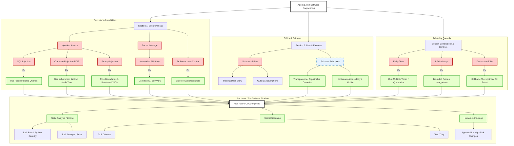

Here is a Mermaid diagram that visualizes the lecture flow, mapping the **Risks** (Red) to their specific **Mitigations/Tools** (Green) and the overall **Pipeline Strategy** (Blue).

```mermaid
graph TD
    %% Define Styles
    classDef risk fill:#ffcccc,stroke:#b30000,stroke-width:2px;
    classDef safe fill:#e6ffcc,stroke:#009900,stroke-width:2px;
    classDef concept fill:#e6f3ff,stroke:#0066cc,stroke-width:2px,stroke-dasharray: 5 5;
    classDef main fill:#fff,stroke:#333,stroke-width:4px;

    Main[Agentic AI in Software Engineering]:::main
    
    %% Three Main Pillars
    Main --> Sec[Section 1: Security Risks]
    Main --> Eth[Section 2: Bias & Fairness]
    Main --> Rel[Section 3: Reliability & Controls]

    %% Section 1: Security
    subgraph Security_Risks [Security Vulnerabilities]
        direction TB
        Sec --> Inj[Injection Attacks]:::risk
        Sec --> Leak[Secret Leakage]:::risk
        Sec --> BAC[Broken Access Control]:::risk

        Inj --> SQL[SQL Injection]:::risk
        Inj --> RCE[Command Injection/RCE]:::risk
        Inj --> Prmpt[Prompt Injection]:::risk
        
        Leak --> HardKeys[Hardcoded API Keys]:::risk
        
        %% Mitigations
        SQL -.->|Fix| ParamQ[Use Parameterized Queries]:::safe
        RCE -.->|Fix| SubP[Use subprocess list / No shell=True]:::safe
        Prmpt -.->|Fix| Role[Role Boundaries & Structured JSON]:::safe
        HardKeys -.->|Fix| EnvVar[Use dotenv / Env Vars]:::safe
        BAC -.->|Fix| Decor[Enforce Auth Decorators]:::safe
    end

    %% Section 2: Ethics
    subgraph Ethics_Bias [Ethics & Fairness]
        direction TB
        Eth --> Source[Sources of Bias]:::risk
        Source --> DataSkew[Training Data Skew]
        Source --> Cult[Cultural Assumptions]
        
        Eth --> Principles[Fairness Principles]:::concept
        Principles --> Transp[Transparency / Explainable Commits]:::safe
        Principles --> Incl[Inclusion / Accessibility / Mobile]:::safe
    end

    %% Section 3: Reliability
    subgraph Reliability_Safety [Reliability Controls]
        direction TB
        Rel --> Flaky[Flaky Tests]:::risk
        Rel --> Loop[Infinite Loops]:::risk
        Rel --> Chaos[Destructive Edits]:::risk

        Flaky -.->|Fix| MultiRun[Run Multiple Times / Quarantine]:::safe
        Loop -.->|Fix| Bound[Bounded Retries max_retries]:::safe
        Chaos -.->|Fix| Roll[Rollback Checkpoints / Git Reset]:::safe
    end

    %% Section 4: Pipeline (The Implementation)
    subgraph Pipeline [Section 4: The Defense Pipeline]
        P[Risk-Aware CI/CD Pipeline]:::main
        
        P --> Tool1[Static Analysis / Linting]:::safe
        Tool1 --> Bandit[Tool: Bandit Python Security]
        Tool1 --> Semgrep[Tool: Semgrep Rules]
        
        P --> Tool2[Secret Scanning]:::safe
        Tool2 --> Gitleaks[Tool: Gitleaks]
        Tool2 --> Trivy[Tool: Trivy]
        
        P --> Human[Human-in-the-Loop]:::safe
        Human --> Review[Approval for High-Risk Changes]
    end

    %% Connect Sections to Pipeline
    ParamQ & SubP & Role & EnvVar & Decor --> P
    Transp & Incl --> P
    MultiRun & Bound & Roll --> P

```